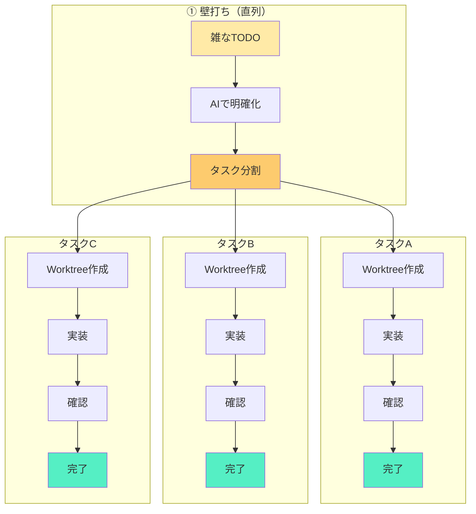

こんにちは！2021年から「React Native」でモバイルアプリ開発をしている阿武（[@app_anno](https://twitter.com/app_anno)）です！
この記事は React Native Advent Calendar 2025 の24日目の投稿です。

https://qiita.com/advent-calendar/2025/react-native

## はじめに

**「個人開発、詰まると時間溶けがち問題」**ありませんか？

1つのバグで1週間ハマって、そのままフェードアウト...。気づけばリポジトリは草も生えない荒野に...。

自分がまさにそうでした。

でも、**Expo × Git Worktree × AIコーディング**（この記事では Cursor と Claude Code を使用）っていう組み合わせを見つけてから、開発体験が激変したんですよね！

**結果: 1ヶ月で222コミット → 最終的に2.5ヶ月で343コミット達成**

この記事では、その開発フローを具体的に紹介していきます！

---

## Before: 従来の開発で何が辛かったか

### 1ブランチで詰まると全体が止まる

エラーにハマると、そのブランチに固執しちゃうんですよね。他のタスクがあっても手がつかない。

### 待ち時間で集中力が途切れる

Claude や ChatGPT の応答を待っていると、ついX（Twitter）やSlack、ネットサーフィンしちゃって、気づけば集中力が削られてる。
実際、ブランチの切り替えで集中が切れることはあまりなくて、主な原因はこうした「ついスマホ・PCで別のことを見る」ことだったんですよね。

---

## After: 新しい開発フローの全体像

### 5ステップフロー（並列運用）



**ポイント: 壁打ちでタスクを分割したら、3つ同時に並列で回す！**

詰まっても他が進む。待ち時間も無駄にならない。

---

## 技術スタック

| 技術 | 役割 |
|------|------|
| **Expo** | React Native の開発体験を劇的に改善。QRコードで実機確認できる |
| **Git Worktree** | 1リポジトリで複数の作業ディレクトリを持てる |
| **Cursor** | 壁打ち・タスク整理で使用。対話しやすくてファイル操作もスムーズ |
| **Claude Code** | 実装フェーズで使用。CLI版Claudeでターミナル完結が最高 |
| **pnpm + Turborepo** | モノレポ管理。依存関係を効率的に共有できる |

---

## 環境セットアップ

### Expo の複数ポート運用

Expo では、通常 `npx expo start` っていうコマンドだけでOKです！

このコマンドを実行すると、既に8081番ポートが使用されている場合、自動的に8082・8083...と空いているポートを探して立ち上げてくれます。

```bash
npx expo start --clear
```

**ポートごとに異なる QR コードが表示されるので、スマホでQRを読み取るだけで複数の環境を瞬時に切り替え可能！**

特に意識しなくても、複数の開発環境を同時に動かせるのがめっちゃ便利です。

### Git Worktree の基本

Git Worktree の詳しい解説は[こちらの記事](https://zenn.dev/stellarcreate/articles/git-worktree-parallel-development-with-cursor)がとても分かりやすいので、ぜひ参考にしてください！

ここでは簡単に使い方だけ紹介します。

```bash
# worktree 作成（新しいブランチを作って作業ディレクトリを用意）
git worktree add -b feature/xxx ../project-xxx main

# 一覧確認
git worktree list

# 削除
git worktree remove ../project-xxx
```

**メリット:**
- ブランチ切り替え不要
- `node_modules` も独立
- 同時に複数の作業ができる

### セットアップ自動化スクリプト

毎回手動でセットアップするのは面倒なので、スクリプトを用意しました！

※ このスクリプトは pnpm 前提です。pnpm の content-addressable store のおかげで、worktree ごとに node_modules を作っても実際のディスク使用量は抑えられます。npm や yarn でも動作はしますが、ディスク容量が厳しくなる可能性があるので、必要に応じてシンボリックリンクなどの工夫が必要かもしれません！

:::details setup-worktree.sh（クリックで展開）

```bash
#!/bin/bash

# ===============================================
# git worktree セットアップスクリプト (pnpm install方式)
# ===============================================
# このスクリプトは、Expo/React Nativeプロジェクトで
# git worktreeを使った並行開発を可能にします。
#
# 使用方法:
#   ./setup-worktree.sh <branch-name> <worktree-path>
#
# 例:
#   ./setup-worktree.sh fix-a ../weight-fix-a
#   ./setup-worktree.sh test-worktree ../weight-test
# ===============================================

set -e  # エラー時に即座に終了

# 色付き出力
GREEN='\033[0;32m'
YELLOW='\033[1;33m'
RED='\033[0;31m'
BLUE='\033[0;34m'
NC='\033[0m' # No Color

# 引数チェック
if [ $# -ne 2 ]; then
  echo -e "${RED}エラー: 引数が不足しています${NC}"
  echo "使用方法: ./setup-worktree.sh <branch-name> <worktree-path>"
  echo ""
  echo "例:"
  echo "  ./setup-worktree.sh fix-a ../weight-fix-a"
  echo "  ./setup-worktree.sh test-worktree ../weight-test"
  exit 1
fi

BRANCH_NAME=$1
WORKTREE_PATH=$2
MAIN_WORKTREE=$(pwd)

echo -e "${YELLOW}========================================${NC}"
echo -e "${YELLOW}git worktree セットアップ開始${NC}"
echo -e "${YELLOW}========================================${NC}"
echo -e "ブランチ名: ${GREEN}$BRANCH_NAME${NC}"
echo -e "Worktreeパス: ${GREEN}$WORKTREE_PATH${NC}"
echo -e "ベースブランチ: ${GREEN}main${NC}"
echo -e "方式: ${BLUE}pnpm install${NC} (シンボリックリンクではなく実際のnode_modules)"
echo ""

# 1. Worktreeを作成
echo -e "${YELLOW}[1/5]${NC} Worktreeを作成中..."
if git worktree add -b "$BRANCH_NAME" "$WORKTREE_PATH" main; then
  echo -e "${GREEN}✓${NC} Worktree作成完了"
else
  echo -e "${RED}✗ Worktree作成に失敗しました${NC}"
  exit 1
fi
echo ""

# 2. 作成したworktreeに移動
cd "$WORKTREE_PATH"
echo -e "${YELLOW}現在のディレクトリ:${NC} $(pwd)"
echo ""

# 3. 設定ファイルをコピー
echo -e "${YELLOW}[2/5]${NC} pnpm設定ファイルをコピー中..."

if [ -f "$MAIN_WORKTREE/.npmrc" ]; then
  cp "$MAIN_WORKTREE/.npmrc" ./.npmrc
  echo -e "${GREEN}✓${NC} .npmrc コピー完了"
fi

if [ -f "$MAIN_WORKTREE/pnpm-workspace.yaml" ]; then
  cp "$MAIN_WORKTREE/pnpm-workspace.yaml" ./pnpm-workspace.yaml
  echo -e "${GREEN}✓${NC} pnpm-workspace.yaml コピー完了"
fi

if [ -f "$MAIN_WORKTREE/pnpm-lock.yaml" ]; then
  cp "$MAIN_WORKTREE/pnpm-lock.yaml" ./pnpm-lock.yaml
  echo -e "${GREEN}✓${NC} pnpm-lock.yaml コピー完了"
fi

echo ""

# 4. .turboをシンボリックリンク（キャッシュ共有）
echo -e "${YELLOW}[3/5]${NC} .turbo をリンク中..."
if [ -d "$MAIN_WORKTREE/.turbo" ]; then
  ln -sf "$MAIN_WORKTREE/.turbo" ./.turbo
  echo -e "${GREEN}✓${NC} .turbo リンク完了（キャッシュ共有）"
fi
echo ""

# 5. pnpm installを実行
echo -e "${YELLOW}[4/5]${NC} pnpm install を実行中..."
echo -e "${BLUE}ℹ${NC}  pnpmのcontent-addressable storeにより、ディスク容量は効率的に管理されます"
echo ""

if pnpm install; then
  echo ""
  echo -e "${GREEN}✓${NC} pnpm install 完了"
else
  echo -e "${RED}✗ pnpm install に失敗しました${NC}"
  cd "$MAIN_WORKTREE"
  exit 1
fi
echo ""

# 6. 完了メッセージ
echo -e "${YELLOW}[5/5]${NC} セットアップ検証中..."
if [ -d "./node_modules" ]; then
  echo -e "${GREEN}✓${NC} node_modules 作成確認"
fi
echo ""

# 完了メッセージ
echo -e "${GREEN}========================================${NC}"
echo -e "${GREEN}✅ Worktreeセットアップ完了！${NC}"
echo -e "${GREEN}========================================${NC}"
echo ""
echo -e "${YELLOW}次のステップ:${NC}"
echo ""
echo "  1. 新しいworktreeに移動:"
echo -e "     ${GREEN}cd $WORKTREE_PATH${NC}"
echo ""
echo "  2. Expoを起動:"
echo -e "     ${GREEN}npx expo start${NC}"
echo ""
echo "  3. 作業完了後、mainにマージ:"
echo -e "     ${GREEN}cd $MAIN_WORKTREE${NC}"
echo -e "     ${GREEN}git merge $BRANCH_NAME${NC}"
echo ""
echo "  4. Worktreeを削除:"
echo -e "     ${GREEN}./cleanup-worktree.sh $WORKTREE_PATH --delete-branch${NC}"
echo ""

# メインworktreeに戻る
cd "$MAIN_WORKTREE"
```

:::

**スクリプトのポイント:**

1. **Worktree作成**: `git worktree add` でブランチと作業ディレクトリを同時に作成
2. **pnpm設定ファイルのコピー**: `.npmrc`, `pnpm-workspace.yaml`, `pnpm-lock.yaml`
3. **Turboキャッシュのシンボリックリンク**: ビルドキャッシュを共有して高速化
4. **pnpm install**: content-addressable store のおかげでディスク効率的

### クリーンアップスクリプト

作業が終わったら、worktree とブランチを削除します。

```bash
# 基本: Worktreeのみ削除、ブランチは保持
./cleanup-worktree.sh ../project-xxx

# ブランチも一緒に削除
./cleanup-worktree.sh ../project-xxx --delete-branch

# 未コミット変更があっても強制削除
./cleanup-worktree.sh ../project-xxx --force --delete-branch
```

:::details cleanup-worktree.sh（クリックで展開）

```bash
#!/bin/bash

# ===============================================
# git worktree クリーンアップスクリプト
# ===============================================
# このスクリプトは、git worktreeと関連ブランチを
# 安全に削除します。
#
# 使用方法:
#   ./cleanup-worktree.sh <worktree-path|branch-name|directory-name> [--force] [--delete-branch]
#
# 例:
#   ./cleanup-worktree.sh ../weight-fix-a
#   ./cleanup-worktree.sh weight-test3 --force
#   ./cleanup-worktree.sh test-worktree3 --force --delete-branch
#   ./cleanup-worktree.sh ../weight-fix-a --delete-branch --force
# ===============================================

# 色付き出力
GREEN='\033[0;32m'
YELLOW='\033[1;33m'
RED='\033[0;31m'
BLUE='\033[0;34m'
NC='\033[0m' # No Color

# 引数チェック
if [ $# -lt 1 ]; then
  echo -e "${RED}エラー: 引数が不足しています${NC}"
  echo "使用方法: ./cleanup-worktree.sh <worktree-path|branch-name|directory-name> [--force] [--delete-branch]"
  exit 1
fi

# 引数を解析（順序不問）
WORKTREE_INPUT=$1
DELETE_BRANCH=false
FORCE=false

shift  # 最初の引数を除外

# 残りの引数をループで処理
while [ $# -gt 0 ]; do
  case "$1" in
    --delete-branch)
      DELETE_BRANCH=true
      ;;
    --force)
      FORCE=true
      ;;
    *)
      echo -e "${YELLOW}⚠${NC}  未知のオプション: $1"
      ;;
  esac
  shift
done

# パス正規化関数
normalize_worktree_path() {
  local input="$1"

  # 絶対パスの場合はそのまま返す
  if [[ "$input" == /* ]]; then
    echo "$input"
    return 0
  fi

  # 相対パス（../ や ./で始まる）の場合はそのまま返す
  if [[ "$input" == ../* ]] || [[ "$input" == ./* ]]; then
    echo "$input"
    return 0
  fi

  # ディレクトリ名のみの場合、git worktree listから検索
  local worktree_list=$(git worktree list --porcelain)
  local matched_path=""

  while IFS= read -r line; do
    if [[ "$line" == worktree\ * ]]; then
      local path="${line#worktree }"
      local dirname=$(basename "$path")

      # ディレクトリ名が一致するか確認
      if [[ "$dirname" == "$input" ]]; then
        matched_path="$path"
        break
      fi
    fi
  done <<< "$worktree_list"

  if [ -n "$matched_path" ]; then
    echo "$matched_path"
    return 0
  fi

  # ブランチ名の可能性があるので、git worktree listから検索
  while IFS= read -r line; do
    if [[ "$line" == branch\ * ]]; then
      local branch="${line#branch refs/heads/}"
      if [[ "$branch" == "$input" ]]; then
        matched_path=$(git worktree list | grep "\[$input\]" | awk '{print $1}')
        if [ -n "$matched_path" ]; then
          echo "$matched_path"
          return 0
        fi
      fi
    fi
  done <<< "$worktree_list"

  # どれにも一致しない場合、../を付けて返す
  echo "../$input"
}

# パスを正規化
WORKTREE_PATH=$(normalize_worktree_path "$WORKTREE_INPUT")

echo -e "${YELLOW}========================================${NC}"
echo -e "${YELLOW}git worktree クリーンアップ開始${NC}"
echo -e "${YELLOW}========================================${NC}"
echo -e "入力: ${BLUE}$WORKTREE_INPUT${NC}"
echo -e "解決されたパス: ${GREEN}$WORKTREE_PATH${NC}"
echo ""

# Worktreeの存在確認
if ! git worktree list | grep -q "$WORKTREE_PATH"; then
  echo -e "${RED}✗ Worktree '$WORKTREE_PATH' が見つかりません${NC}"
  exit 1
fi

# Worktreeからブランチ名を取得
BRANCH_NAME=$(git worktree list | grep "$WORKTREE_PATH" | awk '{print $3}' | sed 's/\[//;s/\]//')

echo -e "対象ブランチ: ${GREEN}$BRANCH_NAME${NC}"
echo ""

# 1. Worktreeを削除
echo -e "${YELLOW}[1/2]${NC} Worktreeを削除中..."

REMOVE_CMD="git worktree remove"
if [ "$FORCE" == true ]; then
  REMOVE_CMD="$REMOVE_CMD --force"
fi

if $REMOVE_CMD "$WORKTREE_PATH"; then
  echo -e "${GREEN}✓${NC} Worktree削除完了"
else
  echo -e "${RED}✗ Worktree削除に失敗しました${NC}"
  exit 1
fi
echo ""

# 2. ブランチを削除 (オプション)
if [ "$DELETE_BRANCH" == true ]; then
  echo -e "${YELLOW}[2/2]${NC} ブランチ '$BRANCH_NAME' を削除中..."

  # マージ済みかチェック
  if git branch --merged main | grep -q "$BRANCH_NAME"; then
    if git branch -d "$BRANCH_NAME"; then
      echo -e "${GREEN}✓${NC} ブランチ削除完了 (マージ済み)"
    fi
  else
    echo -e "${YELLOW}⚠${NC}  ブランチ '$BRANCH_NAME' はまだmainにマージされていません"
    echo -e "${YELLOW}   強制削除しますか? (y/N):${NC} \c"
    read -r response
    if [[ "$response" =~ ^[Yy]$ ]]; then
      git branch -D "$BRANCH_NAME"
      echo -e "${GREEN}✓${NC} ブランチ強制削除完了"
    fi
  fi
fi

# 古いworktree情報をクリーンアップ
git worktree prune
echo -e "${GREEN}✓${NC} クリーンアップ完了"
echo ""

echo -e "${GREEN}========================================${NC}"
echo -e "${GREEN}✅ クリーンアップ完了！${NC}"
echo -e "${GREEN}========================================${NC}"
```

:::

**cleanup-worktree.sh のポイント:**

1. **柔軟なパス指定**: 相対パス、絶対パス、ディレクトリ名、ブランチ名のいずれでも指定可能
2. **安全な削除**: マージ済みブランチは自動削除、未マージは確認ダイアログ
3. **強制削除オプション**: `--force` で未コミット変更があっても削除可能

---

## 開発フロー詳細（5ステップ）

### Step 1: 壁打ちフェーズ

まず、雑なTODOリストを作ります。

```markdown
- メモ入力が全画面共通になっていて、使い勝手が悪い。画面ごと・シーンごとに分離できないか検討する
- アプリ起動時、スプラッシュスクリーン消滅後からホーム画面表示までの遅延が体感で長い。表示速度の最適化が必要
- タグ未設定時でも部位タブや空のタグエリアが表示される。非表示やプレースホルダー表示などUI改善を考える
- 前回メモでMarkdown（strong等）の装飾が反映されていない。テキスト整形処理に問題がないか確認・修正
- 「今日やる予定」の種目を、ユーザーがスキップできる機能を追加する
```

このメモを Cursor に投げて、1つずつ質問してもらいます。自分は Cursor の方が対話しやすかったのでこっちを使ってますが、Claude Code でも同じことはできます！

```
それぞれ壁打ちしてほしいです。
タスクの要件が不明瞭なところがあると思うんで、壁打ちして、
ちゃんとAIが理解し、すぐ作業できるような形にしたいです。
なので分からないところは一つずつ質問してください！
```

### Step 2: タスク作成 & Prompt準備フェーズ

壁打ちで明確になったタスクをもとに、Cursor に以下のプロンプトを投げます。ここも Cursor の方がファイル操作とかスムーズだったので使ってますが、Claude Code でも代替可能です！

```
@setup-worktree.sh を使用して、各worktreeとそれぞれ作業に必要なコマンドと
最適なPromptを記載したドキュメントを作成して！
worktreeは作ってもらっていいです
```

すると、Cursor が以下のようなドキュメントを生成してくれます！

:::details 生成されるドキュメントの例（クリックで展開）

```markdown
# Worktree作業計画

## タスク1: スプラッシュスクリーン後の遅延修正

**Worktree:**
- Path: `../project-fix-splash`
- Branch: `fix-splash`

**セットアップ:**
\`\`\`bash
./setup-worktree.sh fix-splash ../project-fix-splash
cd ../project-fix-splash
npx expo start --clear
\`\`\`

**Claude Code用Prompt:**
\`\`\`
スプラッシュスクリーン後のアプリ起動が遅い問題を修正してください。

現状:
- スプラッシュスクリーンが消えた後、数秒間白い画面が表示される

期待する動作:
- スプラッシュスクリーン → すぐにホーム画面が表示される

調査ポイント:
- 初期データのフェッチタイミング
- 重いコンポーネントの遅延読み込み
\`\`\`

---

## タスク2: メモ機能のHTMLタグ修正

**Worktree:**
- Path: `../project-fix-memo`
- Branch: `fix-memo`

**セットアップ:**
\`\`\`bash
./setup-worktree.sh fix-memo ../project-fix-memo
cd ../project-fix-memo
npx expo start --clear
\`\`\`

**Claude Code用Prompt:**
\`\`\`
前回のメモに含まれる<strong>タグなどのHTMLが
正しくレンダリングされない問題を修正してください。

現状:
- メモに「<strong>重要</strong>」と入力すると、タグがそのまま表示される

期待する動作:
- HTMLタグが解釈されて「**重要**」のように太字で表示される
\`\`\`

---

## タスク3: スキップ機能の追加

**Worktree:**
- Path: `../project-add-skip`
- Branch: `add-skip`

**セットアップ:**
\`\`\`bash
./setup-worktree.sh add-skip ../project-add-skip
cd ../project-add-skip
npx expo start --clear
\`\`\`

**Claude Code用Prompt:**
\`\`\`
今日のトレーニング種目にスキップ機能を追加してください。

要件:
- 各種目の横にスキップボタンを追加
- スキップした種目は一覧の下に移動
- スキップ状態はその日だけ有効（翌日リセット）
\`\`\`
```

:::

**このドキュメントがあると何が嬉しいか:**

1. **コンテキストスイッチが楽**: どの worktree で何をやるか一目瞭然
2. **Prompt のコピペで即作業開始**: Claude Code に投げるだけ
3. **AIが作るから抜け漏れが少ない**: 壁打ちの内容を反映したPromptになる

実際に worktree を作成するコマンドも生成されているので、そのまま実行：

```bash
./setup-worktree.sh fix-splash ../project-fix-splash
./setup-worktree.sh fix-memo ../project-fix-memo
./setup-worktree.sh add-skip ../project-add-skip
```

### Step 3: 実装フェーズ（Claude Code）

ここが最も重要なポイントです！

**ターミナルの配置:**

```
┌──────────────────────────────────────────────────────────────┐
│                        VS Code / Cursor                       │
├─────────────────────────────┬────────────────────────────────┤
│         【左】               │          【右】                │
│      Claude Code            │        Expo                    │
│      (plan モード)           │        (開発サーバー)           │
│                             │                                │
│  $ claude                   │  $ npx expo start --port 8081  │
│  > plan モードで実装中...    │  › Metro waiting on ...        │
│                             │  › Scan the QR code above      │
│                             │                                │
├─────────────────────────────┴────────────────────────────────┤
│                         タブ: worktree A                      │
└──────────────────────────────────────────────────────────────┘
```

**📸 [ここにCursor/VS Codeのターミナル分割スクリーンショット]**

- **左ペイン**: Claude Code（plan モードでやり取り）
- **右ペイン**: Expo起動（開発サーバー）

このセットを **3〜4 worktree分** 準備します。タブで切り替えながら並行作業できるのがめっちゃ楽！

### Step 4: 確認フェーズ

スマホで QRコードを読み込んで動作確認します。

- ポート8081の環境を確認 → QRコードスキャン
- ポート8082の環境に切り替え → 別のQRコードスキャン
- ポート8083の環境に切り替え → また別のQRコードスキャン

**脳のリソースを最小限に抑えて環境切り替え完了！**

ダメだったら Step 3 に戻って修正。

### Step 5: 完了処理

```bash
# メインに戻ってマージ
cd /path/to/main-worktree
git merge fix-splash

# Worktree削除
./cleanup-worktree.sh ../project-fix-splash --delete-branch
```

---

## なぜこの方法が良かったのか（脳のリソース管理）

### 環境切り替えのコストをゼロに

従来: ブランチ切り替え → `npm install` → サーバー再起動 → ...
今: **QRコードをスキャン** → 終わり

物理的な操作が「スマホでQRコードを読む」だけなので、認知負荷をかなり減らせるんですよね。

### Expo Go だからこそのメリット

Next.js などでも同じように複数ポートで並列開発はできるんですが、「今どのタブが3001で、どれが3002だっけ...」といちいち確認が必要だったり、終わったタブを閉じたり整理したりと、小さな認知コストが積み重なるんですよね。

Expo Go だと、**QRコードをスキャンするだけで環境が切り替わる**。ポート番号を覚える必要もない。

この「ほんの少しの違い」ですが、実際やってみると開発体験かなり良かったです！

### なぜ3つのポートなのか

人間の脳のワーキングメモリには限界があります。

- **3つ**: ちょうど管理できる
- **5つ以上**: 混乱し始める
- **10個**: 何がなんだか分からない

だから基本は3つ。小さいタスクが増えたら一時的に増やすこともありますが、3つがベストかなと！

### 詰まっても止まらない

1つのタスクでエラーにハマっても、他の2つは進んでいる。

**「プロジェクト全体が止まる」という状況が起きない。**

これが精神的にかなり楽ですね！

### 待ち時間の有効活用

Claude Code の応答を待っている間:

- ❌ X（Twitter）を開く
- ❌ Slackを眺める
- ✅ **別のworktreeで作業する**

1つのターミナルにフォーカスしているので、マルチタスクではなくシングルタスクの連続。集中力が途切れにくいんですよね。

---

## 実績データ

| 指標 | 数値 |
|------|------|
| 期間 | 約2.5ヶ月（10/13 - 12/22） |
| 1ヶ月時点 | 222コミット |
| 最終 | 343コミット |
| 1日最大 | 42コミット（11/23） |
| 日平均 | 4.8コミット/日 |
| 新機能(feat) | 168件（49%） |

**過去にリリースできなかったアプリが、ついにリリース目前に！**

---

## 注意点・デメリット

### 大きなリファクタリングは分割しづらい

広範囲に影響するリファクタリングは、worktree を分けるメリットが薄いです。その場合は1ブランチで作業するのがいいかと！

### ディスク容量

worktree ごとに `node_modules` が必要なので、ディスク容量を使います。

ただし pnpm の content-addressable store のおかげで、実際のディスク使用量は抑えられてるのでそこまで心配しなくて大丈夫です！

### 初期セットアップの学習コスト

Git Worktree に馴染みがないと最初は戸惑うかも。でも一度覚えれば簡単です！

---

## まとめ

**Git Worktree + Expo + Claude Code = 最強の個人開発環境**

- 「詰まったら放置」→「詰まっても進む」
- QRコードで環境切り替え = 認知負荷を大幅カット
- 待ち時間も無駄にならない

まずは **3つのworktree** から始めてみてください！

---

## 参考記事

- [Cursor のアップデートで知った git worktree の便利さ - 並行開発が劇的に楽になった話](https://zenn.dev/stellarcreate/articles/git-worktree-parallel-development-with-cursor)
