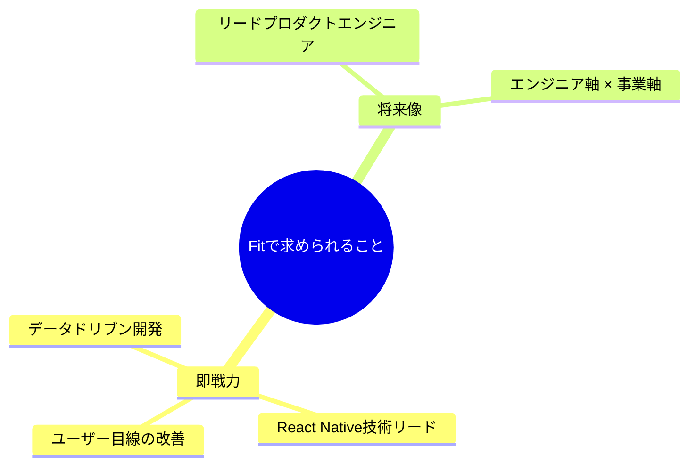
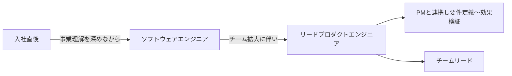
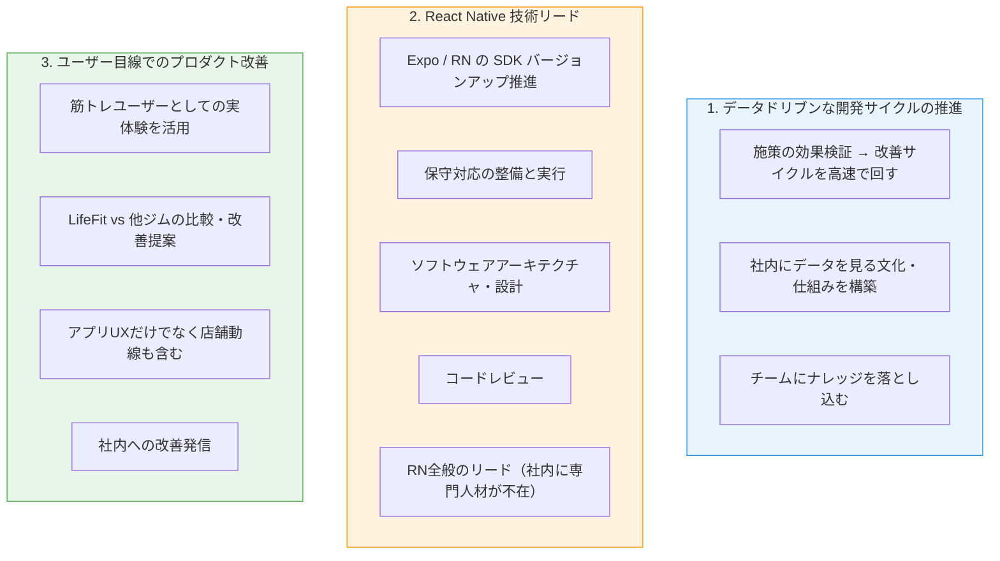
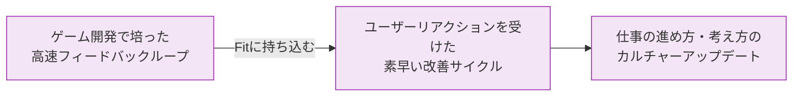
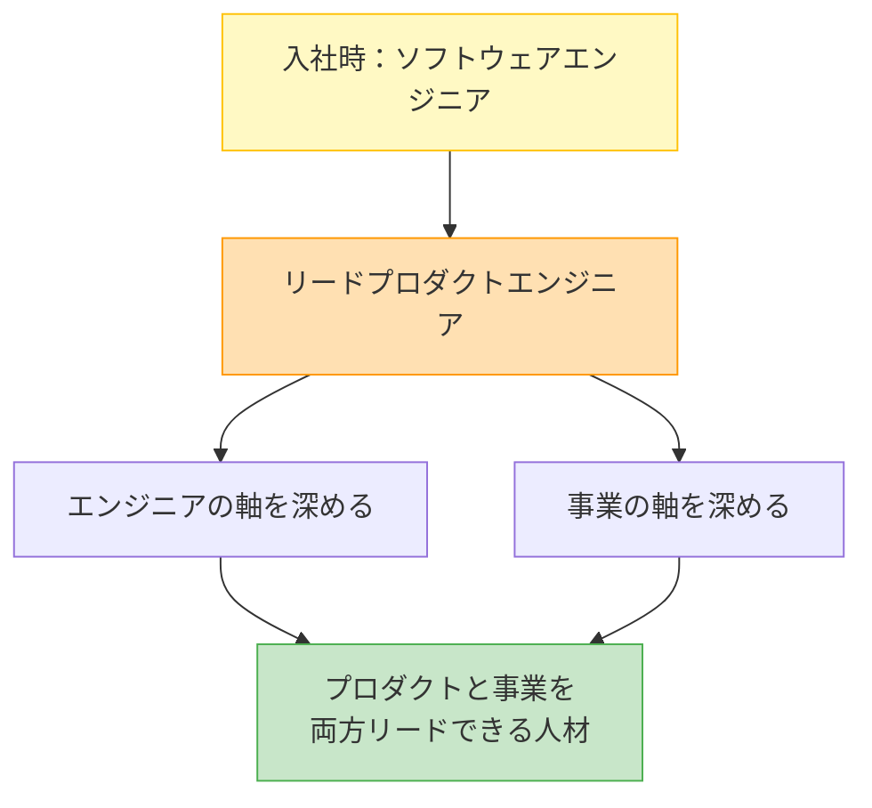

# 株式会社Fit オファー面談 - 求められていること

## 全体像

## 期待される役割の流れ

## 求められている3本柱

## 社長（小林さん）からのメッセージ

> Fitはオフライン×オンラインのサービスのため、ゲームほどリアクションスピードが速くない。
> その改善スピード感を文化レベルで引き上げてほしい。

## 将来のキャリアパス

## 条件まとめ

| 項目 | 内容 |
|------|------|
| 入社日 | 2026年3月1日 |
| 年収 | 830万円（45h固定残業+20h深夜残業込み） |
| 勤務形態 | フルリモート（月1回出社日あり） |
| コアタイム | 12:00〜16:00（フレックス） |
| 賞与 | 現状なし。半年ごとの評価でストックオプション付与 |
| IPO目標 | 2027年9月 |
| 夏季休暇 | あり（一斉休暇） |
