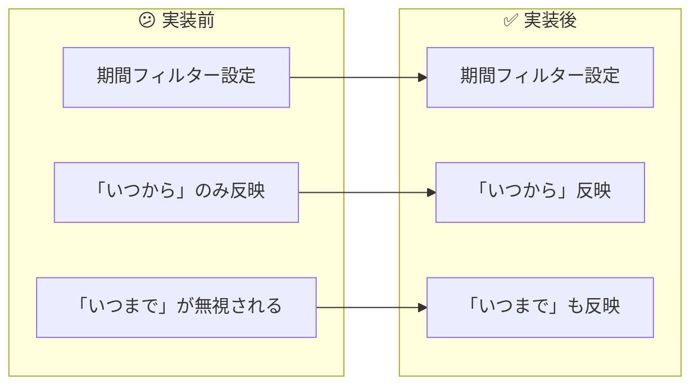

# タスク003：釣果の期間絞り込みが機能しない問題の修正

**プロジェクト:** App
**ステータス:** ✅ 完了
**完了日:** 2026-01-15
**ブランチ:** `fix/result-filter-not-updating`
**PR:** https://github.com/anglers/app/pull/3710
**Linear:** https://linear.app/anglers/issue/WAM-348

---

## 概要

都道府県別の釣果一覧画面で、期間フィルターの「いつまで（endOn）」が効かない不具合を修正。過去のリファクタリング時に誤って削除されていた `endOn` プロップを復元した。

---

## 実装前 → 実装後



---

## 実装内容

### 1. `endOn` プロップの追加

**何をしたか**: `ResultsFetcherGridList` コンポーネントに欠落していた `endOn` プロップを追加

```javascript
// app/views/prefectures/results/IndexView.js
<ResultsFetcherGridList
  prefecture={prefecture}
  order={order}
  weathers={[...weathers]}
  startOn={startOn}
  endOn={endOn}        // ← この1行を追加
  timesRange={timesRange}
  screenProps={screenProps}
  navigation={navigation}
  utmCampaign={UTM_CAMPAIGN_VALUES.SEARCH_REGION_PREFECTURE}
/>
```

**ポイント**: `startOn` は渡されていたが `endOn` だけが欠落していたため、「いつから」は効くが「いつまで」は効かない状態だった。

---

## 変更ファイル一覧

| ファイル | 変更種別 | 変更内容 |
|---------|---------|----------|
| `app/views/prefectures/results/IndexView.js` | 修正 | `endOn={endOn}` プロップを追加（1行） |

---

## 根本原因の調査結果

### バグ発生経緯

| 日付 | コミット | 内容 |
|------|----------|------|
| 2020-06-11 | `cea9b7ce7` | `#1726 Add times range` - `endOn` は正しく実装されていた |
| 2025-02-26 | `0e22e6910` | 「デザイン調整①：ヘッダーのタイトル表示位置」- **リファクタリング時に誤って `endOn={endOn}` が削除された** |

### 調査方法

```bash
# ファイルの変更履歴を確認
git log --oneline --all --follow -- app/views/prefectures/results/IndexView.js

# 各コミットの差分を確認
git show 0e22e6910 -- app/views/prefectures/results/IndexView.js
```

**発見**: 2025年2月のヘッダーデザイン変更（`Header` → `StyledHeader`）のリファクタリング時に、周辺コードを整理する際、`endOn={endOn}` の1行が誤って削除されていた。

---

## デバッグプロセス

### Phase 1: 仮説立て

3つの仮説を検討：
1. DatePickerListItem の moment 生成問題
2. FilterModal の props 未反映問題
3. moment オブジェクトの比較問題

### Phase 2: デバッグログ仕込み

`[DEBUG_ANGLERS]` プレフィックスでログを追加：
- `DatePickerListItem.js`
- `FilterModal.js`
- `results/IndexView.js`
- `ResultList.js`

### Phase 3: 問題の特定

ログ確認の結果、`FilterModal onApply` は呼ばれているが `IndexView onApplyFilter` のログが出ない。

**重要な気づき**: ユーザーが操作していたのは `results/IndexView.js` ではなく `prefectures/results/IndexView.js` だった（都道府県別画面）。

### Phase 4: 根本原因の発見

`prefectures/results/IndexView.js` を確認したところ、`endOn` プロップが欠落していることを発見。

---

## 影響範囲の確認

類似画面をすべて確認：

| ファイル | 状態 |
|---------|------|
| `regions/results/IndexView.js` | ✅ `endOn` あり |
| `areas/results/IndexView.js` | ✅ `endOn` あり |
| `fishes/results/IndexView.js` | ✅ `endOn` あり |
| `prefectures/results/IndexView.js` | ❌ `endOn` 欠落（今回修正） |

---

## 動作確認

- [x] iOS 実機デバイスで動作確認済み
- [x] Android 実機デバイスで動作確認済み

### 確認手順
1. 「見つける」タブ → 「地域」 → 任意の都道府県 → 「すべてを見る」
2. オプションアイコンをタップ
3. 「いつから」「いつまで」を設定
4. 「完了」をタップ
5. 期間内の釣果のみが表示されることを確認

---

## 学び・メモ

### リファクタリング時の注意点

- ヘッダーやレイアウトの変更時、**データ渡しに関するプロップを誤って削除しやすい**
- 特に `startOn` / `endOn` のように似た名前のプロップが並んでいる場合、片方だけ消してしまいやすい
- リファクタリング後は、**プロップの欠落がないか**要確認

### 複数のIndexView.jsファイル

このアプリには複数の `IndexView.js` が存在する：
- `results/IndexView.js` - 「見つける」タブのメイン画面
- `prefectures/results/IndexView.js` - 都道府県別
- `regions/results/IndexView.js` - 地域別
- `areas/results/IndexView.js` - エリア別
- `fishes/results/IndexView.js` - 魚種別

**ユーザーがどの画面で問題を体験しているかを正確に確認することが重要**。

### 却下した変更

デバッグ中に `ResultList.js` に以下の改善を追加したが、レビュー時の指摘により削除：
- `isMomentEqual` ヘルパー関数
- `shouldReset` パラメータ

理由: 呼び出し元で既に `results: []` がクリアされているため、厳密には不要な防御的コードだった。
