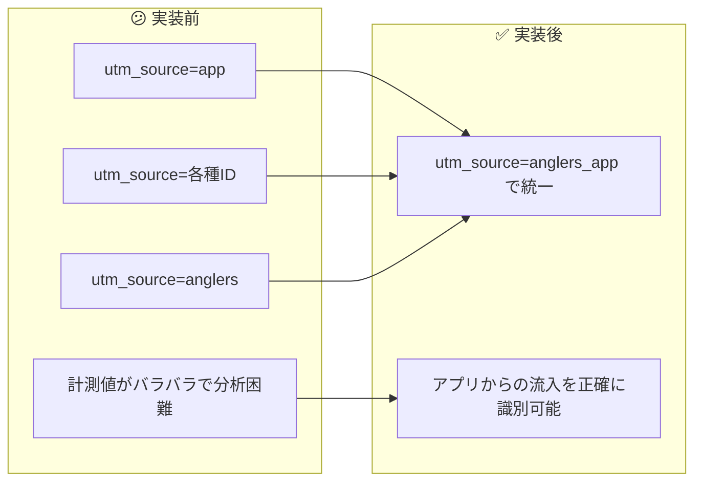

# タスク003：UTM Source統一（anglers_app）

**プロジェクト:** App
**ステータス:** ✅ 完了
**完了日:** 2026-01-13
**ブランチ:** `fix/utm-source-unified-to-anglers-app`

---

## 概要

アプリ内の全ての外部リンクに付与される `utm_source` を `anglers_app` に統一し、GA4でアプリからの流入を正確に計測できるようにした。

---

## 実装前 → 実装後



---

## 背景

### UTMパラメータルールに基づく変更

社内のUTMパラメータルールに従い、アングラーズアプリからのリンクは `source=anglers_app` を使用する必要があった。

| ソース | 規則 |
|--------|------|
| アングラーズアプリ | `anglers_app` |
| アングラーズWEB | `anglers_web` |
| 釣船予約 | `anglers_ships` |

### 調査で判明した現状

タスク開始時に調査した結果、変更対象は2種類あることが判明：

1. **釣船予約への導線**: `utm_source=anglers`（定数で一元管理）
2. **シェアURL**: `utm_source=app` または各種ID（7ファイルに分散）

---

## 実装内容

### 1. 釣船予約への導線（定数変更）

**変更ファイル**: `app/constants/utmParams.ts`

```typescript
// Before
export const UTM_SOURCE_VALUES = {
  UTM_SOURCE: 'anglers',
};

// After
export const UTM_SOURCE_VALUES = {
  UTM_SOURCE: 'anglers_app',
};
```

**ポイント**: この1箇所の定数変更で、釣船予約への全導線（24箇所以上）の `utm_source` が自動的に変更される。

### 2. GoogleUtils.js（デフォルト値変更）

**変更内容**: WebViewリンクのデフォルト `utm_source` を変更

```javascript
// Before
uri.addQuery('utm_source', 'app');

// After
uri.addQuery('utm_source', 'anglers_app');
```

### 3. AdjustLinkHelper.js（6箇所）

各種シェアURL生成メソッドの `utm_source` をIDから `anglers_app` に変更：

| メソッド | 変更前 | 変更後 |
|---------|--------|--------|
| `generateAreaShareUrl` | `utm_source=${areaId}` | `utm_source=anglers_app` |
| `generateResultShareUrl` | `utm_source=${resultId}` | `utm_source=anglers_app` |
| `generateFishingTalkShareUrl` | `utm_source=${fishingTalkId}` | `utm_source=anglers_app` |
| `generateUserInviteUrl` | `utm_source=${userId}` | `utm_source=anglers_app` |
| `generateUserShareUrl` | `utm_source=${userId}` | `utm_source=anglers_app` |
| `generatePrefectureShareUrl` | `utm_source=${prefectureId}` | `utm_source=anglers_app` |

### 4. 各ヘルパーファイル（FDL版）

Firebase Dynamic Links用の各ヘルパーファイルも同様に変更：

- `ResultHelper.js`: 釣果シェアURL
- `AreaHelper.js`: エリアシェアURL
- `UserHelper.js`: ユーザーシェア/招待URL（2箇所）
- `PrefectureHelper.js`: 都道府県シェアURL
- `FishingTalkHelper.js`: 釣りトークシェアURL

---

## 変更ファイル一覧

| ファイル | 変更箇所数 | 変更内容 |
|---------|-----------|----------|
| `app/constants/utmParams.ts` | 1 | 釣船予約導線の定数 `anglers` → `anglers_app` |
| `lib/GoogleUtils.js` | 1 | デフォルト値 `app` → `anglers_app` |
| `app/helpers/AdjustLinkHelper.js` | 6 | 各種シェアURLの `utm_source` |
| `app/helpers/ResultHelper.js` | 1 | 釣果シェア |
| `app/helpers/AreaHelper.js` | 1 | エリアシェア |
| `app/helpers/UserHelper.js` | 2 | ユーザーシェア/招待 |
| `app/helpers/PrefectureHelper.js` | 1 | 都道府県シェア |
| `app/helpers/FishingTalkHelper.js` | 1 | 釣りトークシェア |
| **合計** | **14** | |

---

## 当初計画からの変更点

| 項目 | 当初計画（タスクファイル） | 実際の実装 | 理由 |
|-----|--------------------------|-----------|------|
| 変更対象 | シェアURL（7ファイル、13箇所） | 釣船予約導線 + シェアURL（8ファイル、14箇所） | 調査で釣船予約導線も `anglers` であることが判明し、UTMルールに従い両方変更 |
| 変更ファイル数 | 7ファイル | 8ファイル | `app/constants/utmParams.ts` を追加 |

### 調査で判明した重要な発見

タスクファイルには「釣船予約への導線」と記載されていたが、変更対象はシェアURLのみだった。調査の結果：

1. **釣船予約への導線**は `config/utmParams.js` で一元管理されており、定数 `UTM_SOURCE_VALUES.UTM_SOURCE`（値: `anglers`）を使用
2. **シェアURL**は各ヘルパーファイルに分散して `app` や各種IDを使用

UTMパラメータルールに従い、両方を `anglers_app` に統一した。

---

## 動作確認

- [x] `grep` で全ての `utm_source` 箇所を確認し、`anglers_app` に統一されていることを確認
- [x] 変更不要な箇所（許可リスト、動的値使用箇所）が影響を受けていないことを確認

---

## 影響範囲

この変更により以下の全ての導線で `utm_source=anglers_app` が設定される：

### 釣船予約への導線（24箇所以上）
- 釣果詳細 → 釣船・船宿
- ユーザープロフィール → フォロー釣船
- ホーム → ランキング → 釣船名
- ホーム → タイムライン → 釣船名
- 見つける → 釣船予約
- グローバルナビ → 釣船タブ
- トップバナー → 釣船予約
- デフォルトレクタングルバナー
- その他多数

### シェアURL
- エリアシェア
- 釣果シェア
- ユーザーシェア/招待
- 都道府県シェア
- 釣りトークシェア

---

## 注意事項

- 既存のGA4データとの連続性が一部失われる（`utm_source` の値が変わるため）
- 変更後は `utm_source=anglers_app` でフィルタリングしてアプリからの流入を分析する
- `utm_campaign` は変更していないため、機能別（`area_share`, `result_share`など）の分析は引き続き可能

---

## 学び・メモ

- タスクファイルの記載と実際のコードを照らし合わせる調査が重要
- 釣船予約への導線は定数で一元管理されており、1箇所の変更で多数の導線に影響
- UTMパラメータのルール化と一元管理の重要性
