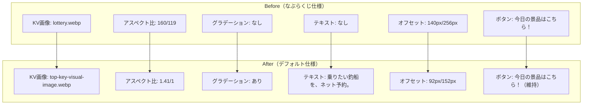

# タスク001：TOPページFVをなぶらくじからデフォルトに戻す

**ステータス:** 未着手
**優先度:** 高
**ブランチ:** `feature/revert-top-fv-to-default`
**壁打ち日:** 2026-01-09

---

## 概要

TOPページのファーストビュー（KV画像）をなぶらくじ仕様からデフォルト仕様に戻す。「今日の景品はこちら！」ボタンは残し、なぶらくじ機能自体は継続する。

---

## 背景

### 現状の問題

- なぶらクジの定着と、リミットを迫る施策ではなくなったため、TOPページのKVを元のデフォルト状態に戻す必要がある
- なぶらくじ機能自体は継続するため、「今日の景品はこちら！」ボタンや関連機能は維持する

### 設計方針（壁打ちで確定）

| 方針 | 説明 |
|------|------|
| **KV画像のみ変更** | なぶらくじ機能は維持し、見た目（KV）のみ元に戻す |
| **ボタン維持** | 「今日の景品はこちら！」ボタンは残してなぶらくじへの導線を維持 |
| **不要ファイル削除** | `lottery.webp` は他で使用されていないため削除 |

---

## 事前調査で把握した既存実装

| ファイル | 内容 | 本タスクとの関連 |
|---------|------|-----------------|
| `src/app/(home)/_components/top-banner-image/index.tsx` | TOPページKV画像コンポーネント | 画像・アスペクト比・グラデーション・テキストを変更 |
| `src/app/(home)/_layouts/position-relative-layout/index.tsx` | 検索フォームの配置レイアウト | オフセット値を変更 |
| `src/app/(home)/_components/search-ship-form/index.tsx` | 検索フォーム（ボタン含む） | 変更なし（ボタン維持） |
| `src/app/(home)/_libs/get-web-banner-ship-interstitial.ts` | なぶらくじボタンのリンク先取得 | 変更なし（ボタンで使用中） |
| `public/images/home/lottery.webp` | なぶらくじKV画像 | 削除対象 |
| `public/images/home/top-key-visual-image.webp` | デフォルトKV画像 | 使用する画像 |

### 関連PR

| PR番号 | タイトル | 備考 |
|--------|---------|------|
| [#2116](https://github.com/anglers/ship_front/pull/2116) | TOP の KV を「ナブラくじ」に変更する | 元の変更PR |
| [#2128](https://github.com/anglers/ship_front/pull/2128) | Revert : TOP の KV を「ナブラくじ」に変更する | リバートPR（未マージ・クローズ済み） |

---

## 変更一覧

### 1. `src/app/(home)/_components/top-banner-image/index.tsx`

**変更内容**: KV画像をデフォルトに戻し、グラデーション・テキストオーバーレイを有効化

```typescript
// Before
import LotteryImageWebp from "/public/images/home/lottery.webp";

const _TopBannerImage = () => {
  return (
    <div className="tw-relative">
      <div className="tw-relative">
        {/* グラデーション: コメントアウト */}
        {/* <div
          className="tw-absolute tw-z-10 tw-w-full tw-h-full"
          style={{
            background: `linear-gradient(331deg, rgba(238, 238, 238, 0.00) 44.42%, rgba(21, 69, 102, 0.25) 64.99%)`,
          }}
        /> */}

        <div className="tw-relative tw-w-full tw-aspect-[160/119]">
          <ImageWithFallback
            src={LotteryImageWebp.src}
            alt="釣船の予約でナブラくじスタート！"
            // ...
          />
        </div>
      </div>

      {/* テキストオーバーレイ: コメントアウト */}
      {/* <section className="tw-absolute tw-z-20 tw-top-[22%] tw-left-[16px]">
        <h1>...</h1>
      </section> */}
    </div>
  );
};

// After
import TopKeyVisualImage from "/public/images/home/top-key-visual-image.webp";

const _TopBannerImage = () => {
  return (
    <div className="tw-relative">
      <div className="tw-relative">
        {/* グラデーション: 有効化 */}
        <div
          className="tw-absolute tw-z-10 tw-w-full tw-h-full"
          style={{
            background: `linear-gradient(331deg, rgba(238, 238, 238, 0.00) 44.42%, rgba(21, 69, 102, 0.25) 64.99%)`,
          }}
        />

        <div className="tw-relative tw-w-full tw-aspect-[1.41/1]">
          <ImageWithFallback
            src={TopKeyVisualImage.src}
            alt="乗りたい釣船を、ネット予約。"
            // ...
          />
        </div>
      </div>

      {/* テキストオーバーレイ: 有効化 */}
      <section className="tw-absolute tw-z-20 tw-top-[22%] tw-left-[16px]">
        <h1
          className="tw-whitespace-pre-wrap tw-font-weight_bold_en tw-text-tuna_1 tw-text-[32px] md:tw-text-[56px]"
          style={{ textShadow: `0px 0px 12px rgba(0, 0, 0, 0.12)` }}
        >{`乗りたい釣船を、\nネット予約。`}</h1>
      </section>
    </div>
  );
};
```

**理由**: KV画像をデフォルト状態に戻すため

---

### 2. `src/app/(home)/_layouts/position-relative-layout/index.tsx`

**変更内容**: オフセット値を元に戻す

```typescript
// Before
const _PositionRelativeLayout = (props: Props) => {
  const { children, className } = props;
  // TODO: tw-bottom-[92px] md:tw-bottom-[152px] に戻す
  return <div className={cn("tw-relative tw-bottom-[140px] md:tw-bottom-[256px] tw-z-30", className)}>{children}</div>;
};

// After
const _PositionRelativeLayout = (props: Props) => {
  const { children, className } = props;
  return <div className={cn("tw-relative tw-bottom-[92px] md:tw-bottom-[152px] tw-z-30", className)}>{children}</div>;
};
```

**理由**: KV画像のアスペクト比が変わるため、検索フォームの配置位置も調整が必要

---

### 3. `public/images/home/lottery.webp`

**変更内容**: ファイルを削除

**理由**: このファイルは `top-banner-image/index.tsx` でのみ使用されており、KV画像変更後は参照がなくなるため

---

## 変更の視覚的イメージ



---

## 実装手順

### Phase 1: KV画像コンポーネントの変更

- [ ] `src/app/(home)/_components/top-banner-image/index.tsx` を編集
  - [ ] import文を `LotteryImageWebp` から `TopKeyVisualImage` に変更
  - [ ] アスペクト比を `tw-aspect-[160/119]` から `tw-aspect-[1.41/1]` に変更
  - [ ] `alt` 属性を「乗りたい釣船を、ネット予約。」に変更
  - [ ] グラデーションのコメントアウトを解除
  - [ ] テキストオーバーレイのコメントアウトを解除
  - [ ] TODOコメントを削除

### Phase 2: レイアウト調整

- [ ] `src/app/(home)/_layouts/position-relative-layout/index.tsx` を編集
  - [ ] オフセット値を `tw-bottom-[92px] md:tw-bottom-[152px]` に変更
  - [ ] TODOコメントを削除

### Phase 3: 不要ファイル削除

- [ ] `public/images/home/lottery.webp` を削除

### Phase 4: 動作確認

- [ ] `npm run ts:test` で型エラーがないことを確認
- [ ] `npm run dev:stg` でローカル起動し、TOPページのFVを目視確認
  - [ ] KV画像がデフォルト画像に変わっていること
  - [ ] グラデーションが表示されていること
  - [ ] 「乗りたい釣船を、ネット予約。」テキストが表示されていること
  - [ ] 「今日の景品はこちら！」ボタンが表示されていること
  - [ ] 検索フォームの位置が適切であること

---

## 関連ファイル

### 変更対象

| ファイル | 変更内容 |
|---------|----------|
| `src/app/(home)/_components/top-banner-image/index.tsx` | KV画像・アスペクト比・グラデーション・テキストを変更 |
| `src/app/(home)/_layouts/position-relative-layout/index.tsx` | オフセット値を変更 |

### 削除対象

| ファイル | 説明 |
|---------|------|
| `public/images/home/lottery.webp` | 使用されなくなるKV画像 |

### 変更なし（参照のみ）

| ファイル | 参照理由 |
|---------|----------|
| `src/app/(home)/_components/search-ship-form/index.tsx` | ボタン維持の確認 |
| `src/app/(home)/_libs/get-web-banner-ship-interstitial.ts` | ボタンで使用中のため変更なし |
| `src/common/constants/ga4-id.ts` | `GA4_CLICK_FV_LOTTERY_PRIZE` はボタンで使用中のため変更なし |
| `public/images/home/top-key-visual-image.webp` | 使用する画像（既存） |

---

## 確認事項

- [ ] TypeScriptエラー: 0件（`npm run ts:test`）
- [ ] 動作確認:
  - [ ] KV画像がデフォルトに変更されている
  - [ ] グラデーションが表示されている
  - [ ] テキスト「乗りたい釣船を、ネット予約。」が表示されている
  - [ ] 「今日の景品はこちら！」ボタンが正常に動作する
  - [ ] 検索フォームの位置が適切

---

## 注意事項

- 「今日の景品はこちら！」ボタンは残すこと。なぶらくじ機能自体は継続するため、ボタンや関連のAPI呼び出し・GA4イベントIDは削除しない
- PR #2128 の差分を参考にできるが、ボタン関連の変更は含めないこと

---

## 壁打ち決定事項サマリー

### 質問と回答一覧

| # | 質問 | 決定 |
|---|------|------|
| 1 | lottery.webp 画像ファイルの扱い | 削除する（他で使用されていないため） |
| 2 | 「今日の景品はこちら！」ボタンの扱い | 残す（なぶらくじ機能は継続） |
| 3 | get-web-banner-ship-interstitial.ts の扱い | 残す（ボタンで使用中） |
| 4 | GA4_CLICK_FV_LOTTERY_PRIZE の扱い | 残す（ボタンで使用中） |

### 保留事項

なし
