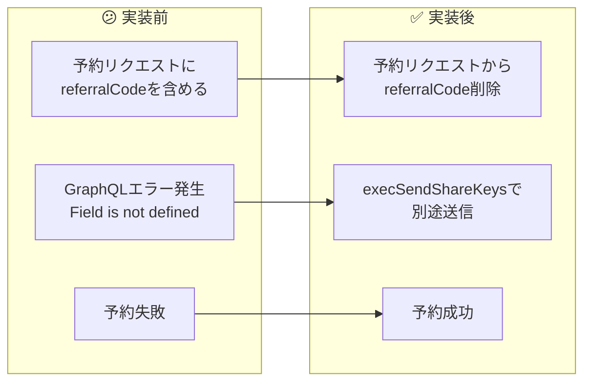
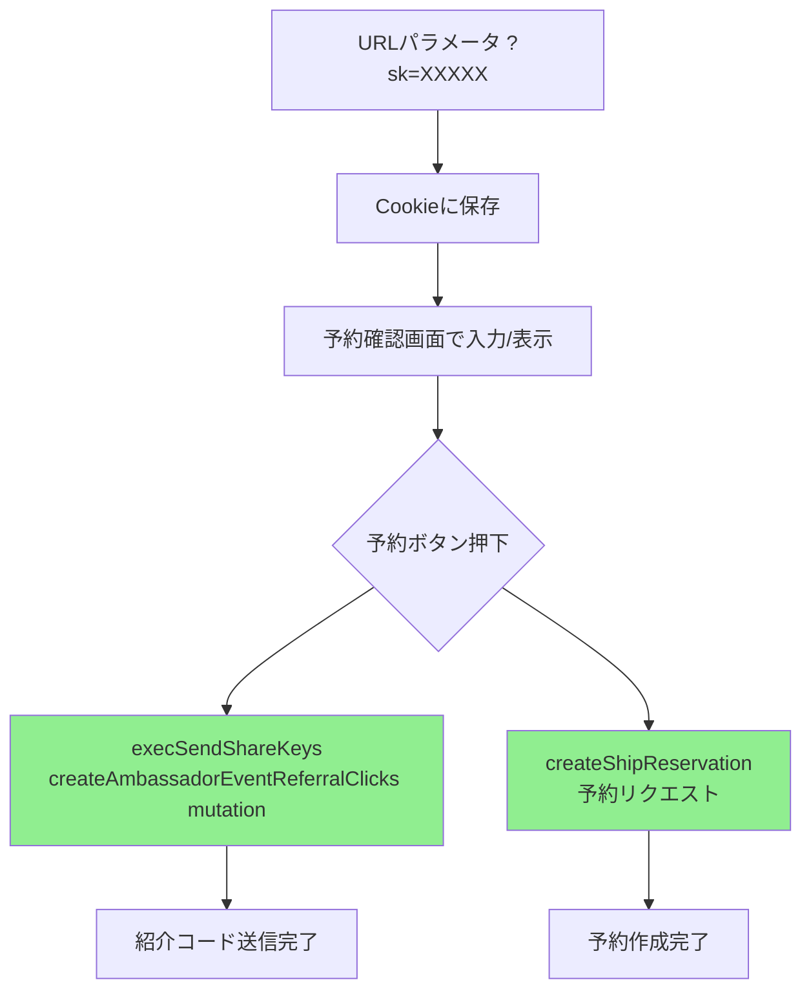
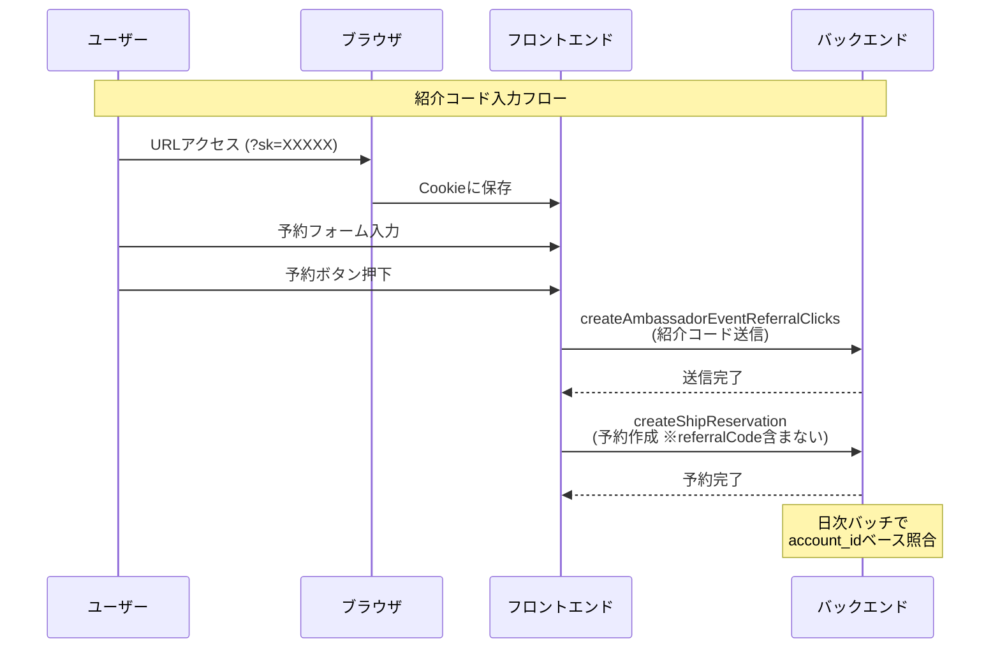

# タスク005：予約失敗エラーの修正（referralCodeフィールド削除）

**プロジェクト:** ShipFront
**ステータス:** ✅ 完了
**完了日:** 2026-01-20
**ブランチ:** feature/reservation-referral-code

---

## 概要

予約確認画面で「予約に失敗しました」エラーが発生する問題を修正。原因は予約リクエストに不要な `referralCode` フィールドを含めていたこと。

---

## 実装前 → 実装後



---

## 原因分析

### GraphQLエラー内容

```json
{
  "message": "Variable $input ... was provided invalid value for params.referralCode
              (Field is not defined on Types_Inputs__ShipReservationType)",
  "problems": [{
    "path": ["params", "referralCode"],
    "explanation": "Field is not defined on Types_Inputs__ShipReservationType"
  }]
}
```

### 紹介コードの正しい送信フロー



**ポイント**:
- 紹介コードは `execSendShareKeys` で別途送信される
- 予約API (`createShipReservation`) には紹介コードを含めてはいけない
- バックエンドで日次バッチにより account_id ベースで照合・スコア付与される

---

## 実装内容

### 1. transformers/index.ts から referralCode を削除

**変更前:**
```typescript
return {
  // ...
  inquiry: createStorageResult.inquiry ?? null,
  consumePoints: createStorageResult.consumePoints ?? null,
  referralCode: createStorageResult.referralCode ?? null, // ❌ 不要
};
```

**変更後:**
```typescript
return {
  // ...
  inquiry: createStorageResult.inquiry ?? null,
  consumePoints: createStorageResult.consumePoints ?? null,
  // referralCode は execSendShareKeys で別途送信するため、ここでは送信しない
};
```

### 2. types/request.ts から referralCode プロパティを削除

**変更前:**
```typescript
export type CreateReservationRequest = {
  // ...
  consumePoints: number | null;
  /** 紹介コード */
  referralCode: string | null;  // ❌ 不要
};
```

**変更後:**
```typescript
export type CreateReservationRequest = {
  // ...
  consumePoints: number | null;
  // referralCode は execSendShareKeys で別途送信するため、予約リクエストには含めない
};
```

### 3. テストファイルの修正

テストデータからも `referralCode` を削除。

---

## 変更ファイル一覧

| ファイル | 変更種別 | 変更内容 |
|---------|---------|----------|
| `src/features/reserve/hooks/use-create-ship-reservation/transformers/index.ts` | 修正 | `referralCode` フィールドを削除 |
| `src/features/reserve/hooks/use-create-ship-reservation/types/request.ts` | 修正 | `referralCode` プロパティを削除 |
| `src/features/reserve/hooks/use-create-ship-reservation/__tests__/error-handlers.test.ts` | 修正 | テストデータから `referralCode` を削除（2箇所） |

---

## 紹介コード機能の全体フロー（参考）



---

## 動作確認

- [x] TypeScript型チェック通過 (`npm run ts:test`)
- [ ] 紹介コードなしで予約が成功することを確認（ブラウザ確認待ち）
- [ ] 紹介コード入力ありで予約が成功することを確認（ブラウザ確認待ち）
- [ ] 予約完了画面に遷移することを確認（ブラウザ確認待ち）

---

## 学び・メモ

- GraphQLのバックエンド型定義に存在しないフィールドを送信するとエラーになる
- 紹介コードのような補助的な情報は、メインのAPIとは別のmutationで送信するアーキテクチャになっている場合がある
- 機能追加時は、既存のデータフローを十分に理解してから実装することが重要
