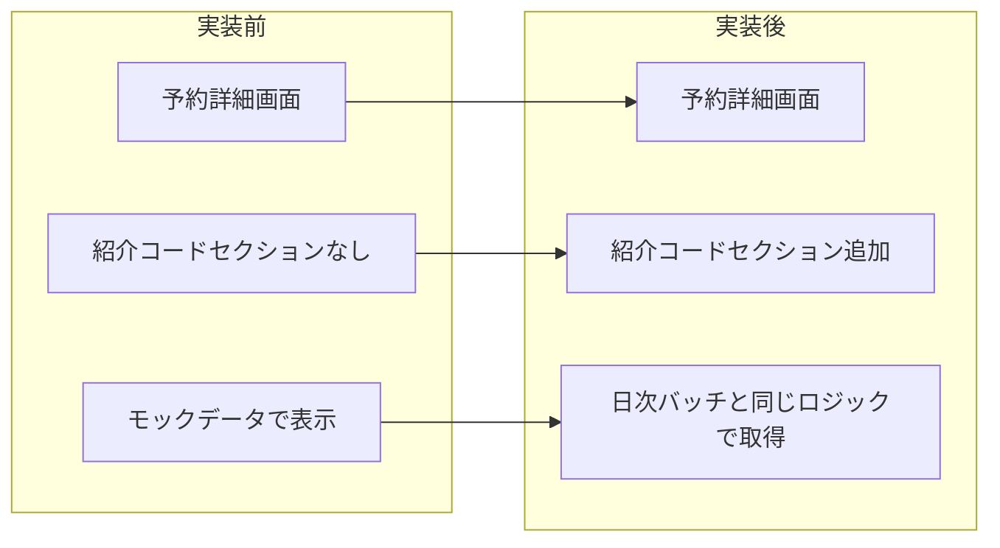
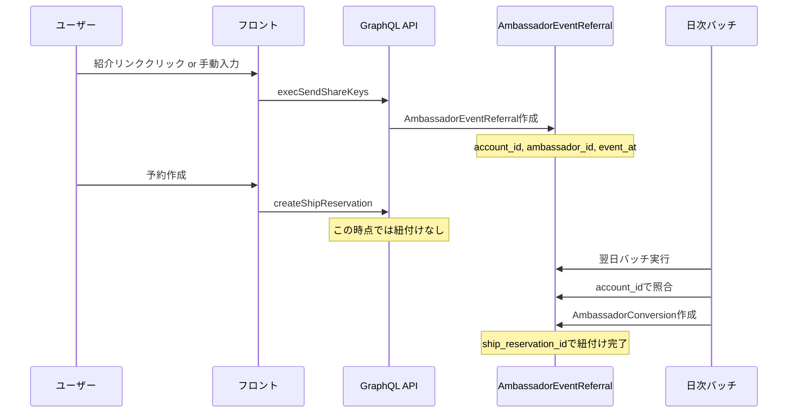
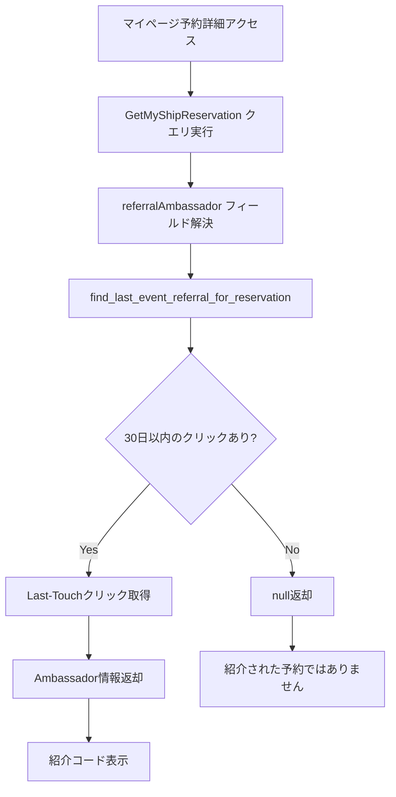
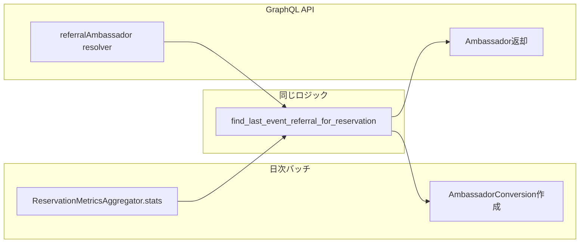

# タスク006：マイページ予約詳細に紹介コード表示機能追加

**プロジェクト:** ShipFront + Core
**ステータス:** 🚧 実装完了（codegen待ち）
**完了日:** 2026-01-21
**ブランチ:** feature/reservation-referral-code

---

## 概要

マイページの予約詳細画面に紹介コード（紹介者情報）を表示する機能を追加。日次バッチと同じロジックを使用することで、スコア計算との整合性を保証。

---

## 実装前 → 実装後



---

## 背景・設計検討

### 紹介コード機能の現状フロー



### 設計の選択肢と決定

| 選択肢 | 説明 | 採用 |
|--------|------|------|
| A: ShipReservationにカラム追加 | referral_code, referral_ambassador_id等を追加 | ❌ |
| B: 既存のAmbassadorConversion活用 | 日次バッチ後に参照 | ❌ |
| **C: 日次バッチと同じロジックを即座に実行** | find_last_event_referral_for_reservation | ✅ |

**決定理由:**
- DBカラム追加不要でシンプル
- 日次バッチと完全に同じロジックなのでスコア計算と整合性が取れる
- 即座に紹介者情報を表示可能

---

## 実装内容

### 1. Core: GraphQL Model型に referralAmbassador フィールド追加

**ファイル:** `core/app/graphql/types/models/ship_reservation_type.rb`

```ruby
field :referral_ambassador, Types::Models::AmbassadorType, null: true,
      description: '紹介者アンバサダー（日次バッチと同じロジックで取得）'

def referral_ambassador
  # 日次バッチと同じロジックを使用して紹介者を取得
  event_referral = AmbassadorEventReferral::ReservationMetricsAggregator
                     .find_last_event_referral_for_reservation(object)
  event_referral&.ambassador
end
```

**ポイント:**
- `ReservationMetricsAggregator.find_last_event_referral_for_reservation` は日次バッチで使用されているメソッド
- Last-Touch方式で、予約作成日から30日以内の最新クリックを取得
- スコア計算と完全に同じロジックなので整合性が保証される

### 2. Front: GraphQLクエリに referralAmbassador 追加

**ファイル:** `ship_front/src/apis/my/reservation/get-my-ship-reervation.gql`

```graphql
# 紹介者アンバサダー（日次バッチと同じロジックで取得）
referralAmbassador {
  id
  shareKey
  account {
    id
    nicknm
  }
}
```

### 3. Front: ReferralCodeSection コンポーネント作成

**ファイル:** `ship_front/src/app/my/reservations/[reservationId]/_components/reserve-content/reserve-detail/components/referral-code-section/index.tsx`

```tsx
import { memo } from "react";
import { ReservationSectionLayout } from "@/components/layouts/reservation-section-layout";
import { Separator } from "@/components/ui/separator";
import { SectionEmpty } from "../common/section-empty";

type Props = {
  referralAmbassador?: {
    id: string;
    shareKey: string;
    account: {
      id: string;
      nicknm?: string | null;
    };
  } | null;
};

const _ReferralCodeSection = (props: Props) => {
  const { referralAmbassador } = props;

  return (
    <>
      <Separator orientation="horizontal" className="tw-h-[24px] tw-bg-tuna_2" />
      <ReservationSectionLayout iconName="gift" sectionTitle="紹介コード" changeButtonElement={null}>
        {referralAmbassador ? (
          <p className="tw-text-tuna_7 tw-text-fz_3/lh_2 md:tw-text-fz_3_px/lh_2">
            {referralAmbassador.shareKey}
          </p>
        ) : (
          <SectionEmpty emptyText="紹介された予約ではありません" />
        )}
      </ReservationSectionLayout>
    </>
  );
};

export const ReferralCodeSection = memo(_ReferralCodeSection);
```

### 4. Front: ReserveDetailに組み込み

**ファイル:** `ship_front/src/app/my/reservations/[reservationId]/_components/reserve-content/reserve-detail/index.tsx`

```tsx
import { ReferralCodeSection } from "./components/referral-code-section";

// ... 省略 ...

<FeedbackSection inquiry={data.myShipReservation.inquiry} />

<ReferralCodeSection referralAmbassador={data.myShipReservation.referralAmbassador} />

<ReservationHolderInfoSection />
```

---

## 変更ファイル一覧

| ファイル | 変更種別 | 変更内容 |
|---------|---------|----------|
| `core/app/graphql/types/models/ship_reservation_type.rb` | 修正 | referralAmbassador フィールド追加 |
| `ship_front/src/apis/my/reservation/get-my-ship-reervation.gql` | 修正 | referralAmbassador クエリ追加 |
| `ship_front/.../referral-code-section/index.tsx` | **新規** | 紹介コードセクションコンポーネント |
| `ship_front/.../reserve-detail/index.tsx` | 修正 | ReferralCodeSection 組み込み |

---

## 処理フロー

### 紹介者情報取得フロー



### 日次バッチとの整合性



---

## 表示仕様

### 紹介者がいる場合

```
┌─────────────────────────────────────┐
│ 🎁 紹介コード                        │
├─────────────────────────────────────┤
│ t4iol7                              │
└─────────────────────────────────────┘
```

### 紹介者がいない場合

```
┌─────────────────────────────────────┐
│ 🎁 紹介コード                        │
├─────────────────────────────────────┤
│ 紹介された予約ではありません           │
└─────────────────────────────────────┘
```

---

## 今後の作業（TODO）

### 必須

- [ ] **Coreサーバー起動してcodegen実行**
  ```bash
  # Coreを起動した状態で
  cd /Users/anno/Downloads/anglers/ship_front
  GRAPHQL_ENDPOINT=http://localhost:3000/graphql npm run codegen
  ```
- [ ] TypeScript型エラーの解消確認
- [ ] 動作確認（http://localhost:3001/my/reservations/[id]）

### オプション

- [ ] N+1問題の対策（予約一覧で使う場合はDataLoader検討）
- [ ] キャンセル予約での表示仕様確定

---

## 設計上の考慮事項

### エッジケース対応

| ケース | 挙動 | 備考 |
|--------|------|------|
| execSendShareKeys失敗後の予約 | 紹介者表示されない | 現状許容 |
| 30日経過後 | 紹介者表示されない | 日次バッチと同じ |
| 複数アンバサダーのクリック | Last-Touch（最新）採用 | 日次バッチと同じ |
| 自己送客 | 紹介者表示されない | CreateClick時点で弾かれる |
| 船が違う予約 | 紹介者表示される | account_idベースのため |

### 「船が違う問題」について

現状の仕様では `account_id` のみで照合するため、以下のケースが発生する：

1. アンバサダーAの船Xのリンクをクリック
2. 予約せずに離脱
3. 後日、自分で船Yを検索して予約
4. → アンバサダーAが紹介者として表示される

これは日次バッチのスコア計算と同じ挙動のため、整合性は取れている。

---

## 参考リンク

- 日次バッチロジック: `core/lib/ambassador_event_referral/reservation_metrics_aggregator.rb`
- Ambassador型: `core/app/graphql/types/models/ambassador_type.rb`
- 既存セクションコンポーネント例: `ship_front/.../feedback-section/index.tsx`
