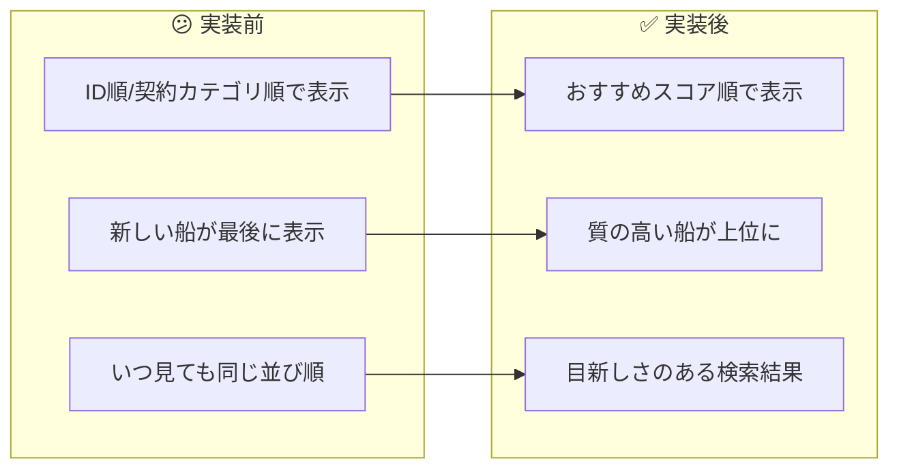
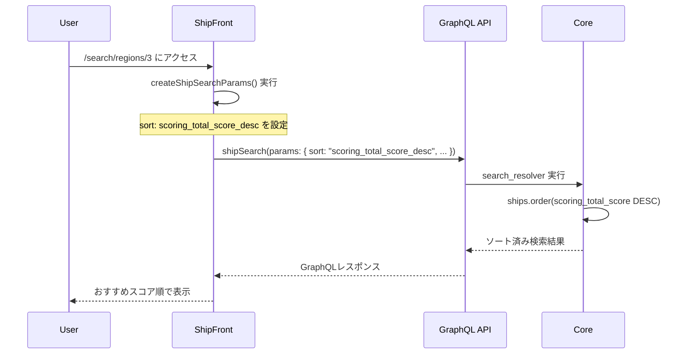

# タスク002：search/のソートをおすすめスコア順にする

**プロジェクト:** ShipFront
**ステータス:** ✅ 完了
**完了日:** 2026-01-13
**ブランチ:** `feature/search-default-sort-by-scoring`

---

## 概要

検索結果一覧（`/search/regions/3`など）のデフォルトソート順を、ID順（契約カテゴリ順）から「おすすめスコア順」に変更した。

---

## 実装前 → 実装後



---

## 実装内容

### 1. GraphQL検索パラメータにsortを追加

**何をしたか**: `createShipSearchParams`関数のreturnオブジェクトに`sort`パラメータを追加

```typescript
// src/features/search/lib/create-ship-search-params/index.ts

import {
  Types_Enums_Ship__SearchSortEnum,
  Types_Enums_ShipReservationPlan__ReservationCategoryEnum,
} from "@/common/libs/graphql/graphql";
import { formatTZISO } from "@/common/utils/format-date";

import type { ParamsInSearchPage, SearchParamsInSearchPage } from "@/features/search";

// ... 中略 ...

return {
  // params
  regionId: regionId,
  prefectureId: prefectureId,
  // ... 他のパラメータ ...
  reservationCategory: convertReservationCategory(reservationCategory),
  sort: Types_Enums_Ship__SearchSortEnum.ScoringTotalScoreDesc,  // 追加
};
```

**ポイント**:
- サーバー側（Core）は既に`scoring_total_score_desc`ソートを実装済み
- フロント側でパラメータを明示的に指定するだけで動作する

---

## 変更ファイル一覧

| ファイル | 変更種別 | 変更内容 |
|---------|---------|----------|
| `src/features/search/lib/create-ship-search-params/index.ts` | 修正 | `sort`パラメータを追加、import順序調整 |

---

## 処理フロー



---

## 発生した問題と解決

### 問題1: Prettierフォーマットエラー

**状況**: コード変更後、`npm run prettier:test`でフォーマットエラーが発生

**解決**: `npm run prettier -- --write`でフォーマットを自動修正

### 問題2: ESLint import順序エラー

**状況**: `@/features/search`のimportが`@/common/`系より前にあり、`import/order`エラーが発生

```
Error: `@/features/search` type import should occur after import of `@/common/utils/format-date`
```

**解決**: import順序を修正（`@/common/`系を先に、`@/features/`系を後に配置）

```typescript
// Before（エラー）
import type { ... } from "@/features/search";
import { ... } from "@/common/libs/graphql/graphql";

// After（修正後）
import { ... } from "@/common/libs/graphql/graphql";
import { formatTZISO } from "@/common/utils/format-date";
import type { ... } from "@/features/search";
```

---

## 動作確認

- [x] TypeScript型チェック（`npm run ts:test`）
- [x] ESLintチェック（`npm run lint:error`）
- [x] Prettierチェック（`npm run prettier:test`）

### 動作確認方法

1. `npm run dev:stg`で開発サーバー起動
2. `http://localhost:3001/search/regions/3?reservationCategory=instant`にアクセス
3. DevToolsのNetworkタブでGraphQLリクエストを確認
4. `sort: "scoring_total_score_desc"`が含まれていることを確認

---

## 関連情報

### サーバー側実装（参照のみ）

| ファイル | 内容 |
|---------|------|
| `core/app/graphql/resolvers/ships/search_resolver.rb:161-162` | `scoring_total_score_desc`ソート実装 |

### GraphQL型定義

```typescript
// src/common/libs/graphql/graphql.ts

export enum Types_Enums_Ship__SearchSortEnum {
  /** おすすめスコアの降順 */
  ScoringTotalScoreDesc = 'scoring_total_score_desc',
  /** 掲載が新しい順 */
  // ... 他のソートオプション
}
```
