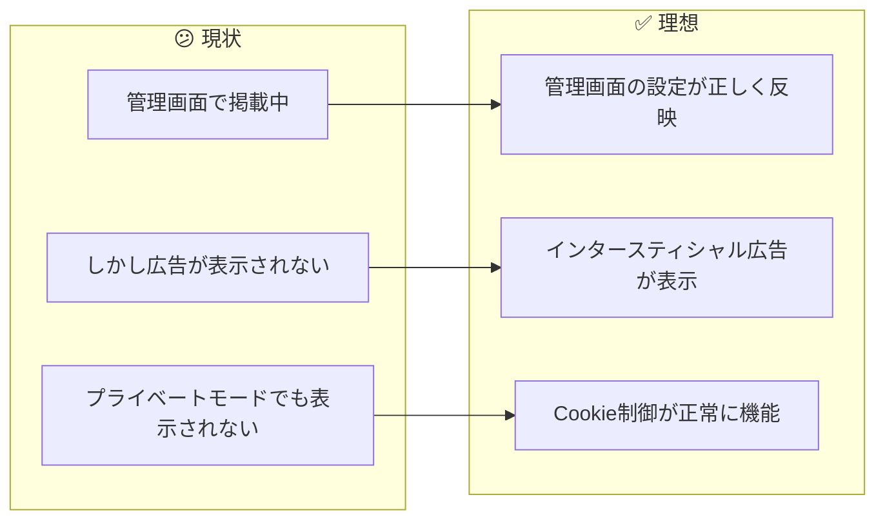
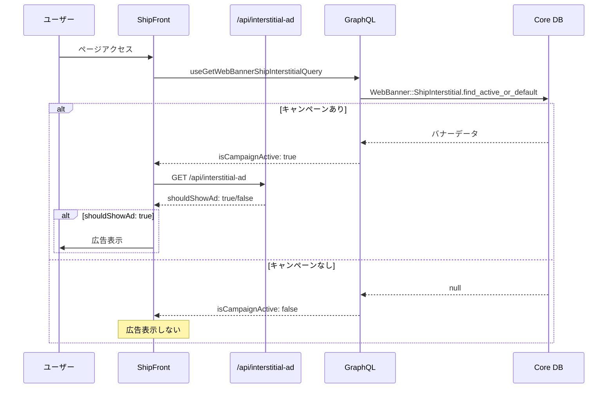
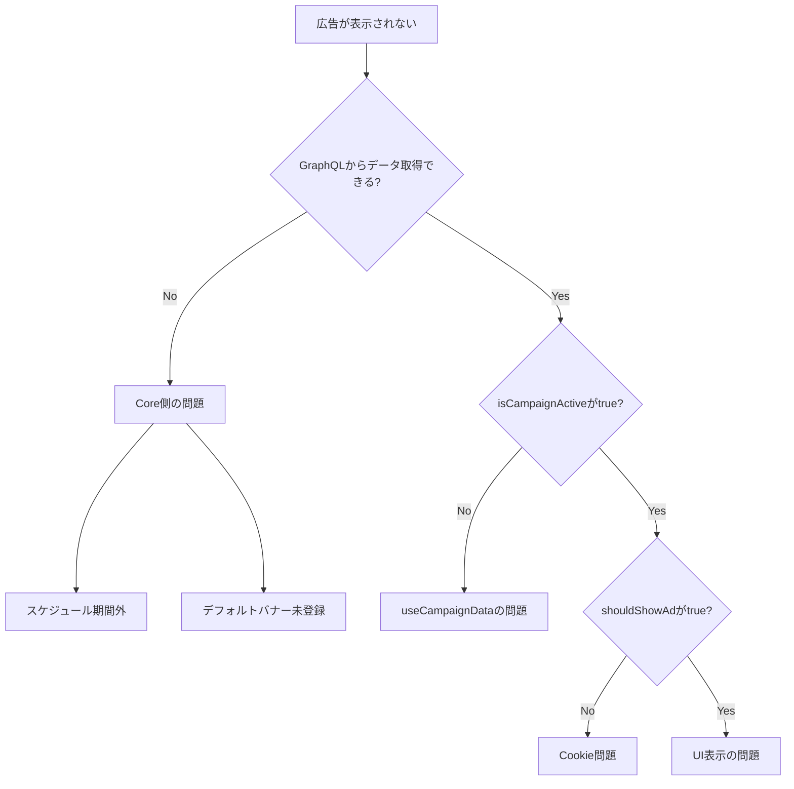

# タスク003：インタースティシャル広告が表示されない問題の調査（ShipFront）

**プロジェクト:** ShipFront / Core
**ステータス:** 調査完了
**優先度:** 高
**ブランチ:** `fix/interstitial-ad-not-displayed`
**壁打ち日:** 2026-01-13

---

## 概要

釣船予約サイト（ship_front）でインタースティシャル広告が表示されなくなっている問題を調査・修正する。

---

## 背景

### 現状 → 理想の変化



---

## 調査結果

### 処理フロー図



### 関連ファイル

| ファイル | 役割 |
|---------|------|
| `ship_front/src/components/ui-elements/interstitial-ad/index.tsx` | 広告表示コンポーネント |
| `ship_front/src/components/ui-elements/interstitial-ad/use-interstitial-ad.ts` | 表示制御hook |
| `ship_front/src/features/campaign/hooks/use-campaign-data/index.ts` | キャンペーンデータ取得 |
| `ship_front/src/app/api/interstitial-ad/route.ts` | Cookie制御API |
| `core/app/models/web_banner.rb` | バナー基底モデル |
| `core/app/models/web_banner/ship_interstitial.rb` | Ship用バナーモデル |
| `core/app/graphql/resolvers/web_banner_ship_interstitial_resolver.rb` | GraphQLリゾルバ |

---

## 問題の特定

### 根本原因の可能性



### 調査ポイント

#### 1. Core側：`find_active_or_default`メソッド

```ruby
# core/app/models/web_banner.rb:27-29
def self.find_active_or_default
  scheduled.first || default_banners.first
end

# scheduled スコープ
scope :scheduled, -> { where('start_at <= ? AND end_at >= ?', Time.current, Time.current) }

# default_banners スコープ
scope :default_banners, -> { where(start_at: nil, end_at: nil) }
```

**確認事項：**
- [ ] `WebBanner::ShipInterstitial.scheduled.count` → 0の場合、期間内キャンペーンがない
- [ ] `WebBanner::ShipInterstitial.default_banners.count` → 0の場合、デフォルトバナーがない
- [ ] `WebBanner::ShipInterstitial.find_active_or_default` → nilの場合、GraphQLがnullを返す

#### 2. ShipFront側：`useCampaignData`

```typescript
// use-campaign-data/index.ts:31-36
if (loading || error || !data?.webBannerShipInterstitial) {
  return {
    ...defaultData,  // isCampaignActive: false
    loading,
    error,
  };
}
```

GraphQLから`null`が返ると`isCampaignActive: false`となり、広告は表示されない。

#### 3. Cookie制御：`/api/interstitial-ad`

```typescript
// route.ts:52-62 GET
const cookieValue = getCookieValue(INTERSTITIAL_AD_CONFIG.COOKIE_NAME);
const shouldShowAd = !cookieValue;  // hideInterstitialAd Cookieがなければ表示
```

プライベートモードでも表示されないということは、Cookieの問題ではない可能性が高い。

---

## 確認手順

### 1. Rails consoleでの確認（Core側）

```ruby
# ステージング環境で実行
rails c

# 現在のShipInterstitialバナーを確認
WebBanner::ShipInterstitial.all

# スケジュール中のバナーを確認
WebBanner::ShipInterstitial.scheduled

# デフォルトバナーを確認
WebBanner::ShipInterstitial.default_banners

# find_active_or_defaultの結果を確認
WebBanner::ShipInterstitial.find_active_or_default
```

### 2. GraphQL Playgroundでの確認

```graphql
query {
  webBannerShipInterstitial {
    id
    name
    url
    desktopImage
    startAt
    endAt
  }
}
```

**期待結果：** nullではなくバナーデータが返る

### 3. ブラウザでの確認

1. DevToolsを開く
2. Networkタブで `graphql` リクエストを確認
3. `webBannerShipInterstitial` の戻り値を確認
4. `/api/interstitial-ad` のGETリクエストが発火しているか確認

---

## 想定される修正パターン

### パターン A: キャンペーン期間の問題

**状況：** キャンペーンが終了しており、デフォルトバナーもない

**修正：**
1. 管理画面で新しいキャンペーンを作成
2. または、デフォルトバナー（start_at, end_atがnull）を登録

### パターン B: デフォルトバナーの登録

**状況：** スケジュールされたキャンペーンがない期間でも広告を表示したい

**修正：** デフォルトバナーを登録

```ruby
# Rails consoleで実行
WebBanner::ShipInterstitial.create!(
  name: "デフォルトインタースティシャル広告",
  url: "https://ships.anglers.jp/coupons",
  desktop_image: [アップロードした画像],
  start_at: nil,
  end_at: nil
)
```

### パターン C: フロント側のフォールバック

**状況：** サーバー側の問題だが、フロント側でも対応したい

**修正案（推奨しない）：**

```typescript
// use-campaign-data/index.ts
// デフォルトの広告を設定（ただしサーバー側で管理すべき）
const defaultFallback = {
  imageSrc: "/images/default-interstitial.png",
  clickUrl: "https://ships.anglers.jp/coupons",
};
```

---

## 結論

### 最有力仮説

**管理画面では「掲載中」表示だが、実際には期間が終了しているか、`ShipInterstitial`タイプのデフォルトバナーが登録されていない。**

### 確認依頼事項

1. ステージング環境のRails consoleで `WebBanner::ShipInterstitial.find_active_or_default` を実行し、結果を確認
2. 管理画面で `ShipInterstitial` タイプのバナーの `start_at` と `end_at` を確認
3. 必要に応じてデフォルトバナーを登録

---

## 補足：campaign-config.tsについて

`ship_front/src/features/campaign/constants/campaign-config.ts` のキャンペーン期間は **2025年11月23日** で終了している。

```typescript
// 最後のキャンペーン
{
  text: "乗船料分のポイントが当たる！",
  start: "2025-11-17T00:00:00+09:00",
  end: "2025-11-23T23:59:59+09:00",
}
```

ただし、これはラベルテキスト用であり、インタースティシャル広告の表示自体には直接影響しない（GraphQLからのデータで制御）。

もし `getActiveCampaign()` がラベルにも使われているなら、こちらも更新が必要。

---

## 次のアクション

| アクション | 担当 | 優先度 |
|-----------|------|--------|
| Rails consoleでのデータ確認 | 開発者 | 高 |
| 管理画面でのバナー設定確認 | 運用担当 | 高 |
| デフォルトバナーの登録検討 | 運用担当 | 中 |
| campaign-config.ts更新（必要に応じて） | 開発者 | 低 |
