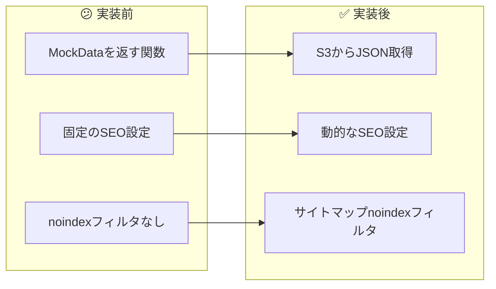
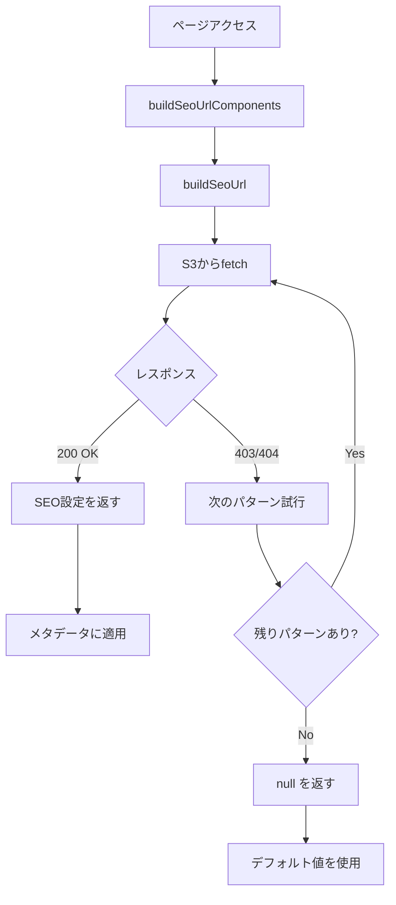

# タスク004：SEOオーバーライド機能 S3 API連携版

**プロジェクト:** ShipFront
**ステータス:** ✅ 完了
**完了日:** 2026-01-16
**ブランチ:** feature/search-metadata

---

## 概要

検索ページのSEO設定（title, description, h1, noindex）をS3から取得し、メタデータに反映する機能を実装。MockDataを返していた `getSeoOverrides()` をS3 APIからデータを取得する方式に差し替えた。

---

## 実装前 → 実装後



---

## 実装内容

### 1. 環境変数追加

**何をしたか**: S3バケットのベースURLを環境変数として追加

```javascript
// env/next-dev/staging.js
SEO_UPLOADS_BASE_URL: "https://seo-uploads-staging1.s3.ap-northeast-1.amazonaws.com/seo_settings",
```

**ポイント**: staging/developmentの両環境に追加

### 2. 型定義の追加

**何をしたか**: S3から取得するJSONの型定義を追加

```typescript
// src/app/search/_types/seo-override.ts
export type S3SeoSettingResponse = {
  composite_key: string;
  location: {
    type: "region" | "prefecture" | "area" | "marine_facility" | null;
    id: number | null;
  };
  fishing_target: {
    type: "fish" | "fishingmethod" | null;
    id: number | null;
  };
  ship_reservation_tag_id: number | null;
  title: string | null;
  description: string | null;
  h1: string | null;
  noindex: boolean;
  updated_at: string;
};
```

### 3. URL構築関数の作成

**何をしたか**: ページパラメータからS3のファイルURLを構築する関数を作成

```typescript
// src/app/search/_lib/get-seo-overrides/build-seo-url.ts
export function buildSeoUrlComponents(
  params: ParamsInSearchPage,
  searchParams?: Pick<SearchParamsInSearchPage, "tags">,
): SeoUrlComponents {
  // location優先順位: marineFacility > area > prefecture > region
  // fishing_target優先順位: fish > fishingMethod
}

export function buildSeoUrl(components: SeoUrlComponents): string {
  // 命名規則: location_type=X__location_id=Y__fishing_target_type=Z__fishing_target_id=W__ship_reservation_tag_id=V.json
}
```

**ポイント**: Core側の `composite_key` 生成ロジックと一致させる

### 4. S3からSEO設定を取得する関数

**何をしたか**: S3からJSONを取得する関数を実装

```typescript
// src/app/search/_lib/get-seo-overrides/index.ts
export async function getSeoOverride(
  params: ParamsInSearchPage,
  searchParams?: Pick<SearchParamsInSearchPage, "tags">,
): Promise<S3SeoSettingResponse | null> {
  const components = buildSeoUrlComponents(params, searchParams);
  const baseUrl = buildSeoUrl(components);

  // 暫定対応: 複数パターンを試行（サフィックスなし → (2) → (3)）
  const urlPatterns = [
    baseUrl,
    baseUrl.replace(".json", "(2).json"),
    baseUrl.replace(".json", "(3).json"),
  ];

  for (const url of urlPatterns) {
    const response = await fetch(url, { cache: "default" });
    if (response.ok) {
      return await response.json();
    }
  }
  return null;
}
```

**ポイント**:
- 404/403は正常系（SEO設定なし）
- HTTPキャッシュを使用（`cache: "default"`）
- 暫定対応として複数パターン試行

### 5. メタデータ生成の更新

**何をしたか**: `generateSearchBaseMetadata` と `getH1Override` でS3設定を適用

```typescript
// src/app/search/_lib/generate-search-base-metadata/index.ts
const seoSetting = await getSeoOverride(params, searchParams);

const title = seoSetting?.title ?? defaultTitle;
const description = seoSetting?.description ?? defaultDescription;
const enabledNoindex = seoSetting?.noindex === true || searchData.shipSearch.pagenateInfo.totalCount === 0;
```

### 6. サイトマップのnoindexフィルタ追加

**何をしたか**: 8つのサイトマップにnoindexフィルタを追加

```typescript
// 例: src/app/seo/search/fishes/sitemap.ts
const fishesWithSeoCheck = await Promise.all(
  fishList.map(async (fish) => {
    const seoSetting = await getSeoOverride({ fishId: String(fish.id) });
    return seoSetting?.noindex === true ? null : fish;
  }),
);
const indexableFishes = fishesWithSeoCheck.filter(isNonNullable);
```

---

## 変更ファイル一覧

| ファイル | 変更種別 | 変更内容 |
|---------|---------|----------|
| `env/next-dev/staging.js` | 修正 | `SEO_UPLOADS_BASE_URL` 追加 |
| `env/next-dev/development.js` | 修正 | `SEO_UPLOADS_BASE_URL` 追加 |
| `src/common/types/env.d.ts` | 修正 | 環境変数の型定義追加 |
| `src/app/search/_types/seo-override.ts` | 修正 | S3レスポンス型に差し替え |
| `src/app/search/_lib/get-seo-overrides/build-seo-url.ts` | 新規 | URL構築関数 |
| `src/app/search/_lib/get-seo-overrides/index.ts` | 修正 | S3取得ロジックに差し替え |
| `src/app/search/_lib/generate-search-base-metadata/index.ts` | 修正 | SEOオーバーライド適用 |
| `src/app/search/_commons/components/search-main-content.tsx` | 修正 | searchParams追加 |
| `src/app/seo/search/areas/sitemap.ts` | 修正 | noindexフィルタ追加 |
| `src/app/seo/search/area/sitemap.ts` | 修正 | noindexフィルタ追加 |
| `src/app/seo/search/fishes/sitemap.ts` | 修正 | noindexフィルタ追加 |
| `src/app/seo/search/methods/sitemap.ts` | 修正 | noindexフィルタ追加 |
| `src/app/seo/search/regions/sitemap.ts` | 修正 | noindexフィルタ追加 |
| `src/app/seo/search/region/sitemap.ts` | 修正 | noindexフィルタ追加 |
| `src/app/seo/search/region-fishes/sitemap.ts` | 修正 | noindexフィルタ追加 |
| `src/app/seo/search/region-methods/sitemap.ts` | 修正 | noindexフィルタ追加 |
| `src/app/search/_lib/get-seo-overrides/mock-data.ts` | 削除 | 不要 |
| `src/app/search/_lib/resolve-override-type/` | 削除 | 不要 |

---

## 処理フロー



---

## 発生した問題と解決

### 問題1: S3ファイル名の不一致

**状況**: S3へのアクセスで403 Forbiddenが返る。調査の結果、Core側でS3にアップロードされるファイル名に `(2)` などのサフィックスが付いていることが判明。

- 期待するファイル名: `...ship_reservation_tag_id=none.json`
- 実際のファイル名: `...ship_reservation_tag_id=none(2).json`

**解決**: ship_front側で複数URLパターン（サフィックスなし → (2) → (3)）を順番に試行する暫定対応を実装。

```typescript
const urlPatterns = [
  baseUrl,
  baseUrl.replace(".json", "(2).json"),
  baseUrl.replace(".json", "(3).json"),
];
```

### 問題2: ESLint import/orderエラー

**状況**: `import type { MetadataRoute } from "next"` の位置でESLintエラー

**解決**: ESLint設定の `groups` 順序（`["builtin", "external", "internal", "index", "type", ...]`）に従い、`internal`（`@/`）を先に、`type`を後に配置

```typescript
import { getSeoOverride } from "@/app/search/_lib/get-seo-overrides";
import { getFishes } from "@/common/apis/get-fishes";
import { isNonNullable } from "@/common/types/is-non-nullable";

import type { MetadataRoute } from "next";
```

---

## 動作確認

- [x] `/search/regions/2/prefectures/4/methods/2` でtitle=`あいうえお`、h1=`１２` が反映
- [x] `/search/regions/3/prefectures/13/methods/4` でnoindex=trueが反映
- [x] S3から正常にデータ取得（`(2).json` パターン）
- [x] `npm run ts:test` パス
- [x] `npm run lint:error` パス
- [x] `npm run prettier:test` パス

---

## 今後の課題・TODO

- [ ] Core側でS3ファイル名を `composite_key.json` に統一する修正を依頼
- [ ] Core修正後、ship_front側の暫定対応（複数パターン試行）を削除
- [ ] 本番環境用S3 URLへの差し替え（`SEO_UPLOADS_BASE_URL`）
- [ ] デバッグログの削除

---

## 学び・メモ

- S3バケットへのアクセスはサーバーサイドで実行されるため、ブラウザのNetworkタブには表示されない
- 403 Forbidden はファイルが存在しない場合にも返る（404ではなく）
- Next.jsのHTTPキャッシュ（`cache: "default"`）でS3リクエストを最適化
