# タスク001-2：検索カテゴリページSEO最適化 - S3版

**ステータス:** 未着手
**優先度:** 高
**ブランチ:** TBD
**壁打ち日:** 2025-01-09
**前提タスク:** task-001-1（MockData版）
**後続タスク:** なし

---

## 概要

タスク001-1（MockData版）で実装した機能を、実際のS3からデータ取得する形式に差し替え、サイトマップ連動を追加して本番デプロイ可能な状態にする。

---

## 背景

### 前提条件

- タスク001-1が完了していること
- バックエンドのS3対応が完了していること
- S3に`Cache-Control: max-age=3600`ヘッダーが設定されていること

### 設計方針

| 方針 | 説明 |
|------|------|
| **データソース** | S3に配置したJSONファイル |
| **取得方式** | HTTPキャッシュ（S3側の`Cache-Control`ヘッダーに従う） |
| **キャッシュ制御** | S3側で`Cache-Control: max-age=3600`（1時間）を設定 |
| **追加実装** | サイトマップ連動（indexed: falseのページを除外） |

---

## タスク分割の全体像

```mermaid
flowchart LR
    subgraph "タスク001-1（完了済み）"
        A[型定義作成] --> B[MockData作成]
        B --> C[取得関数作成]
        C --> D[メタデータ拡張]
        D --> E[h1表示対応]
        E --> F[動作確認]
    end

    subgraph "タスク001-2（本タスク）"
        G[環境変数追加] --> H[S3取得実装]
        H --> I[MockData削除]
        I --> J[サイトマップ対応]
        J --> K[動作確認]
        K --> L[本番デプロイ]
    end

    F --> G

    style G fill:#f9f,stroke:#333
    style H fill:#f9f,stroke:#333
    style I fill:#f9f,stroke:#333
    style J fill:#f9f,stroke:#333
    style K fill:#f9f,stroke:#333
    style L fill:#f9f,stroke:#333
```



---

## 変更一覧

### 1. 環境変数の追加

**ファイル**: `ship_front/.env.example`, `.env.*`

```bash
# SEOオーバーライドJSONのURL
SEO_OVERRIDES_URL=https://your-s3-bucket.s3.ap-northeast-1.amazonaws.com/seo-overrides.json
```

---

### 2. S3データ取得関数の差し替え

**ファイル**: `src/app/search/_lib/get-seo-overrides/index.ts`

```typescript
// Before（MockData版）
import type { SeoOverridesData, SeoOverrideEntry, SeoOverrideType } from "@/app/search/_types/seo-override";
import { mockSeoOverrides } from "./mock-data";

export async function getSeoOverrides(): Promise<SeoOverridesData> {
  return mockSeoOverrides;
}

// After（S3版）
import * as Sentry from "@sentry/nextjs";

import type { SeoOverridesData, SeoOverrideEntry, SeoOverrideType } from "@/app/search/_types/seo-override";

/**
 * S3からSEOオーバーライドデータを取得
 * - S3側のCache-Controlヘッダー（max-age=3600）に従ってキャッシュ
 * - 取得失敗時は空データを返す（エラーはSentryにログ）
 *
 * キャッシュ戦略:
 * - S3側で `Cache-Control: max-age=3600` を設定
 * - フロント側は `cache: 'default'` でHTTPキャッシュに従う
 * - コスト: 月$6程度（DAU 5,000、キャッシュなし最悪ケース）
 */
export async function getSeoOverrides(): Promise<SeoOverridesData> {
  const url = process.env.SEO_OVERRIDES_URL;

  if (!url) {
    console.warn("SEO_OVERRIDES_URL is not configured");
    return { overrides: [] };
  }

  try {
    const response = await fetch(url, {
      cache: 'default', // S3のCache-Controlヘッダーに従う
    });

    if (!response.ok) {
      throw new Error(`Failed to fetch SEO overrides: ${response.status}`);
    }

    const data: SeoOverridesData = await response.json();
    return data;
  } catch (error) {
    if (error instanceof Error) {
      Sentry.captureException(error);
    }
    console.error("Failed to fetch SEO overrides:", error);
    return { overrides: [] };
  }
}

// findSeoOverrideはそのまま維持
```

---

### 3. MockDataファイルの削除

**削除ファイル**: `src/app/search/_lib/get-seo-overrides/mock-data.ts`

```bash
rm src/app/search/_lib/get-seo-overrides/mock-data.ts
```

---

### 4. サイトマップでのindex制御連動

**ファイル**: `src/app/seo/search/areas/sitemap.ts`（他のsitemap.tsも同様）

```typescript
import { getSeoOverrides, findSeoOverride } from "@/app/search/_lib/get-seo-overrides";

// 既存のサイトマップ生成ロジック内に追加

export default async function sitemap(): Promise<MetadataRoute.Sitemap> {
  // 既存のURL一覧取得
  const urls = await getAreaUrls();

  // SEOオーバーライドデータを取得
  const { overrides } = await getSeoOverrides();

  // indexed: falseのページを除外
  const filteredUrls = urls.filter((url) => {
    const override = findSeoOverride({
      overrides,
      type: "area",
      id: url.areaId,
      fishId: null,
      fishingMethodId: null,
    });

    // overrideがない、またはindexed !== falseの場合は含める
    return override?.indexed !== false;
  });

  return filteredUrls.map((url) => ({
    url: `https://ships.anglers.jp/search/areas/${url.areaId}`,
    lastModified: new Date(),
    changeFrequency: "weekly",
    priority: 0.8,
  }));
}
```

### 対象サイトマップファイル一覧

| ファイル | type |
|---------|------|
| `src/app/seo/search/areas/sitemap.ts` | area |
| `src/app/seo/search/regions/sitemap.ts` | region |
| `src/app/seo/search/fishes/sitemap.ts` | fish |
| `src/app/seo/search/methods/sitemap.ts` | fishingMethod |
| `src/app/seo/search/area/sitemap.ts` | area（別パターン？要確認） |
| `src/app/seo/search/region/sitemap.ts` | region（別パターン？要確認） |

---

## 実装手順

### Phase 1: S3取得対応

- [ ] 環境変数`SEO_OVERRIDES_URL`を追加（`.env.example`, `.env.*`）
- [ ] `getSeoOverrides`をS3取得版に差し替え
- [ ] `mock-data.ts`を削除

### Phase 2: サイトマップ連動

- [ ] `src/app/seo/search/areas/sitemap.ts`にnoindexフィルタ追加
- [ ] `src/app/seo/search/regions/sitemap.ts`にnoindexフィルタ追加
- [ ] `src/app/seo/search/fishes/sitemap.ts`にnoindexフィルタ追加
- [ ] `src/app/seo/search/methods/sitemap.ts`にnoindexフィルタ追加
- [ ] その他のsitemap.tsにnoindexフィルタ追加（必要に応じて）

### Phase 3: 動作確認

- [ ] テスト環境で動作確認
  - [ ] S3からデータが取得できること
  - [ ] オーバーライドありのページでtitle/description/h1が上書きされること
  - [ ] オーバーライドなしのページで既存のデフォルト値が表示されること
  - [ ] S3取得失敗時にページが正常表示されること（Sentryにエラーログ）
  - [ ] indexed: falseのページがnoindexになること
- [ ] サイトマップ確認
  - [ ] indexed: falseのページがサイトマップから除外されていること

### Phase 4: 本番デプロイ

- [ ] 本番環境に環境変数を設定
- [ ] 本番デプロイ
- [ ] 本番環境で動作確認

---

## 関連ファイル

### 変更対象

| ファイル | 変更内容 |
|---------|----------|
| `.env.example` | `SEO_OVERRIDES_URL`追加 |
| `.env.*` | `SEO_OVERRIDES_URL`追加 |
| `src/app/search/_lib/get-seo-overrides/index.ts` | S3取得に差し替え |
| `src/app/seo/search/areas/sitemap.ts` | noindexフィルタ追加 |
| `src/app/seo/search/regions/sitemap.ts` | noindexフィルタ追加 |
| `src/app/seo/search/fishes/sitemap.ts` | noindexフィルタ追加 |
| `src/app/seo/search/methods/sitemap.ts` | noindexフィルタ追加 |

### 削除対象

| ファイル | 理由 |
|---------|------|
| `src/app/search/_lib/get-seo-overrides/mock-data.ts` | 不要になったため |

### 変更なし（タスク001-1で作成済み）

| ファイル |
|---------|
| `src/app/search/_types/seo-override.ts` |
| `src/app/search/_lib/resolve-override-type/index.ts` |
| `src/app/search/_lib/generate-search-base-metadata/index.ts` |
| `src/app/search/_components/search-title/index.tsx` |
| `src/app/search/_commons/components/search-main-content.tsx` |

---

## 確認事項

- [ ] TypeScriptエラー: 0件
- [ ] 動作確認（テスト環境）:
  - [ ] S3からデータ取得成功
  - [ ] オーバーライドありページでtitle/description/h1が上書き
  - [ ] オーバーライドなしページで既存のデフォルト値表示
  - [ ] S3取得失敗時のフォールバック動作
  - [ ] indexed: falseページがnoindex
  - [ ] サイトマップからindexed: falseページが除外
- [ ] 動作確認（本番環境）:
  - [ ] 上記全項目

---

## 注意事項

- **バックエンド確認必須**: S3のJSONファイル形式、URLをバックエンドと確認すること
- **Cache-Control確認**: S3で`Cache-Control: max-age=3600`が設定されていることを確認
- **Sentry確認**: S3取得エラー時にSentryにログが送られることを確認

---

## バックエンドとの連携事項

### 確認が必要な項目

| 項目 | 内容 |
|------|------|
| S3 URL | 環境変数に設定するURL |
| JSONデータ構造 | 型定義と一致しているか |
| Cache-Controlヘッダー | `max-age=3600`が設定されているか |
| 更新タイミング | バッチ更新の頻度（深夜？） |

### 依頼事項（再掲）

S3のJSONファイルに以下のHTTPヘッダーを設定してください:

```
Cache-Control: max-age=3600
```

---

## キャッシュ戦略（再掲）

### コスト試算

- DAU: 約5,000
- セッション数: 約5,500/日
- S3 JSONファイルサイズ: 約100KB（想定）

```
最悪ケース（キャッシュ効かない場合）:
- 5,500セッション × 3PV = 16,500リクエスト/日
- 月間: 約50万リクエスト
- S3料金: 約$6/月

HTTPキャッシュ効く場合（80%ヒット）:
- 月間: 10万リクエスト
- S3料金: 約$1.2/月
```

---

## 壁打ち決定事項サマリー（タスク001-1から継続）

### タスク分割の経緯

| 観点 | 決定 |
|------|------|
| 分割理由 | バックエンドS3対応完了前にフロント先行開発 |
| タスク1の範囲 | MockDataで実装・動作確認（サイトマップ除外） |
| タスク2の範囲 | S3取得 + サイトマップ + 本番デプロイ |
| 切り替え方式 | ファイル差し替え（環境変数切り替えは不要） |
