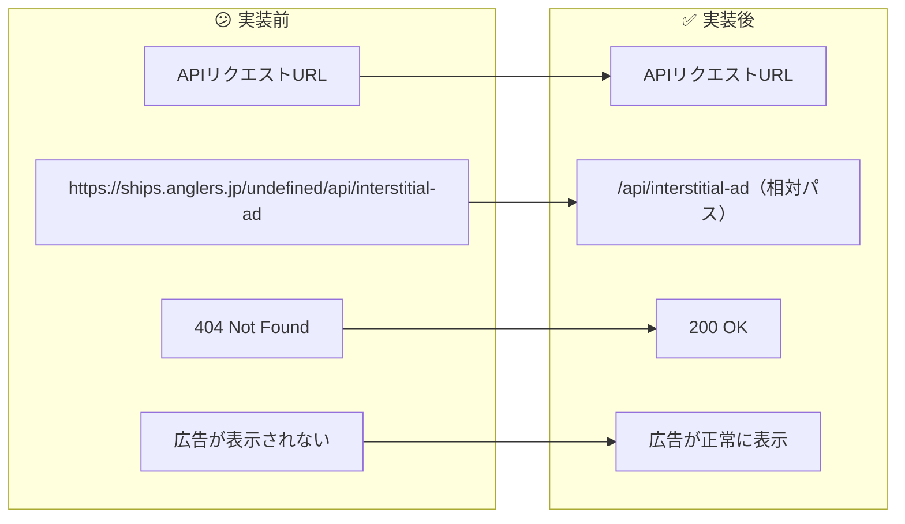
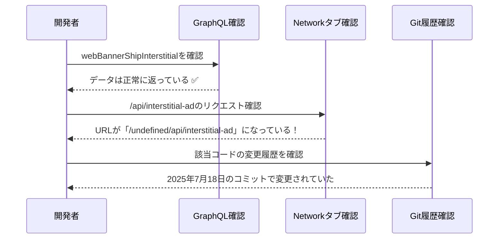
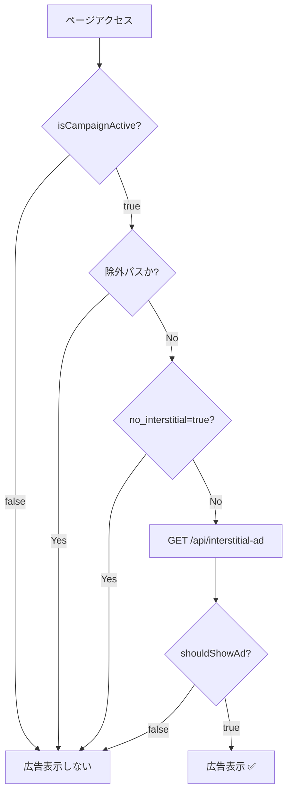

# タスク003：インタースティシャル広告が表示されない問題の修正

**プロジェクト:** ShipFront
**ステータス:** ✅ 完了
**完了日:** 2026-01-13
**ブランチ:** `fix/interstitial-ad-not-displayed`

---

## 概要

インタースティシャル広告のAPIエンドポイントURLに`undefined`が含まれてしまい、404エラーが発生していた問題を修正。相対パスに戻すことで解決した。

---

## 実装前 → 実装後



---

## 問題の発見経緯

### 1. ユーザーからの報告

- 管理画面では「掲載中」と表示されている
- しかし実際のサイトでは広告が表示されない
- プライベートモードでも表示されない

### 2. 調査プロセス



### 3. 根本原因の特定

DevToolsのNetworkタブで以下のリクエストを発見：

```
Request URL: https://ships.anglers.jp/undefined/api/interstitial-ad
Status Code: 404 Not Found
```

`undefined`がURLに含まれていることが判明。

---

## 実装内容

### 1. API_PATH_INTERSTITIAL_ADの修正

**ファイル:** `src/components/ui-elements/interstitial-ad/use-interstitial-ad.ts:15`

**変更前:**
```typescript
const API_PATH_INTERSTITIAL_AD = `${process.env.SHIP_URL}/api/interstitial-ad` as const;
```

**変更後:**
```typescript
const API_PATH_INTERSTITIAL_AD = "/api/interstitial-ad" as const;
```

**問題点:**
1. `process.env.SHIP_URL`はサーバーサイド専用の環境変数
2. クライアントサイドでは`undefined`になる
3. Next.jsでクライアントから環境変数を使うには`NEXT_PUBLIC_`プレフィックスが必要
4. しかし同一オリジンへのAPIコールなので、そもそも相対パスで十分

---

## 変更ファイル一覧

| ファイル | 変更種別 | 変更内容 |
|---------|---------|----------|
| `src/components/ui-elements/interstitial-ad/use-interstitial-ad.ts` | 修正 | API_PATH_INTERSTITIAL_ADを相対パスに戻す |

---

## 処理フロー

### 修正後のインタースティシャル広告表示フロー



---

## 発生した問題と解決

### 問題: 環境変数がクライアントサイドで読み取れない

**状況:**
- 2025年7月18日のコミット `ddb50b350` で `as const` を付与する際に、誤って `${process.env.SHIP_URL}` を追加
- `process.env.SHIP_URL` はサーバーサイド専用の環境変数
- クライアントサイド（ブラウザ）では `undefined` として評価される
- 結果として `/undefined/api/interstitial-ad` という無効なURLが生成されていた

**解決:**
- 相対パス `/api/interstitial-ad` に戻すことで解決
- 同一オリジンへのAPIコールなので、絶対URLは不要

### 問題発生コミットの詳細

```
commit ddb50b350b8fea451bfd067af50af1a3ca8c80fc
Author: kimuniiii <kk.baseball.0824@gmail.com>
Date:   Fri Jul 18 18:46:13 2025 +0900

    feat: as const を付与する様にする
```

当初のコード変更意図は型安全性の向上（`as const`の付与）だったが、その際に誤って環境変数参照を追加してしまっていた。

---

## 動作確認

- [x] `/api/interstitial-ad` への正しいリクエストが飛ぶことを確認
- [x] インタースティシャル広告が表示されることを確認

---

## 学び・メモ

### Next.jsの環境変数について

| 環境変数のプレフィックス | 使用可能な場所 |
|------------------------|---------------|
| `NEXT_PUBLIC_` | クライアントサイド + サーバーサイド |
| なし（通常の環境変数） | サーバーサイドのみ |

**教訓:** クライアントサイドで動作するコードで環境変数を使う場合は、`NEXT_PUBLIC_`プレフィックスが必要。ただし同一オリジンへのAPIコールは相対パスで十分。

### 調査のポイント

1. 管理画面で「掲載中」 ≠ フロントで表示される、とは限らない
2. GraphQLのレスポンスが正常でも、その後の処理で問題が起きている可能性がある
3. DevToolsのNetworkタブで実際のリクエストURLを確認することが重要
