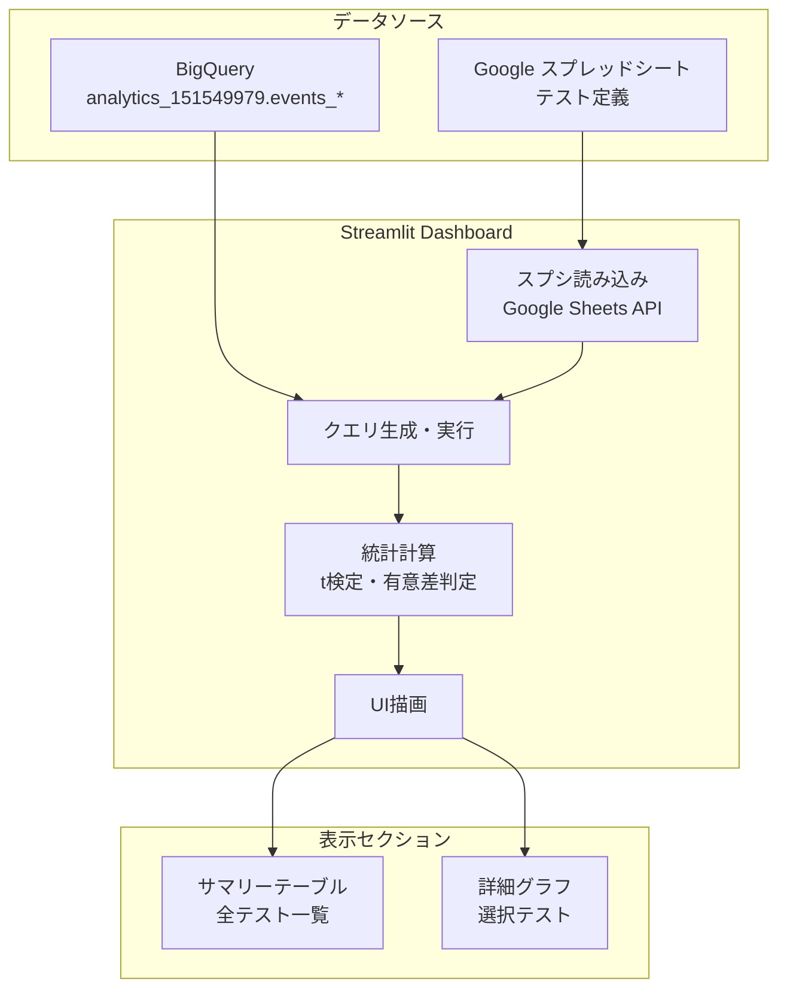

# タスク001：ABテスト分析ダッシュボード作成

**ステータス:** 未着手
**優先度:** 高
**ブランチ:** TBD
**壁打ち日:** 2026-01-09

---

## 概要

Firebase AnalyticsのデータをBigQueryから取得し、複数のABテストを柔軟に分析できるStreamlitダッシュボードを作成する。Google スプレッドシートでテスト定義を管理し、上部にサマリー一覧、下部に選択したテストの詳細を表示する一画面構成。

---

## 背景

### 現状の問題

- ABテストの結果を手動で集計・分析している
- 複数テストを同時に走らせた場合の比較が困難
- テスト期間や対象バージョンの管理が煩雑
- 統計的有意差の判断が属人的

### 設計方針（壁打ちで確定）

| 方針 | 説明 |
|------|------|
| **スプシ管理** | テスト定義をGoogle スプレッドシートで管理。履歴管理も可能 |
| **柔軟なテスト対応** | アプリバージョン比較、アプリ内ABテスト、複数テスト同時実行に対応 |
| **一画面構成** | 上部：全テストサマリー、下部：選択テストの詳細 |
| **Firebase直接参照** | `analytics_151549979.events_*` から直接クエリ |

---

## 事前調査で把握した既存実装

| ファイル | 内容 | 本タスクとの関連 |
|---------|------|-----------------|
| `analytics/ab_test_streamlit.py` | 既存ABテストダッシュボード（589行） | レイアウト・パターンを参考 |
| `app/helpers/ABTestHelper.ts` | ABテストグループ分け実装 | User Property名の確認 |
| `app/helpers/SubscriptionAnalyticsHelper.ts` | 課金イベント送信 | イベント名の確認 |
| `app/actions/results.js` | 釣果投稿イベント送信 | イベント名の確認 |

---

## アーキテクチャ



---

## スプレッドシート設計

### シート名: `ab_test_definitions`

| カラム名 | 型 | 説明 | 例 |
|---------|-----|------|-----|
| `test_id` | string | テストの一意識別子 | `interstitial_freq_v1` |
| `test_name` | string | 表示名 | `インタースティシャル広告頻度テスト` |
| `user_property` | string | Firebase User Property名 | `ab_interstitial_freq` |
| `variants` | string | グループ一覧（カンマ区切り） | `every3,every5,none` |
| `control_variant` | string | 対照群（比較基準） | `none` |
| `start_date` | date | テスト開始日 | `2024-01-15` |
| `end_date` | date | テスト終了日（空欄=継続中） | `2024-02-15` or 空 |
| `app_version_min` | string | 対象アプリバージョン（最小） | `3.5.0` |
| `status` | string | ステータス | `running` / `completed` / `paused` |
| `description` | string | テストの説明・目的 | `広告頻度による離脱率の検証` |

### サンプルデータ

| test_id | test_name | user_property | variants | control_variant | start_date | end_date | app_version_min | status | description |
|---------|-----------|---------------|----------|-----------------|------------|----------|-----------------|--------|-------------|
| interstitial_freq_v1 | インタースティシャル広告頻度テスト | ab_interstitial_freq | every3,every5,none | none | 2024-01-15 | | 11.1.9 | running | 広告頻度による離脱率の検証 |

---

## Firebase Analyticsイベント定義

### 使用するイベント・プロパティ

| 指標 | イベント名/プロパティ | 説明 |
|------|---------------------|------|
| **ABテストグループ** | User Property: `ab_interstitial_freq` | `every3` / `every5` / `none` |
| **起動回数** | `session_start` | セッション開始 |
| **広告視聴回数** | `admob_interstitial_shown` | インタースティシャル広告表示 |
| **釣果投稿** | `post_result` | 釣果投稿完了 |
| **画面遷移** | `screen_view` | 画面表示 |
| **サブスク画面表示** | `view_subscription_screen` | サブスク画面表示 |
| **購入ボタン押下** | `tap_subscribe_button` | 購入ボタンタップ |
| **購入成功** | `subscribe_success` | 購入完了 |

---

## ダッシュボードUI設計

### 全体レイアウト

```
┌─────────────────────────────────────────────────────────────┐
│  🎣 ANGLERS アプリABテスト分析ダッシュボード                    │
├─────────────────────────────────────────────────────────────┤
│  [サイドバー]                                                 │
│  - テスト選択（ドロップダウン）                                 │
│  - 日付範囲                                                   │
│  - プラットフォーム選択                                        │
├─────────────────────────────────────────────────────────────┤
│                                                             │
│  📊 サマリー指標                                              │
│  ┌─────────────────────────────────────────────────────┐    │
│  │ [テーブル: 全テストのサマリー]                          │    │
│  │ 指標 | ユーザー数 | 課金率 | リテンション | ... | 有意差  │    │
│  │ every3 | 10,000 | 0.5% | 45% | ... | ⭐            │    │
│  │ every5 | 10,000 | 0.4% | 47% | ... |              │    │
│  │ none   | 80,000 | 0.3% | 48% | ... | (対照群)      │    │
│  └─────────────────────────────────────────────────────┘    │
│                                                             │
├─────────────────────────────────────────────────────────────┤
│                                                             │
│  📈 詳細分析（選択テスト: インタースティシャル広告頻度テスト）    │
│                                                             │
│  ┌─────────────────────┐  ┌─────────────────────┐          │
│  │ 🔻 課金ファネル       │  │ 💰 課金累積率D0-D7   │          │
│  │ [棒グラフ]           │  │ [折れ線グラフ]       │          │
│  └─────────────────────┘  └─────────────────────┘          │
│                                                             │
│  ┌─────────────────────┐  ┌─────────────────────┐          │
│  │ 🔄 リテンション率     │  │ 📱 画面遷移数        │          │
│  │ D0-D7 [折れ線]       │  │ D0-D7 [折れ線]       │          │
│  └─────────────────────┘  └─────────────────────┘          │
│                                                             │
│  ┌─────────────────────────────────────────────────────┐    │
│  │ 📊 画面遷移ヒートマップ                               │    │
│  │ [ヒートマップ: 画面別遷移数]                          │    │
│  └─────────────────────────────────────────────────────┘    │
│                                                             │
└─────────────────────────────────────────────────────────────┘
```

### サマリーテーブルの指標

| 指標名 | 計算方法 | 単位 |
|--------|----------|------|
| ユーザー数 | DISTINCT user_pseudo_id | 人 |
| 課金率 | 課金ユーザー数 / 総ユーザー数 | % |
| 解約率 | 解約ユーザー数 / 課金ユーザー数 | % |
| エンゲージメント時間 | AVG(engagement_time_msec) / 1000 | 秒 |
| セッション数 | COUNT(session_start) / ユーザー数 | 回/人 |
| 投稿数 | COUNT(post_result) / ユーザー数 | 件/人 |
| ページ遷移数 | COUNT(screen_view) / ユーザー数 | 回/人 |
| D1リテンション | D1復帰ユーザー / D0ユーザー | % |
| D7リテンション | D7復帰ユーザー / D0ユーザー | % |
| 有意確率 | t検定によるp値から計算 | % + ⭐ |

### 詳細グラフ

| グラフ名 | 種類 | X軸 | Y軸 | 系列 |
|----------|------|-----|-----|------|
| 課金ファネル | 棒グラフ | ステップ | イベント数 | バリアント |
| 課金累積率 | 折れ線 | D0-D7 | 累積率 | バリアント |
| リテンション率 | 折れ線 | D0-D7 | リテンション率 | バリアント |
| 画面遷移数 | 折れ線 | D0-D7 | 平均遷移数 | バリアント |
| 画面遷移ヒートマップ | ヒートマップ | 画面名 | バリアント | 遷移数 |

---

## BigQueryクエリ設計

### 1. ユーザーとABテストグループの紐付け

```sql
-- ab_test_user_groups: ユーザーごとのABテストグループを取得
WITH ab_test_user_groups AS (
  SELECT
    user_pseudo_id,
    (SELECT value.string_value
     FROM UNNEST(user_properties)
     WHERE key = 'ab_interstitial_freq') AS ab_group,
    app_info.version AS app_version,
    MIN(PARSE_DATE('%Y%m%d', event_date)) AS first_seen_date
  FROM `api-project-992889377723.analytics_151549979.events_*`
  WHERE _TABLE_SUFFIX BETWEEN @start_date AND @end_date
    AND (SELECT value.string_value
         FROM UNNEST(user_properties)
         WHERE key = 'ab_interstitial_freq') IS NOT NULL
  GROUP BY user_pseudo_id, ab_group, app_version
)
SELECT * FROM ab_test_user_groups
WHERE app_version >= @min_app_version
```

### 2. サマリー指標クエリ

```sql
-- summary_metrics: ABテストグループごとのサマリー指標
WITH user_groups AS (
  SELECT
    user_pseudo_id,
    (SELECT value.string_value
     FROM UNNEST(user_properties)
     WHERE key = @user_property) AS ab_group
  FROM `api-project-992889377723.analytics_151549979.events_*`
  WHERE _TABLE_SUFFIX BETWEEN @start_date AND @end_date
    AND app_info.version >= @min_app_version
  GROUP BY user_pseudo_id, ab_group
),

user_metrics AS (
  SELECT
    ug.ab_group,
    e.user_pseudo_id,
    -- セッション数
    COUNTIF(e.event_name = 'session_start') AS session_count,
    -- 投稿数
    COUNTIF(e.event_name = 'post_result') AS post_count,
    -- 画面遷移数
    COUNTIF(e.event_name = 'screen_view') AS screen_view_count,
    -- 広告視聴数
    COUNTIF(e.event_name = 'admob_interstitial_shown') AS ad_view_count,
    -- サブスク画面表示
    COUNTIF(e.event_name = 'view_subscription_screen') AS subscription_view_count,
    -- 購入ボタン押下
    COUNTIF(e.event_name = 'tap_subscribe_button') AS tap_subscribe_count,
    -- 購入成功
    COUNTIF(e.event_name = 'subscribe_success') AS subscribe_success_count,
    -- エンゲージメント時間
    SUM(CASE WHEN e.event_name = 'user_engagement'
        THEN (SELECT value.int_value FROM UNNEST(e.event_params) WHERE key = 'engagement_time_msec')
        ELSE 0 END) AS engagement_time_msec
  FROM `api-project-992889377723.analytics_151549979.events_*` e
  JOIN user_groups ug ON e.user_pseudo_id = ug.user_pseudo_id
  WHERE _TABLE_SUFFIX BETWEEN @start_date AND @end_date
  GROUP BY ug.ab_group, e.user_pseudo_id
)

SELECT
  ab_group,
  COUNT(DISTINCT user_pseudo_id) AS user_count,
  -- 課金率
  SAFE_DIVIDE(COUNTIF(subscribe_success_count > 0), COUNT(*)) * 100 AS subscription_rate,
  -- 平均セッション数
  AVG(session_count) AS avg_session_count,
  -- 平均投稿数
  AVG(post_count) AS avg_post_count,
  -- 平均画面遷移数
  AVG(screen_view_count) AS avg_screen_view_count,
  -- 平均広告視聴数
  AVG(ad_view_count) AS avg_ad_view_count,
  -- 平均エンゲージメント時間（秒）
  AVG(engagement_time_msec) / 1000 AS avg_engagement_time_sec
FROM user_metrics
GROUP BY ab_group
ORDER BY ab_group
```

### 3. リテンション率クエリ（D0-D7）

```sql
-- retention_by_day: 日別リテンション率
WITH user_first_day AS (
  SELECT
    user_pseudo_id,
    (SELECT value.string_value
     FROM UNNEST(user_properties)
     WHERE key = @user_property) AS ab_group,
    MIN(PARSE_DATE('%Y%m%d', event_date)) AS first_day
  FROM `api-project-992889377723.analytics_151549979.events_*`
  WHERE _TABLE_SUFFIX BETWEEN @start_date AND @end_date
    AND app_info.version >= @min_app_version
  GROUP BY user_pseudo_id, ab_group
),

user_daily_activity AS (
  SELECT
    u.user_pseudo_id,
    u.ab_group,
    u.first_day,
    DATE_DIFF(PARSE_DATE('%Y%m%d', e.event_date), u.first_day, DAY) AS day_number
  FROM user_first_day u
  JOIN `api-project-992889377723.analytics_151549979.events_*` e
    ON u.user_pseudo_id = e.user_pseudo_id
  WHERE _TABLE_SUFFIX BETWEEN @start_date AND @end_date
    AND e.event_name = 'session_start'
  GROUP BY u.user_pseudo_id, u.ab_group, u.first_day, day_number
),

cohort_size AS (
  SELECT ab_group, COUNT(DISTINCT user_pseudo_id) AS d0_users
  FROM user_first_day
  GROUP BY ab_group
)

SELECT
  a.ab_group,
  a.day_number,
  COUNT(DISTINCT a.user_pseudo_id) AS retained_users,
  c.d0_users,
  SAFE_DIVIDE(COUNT(DISTINCT a.user_pseudo_id), c.d0_users) * 100 AS retention_rate
FROM user_daily_activity a
JOIN cohort_size c ON a.ab_group = c.ab_group
WHERE a.day_number BETWEEN 0 AND 7
GROUP BY a.ab_group, a.day_number, c.d0_users
ORDER BY a.ab_group, a.day_number
```

### 4. 課金ファネルクエリ

```sql
-- subscription_funnel: 課金ファネル
WITH user_groups AS (
  SELECT
    user_pseudo_id,
    (SELECT value.string_value
     FROM UNNEST(user_properties)
     WHERE key = @user_property) AS ab_group
  FROM `api-project-992889377723.analytics_151549979.events_*`
  WHERE _TABLE_SUFFIX BETWEEN @start_date AND @end_date
    AND app_info.version >= @min_app_version
  GROUP BY user_pseudo_id, ab_group
),

funnel_events AS (
  SELECT
    ug.ab_group,
    e.user_pseudo_id,
    MAX(CASE WHEN e.event_name = 'view_subscription_screen' THEN 1 ELSE 0 END) AS viewed_screen,
    MAX(CASE WHEN e.event_name = 'tap_subscribe_button' THEN 1 ELSE 0 END) AS tapped_button,
    MAX(CASE WHEN e.event_name = 'subscribe_success' THEN 1 ELSE 0 END) AS subscribed
  FROM `api-project-992889377723.analytics_151549979.events_*` e
  JOIN user_groups ug ON e.user_pseudo_id = ug.user_pseudo_id
  WHERE _TABLE_SUFFIX BETWEEN @start_date AND @end_date
  GROUP BY ug.ab_group, e.user_pseudo_id
)

SELECT
  ab_group,
  'サブスク画面表示' AS step,
  1 AS step_order,
  SUM(viewed_screen) AS user_count
FROM funnel_events
GROUP BY ab_group

UNION ALL

SELECT
  ab_group,
  '購入ボタン押下' AS step,
  2 AS step_order,
  SUM(tapped_button) AS user_count
FROM funnel_events
GROUP BY ab_group

UNION ALL

SELECT
  ab_group,
  '購入成功' AS step,
  3 AS step_order,
  SUM(subscribed) AS user_count
FROM funnel_events
GROUP BY ab_group

ORDER BY ab_group, step_order
```

### 5. 画面遷移ヒートマップクエリ

```sql
-- screen_transitions: 画面遷移数（Top 20）
WITH user_groups AS (
  SELECT
    user_pseudo_id,
    (SELECT value.string_value
     FROM UNNEST(user_properties)
     WHERE key = @user_property) AS ab_group
  FROM `api-project-992889377723.analytics_151549979.events_*`
  WHERE _TABLE_SUFFIX BETWEEN @start_date AND @end_date
    AND app_info.version >= @min_app_version
  GROUP BY user_pseudo_id, ab_group
)

SELECT
  ug.ab_group,
  (SELECT value.string_value FROM UNNEST(e.event_params) WHERE key = 'firebase_screen') AS screen_name,
  COUNT(*) AS view_count,
  COUNT(DISTINCT e.user_pseudo_id) AS unique_users
FROM `api-project-992889377723.analytics_151549979.events_*` e
JOIN user_groups ug ON e.user_pseudo_id = ug.user_pseudo_id
WHERE _TABLE_SUFFIX BETWEEN @start_date AND @end_date
  AND e.event_name = 'screen_view'
GROUP BY ug.ab_group, screen_name
HAVING screen_name IS NOT NULL
ORDER BY view_count DESC
LIMIT 20
```

---

## 統計的有意差の計算

### t検定の実装

```python
from scipy import stats
import numpy as np

def calculate_significance(control_data: list, variant_data: list) -> dict:
    """
    2群間のt検定を実行し、有意確率を返す

    Args:
        control_data: 対照群のデータ（リスト）
        variant_data: 実験群のデータ（リスト）

    Returns:
        dict: {
            'p_value': float,
            'significance': float,  # 有意確率（%）
            'is_significant': bool,  # 95%以上で有意
            'display': str  # 表示用文字列（例: "97.5%⭐"）
        }
    """
    if len(control_data) < 2 or len(variant_data) < 2:
        return {
            'p_value': None,
            'significance': None,
            'is_significant': False,
            'display': '-'
        }

    # Welchのt検定（等分散を仮定しない）
    t_stat, p_value = stats.ttest_ind(control_data, variant_data, equal_var=False)

    significance = (1 - p_value) * 100
    is_significant = significance >= 95

    display = f"{significance:.1f}%"
    if is_significant:
        display += "⭐"

    return {
        'p_value': p_value,
        'significance': significance,
        'is_significant': is_significant,
        'display': display
    }
```

---

## 実装手順

### Phase 1: 基盤構築

- [ ] Google スプレッドシートの作成とサンプルデータ投入
- [ ] Google Sheets API認証設定（サービスアカウント）
- [ ] `ab_test_dashboard_v2.py` の新規作成
- [ ] BigQuery接続の実装
- [ ] スプシ読み込み関数の実装

### Phase 2: クエリ実装

- [ ] ユーザー・ABグループ紐付けクエリ
- [ ] サマリー指標クエリ
- [ ] リテンション率クエリ
- [ ] 課金ファネルクエリ
- [ ] 画面遷移クエリ

### Phase 3: UI実装

- [ ] サイドバー（テスト選択、日付範囲、フィルター）
- [ ] サマリーテーブル表示
- [ ] 統計的有意差の計算と表示
- [ ] 詳細グラフ（課金ファネル）
- [ ] 詳細グラフ（リテンション率）
- [ ] 詳細グラフ（画面遷移）
- [ ] 画面遷移ヒートマップ

### Phase 4: デプロイ

- [ ] cloudbuild.yamlへの追加
- [ ] 環境変数設定
- [ ] Cloud Runデプロイ

---

## 関連ファイル

### 変更対象

| ファイル | 変更内容 |
|---------|----------|
| `analytics/cloudbuild.yaml` | 新ダッシュボードのデプロイ設定追加 |

### 新規作成

| ファイル | 説明 |
|---------|------|
| `analytics/ab_test_dashboard_v2.py` | 新ABテストダッシュボード |
| `analytics/ab_test_config.py` | スプシ読み込み・設定管理 |
| `analytics/ab_test_queries.py` | BigQueryクエリ定義 |
| `analytics/ab_test_stats.py` | 統計計算ユーティリティ |

### 参照のみ（変更なし）

| ファイル | 参照理由 |
|---------|----------|
| `analytics/ab_test_streamlit.py` | 既存実装のパターン参考 |
| `analytics/CLAUDE.md` | プロジェクト規約確認 |
| `app/helpers/ABTestHelper.ts` | User Property名の確認 |
| `app/helpers/SubscriptionAnalyticsHelper.ts` | イベント名の確認 |

---

## 確認事項

- [ ] TypeScriptエラー: N/A（Pythonプロジェクト）
- [ ] 動作確認:
  - [ ] スプシからテスト定義が読み込めること
  - [ ] BigQueryクエリが正常に実行されること
  - [ ] サマリーテーブルが表示されること
  - [ ] 詳細グラフが表示されること
  - [ ] 統計的有意差が正しく計算されること
  - [ ] Cloud Runにデプロイできること

---

## 注意事項

- BigQueryのコストに注意。`_TABLE_SUFFIX`で日付範囲を絞ること
- スプシのAPI呼び出し回数制限に注意（キャッシュを活用）
- 統計的有意差は参考値。サンプルサイズが小さい場合は信頼性が低い
- 既存の`ab_test_streamlit.py`は残しておく（後方互換性）

---

## 壁打ち決定事項サマリー

### 質問と回答一覧

| # | 質問 | 決定 |
|---|------|------|
| 1 | データソース | Firebase Analytics → BigQuery (`analytics_151549979.events_*`) |
| 2 | リテンション | D1/D7日次リテンション率 |
| 3 | 起動回数 | `session_start`イベント |
| 4 | 広告視聴回数 | `admob_interstitial_shown`イベント |
| 5 | 釣果投稿数 | `post_result`イベント |
| 6 | 画面遷移数 | `screen_view`イベント |
| 7 | 課金登録者数 | `subscribe_success`イベント |
| 8 | ABテスト識別 | テストごとに専用User Propertyを追加 |
| 9 | テスト定義管理 | Google スプレッドシート（Sheets API） |
| 10 | UI構成 | 上部：全テストサマリー、下部：選択テスト詳細 |
| 11 | テスト継続 | `end_date`が空欄なら継続中と判断 |
| 12 | スプシ | 新規作成 |
| 13 | サマリー表現 | テーブル形式 + ⭐マーク |
| 14 | 詳細グラフ | 折れ線グラフ（モックと同じ） |
| 15 | BigQueryクエリ | 実際に動くSQLを作成 |

### 保留事項

| 項目 | 理由 |
|------|------|
| なし | - |

---

## 参考リンク

- [ABテスト参考記事](https://techblog.kayac.com/hyper_casual_ab_testing)
- 既存Slackやりとり（撤退基準の議論）
