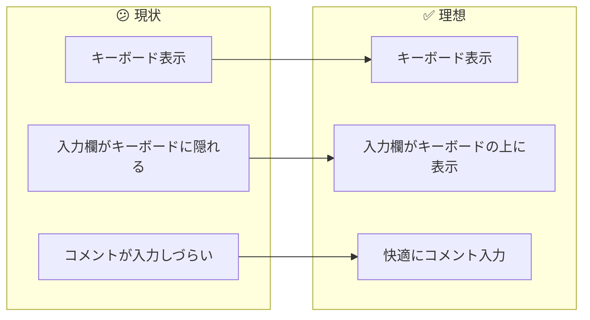

# タスク002：釣りトーク詳細画面でコメント入力時にキーボードが入力欄を隠す問題

**プロジェクト:** App
**ステータス:** 調査中
**優先度:** 高
**ブランチ:** `fix/fishing-talk-comment-keyboard`
**壁打ち日:** 2026-01-13

---

## 概要

iOS 18.7で釣りトーク詳細画面のコメント入力欄にフォーカスした際、キーボードが表示されても入力欄が適切に上に移動せず、キーボードに隠れてしまう問題を修正する。

---

## 背景

### 現状 → 理想の変化



### 報告内容

- **発生環境:** iOS 18.7
- **対象画面:** 釣りトーク詳細画面（コメント入力）
- **症状:** キーボード表示時に入力欄が適切な位置に移動しない

---

## 事前調査で把握した既存実装

### 現在のコード構造

| ファイル | 内容 | 役割 |
|---------|------|------|
| `app/views/fishing_talks/commentForm/CommentForm.js` | コメント入力フォーム | `KeyboardAwareScrollView`使用 |
| `app/constants/platform.ts` | キーボードオフセット定数 | プラットフォーム別の値定義 |

### CommentForm.js の現在の実装

```javascript
// app/views/fishing_talks/commentForm/CommentForm.js:35-39
<KeyboardAwareScrollView
  keyboardShouldPersistTaps="handled"
  bottomOffset={KEYBOARD_BOTTOM_OFFSET_DEFAULT}      // = 0
  extraKeyboardSpace={KEYBOARD_EXTRA_SPACE_COMMENT_LARGE}  // iOS: -95
  showsVerticalScrollIndicator={false}
>
```

### platform.ts の現在の定数

```typescript
// iOS用の値
export const KEYBOARD_EXTRA_SPACE_COMMENT_LARGE = (() => {
  if (IS_IOS) return -95;           // ← この値が問題の可能性
  if (IS_ANDROID_12_OR_BELOW) return -55;
  return -80; // Android 13以上
})();
```

### 使用ライブラリ

- `react-native-keyboard-controller`: v1.19.1
- `KeyboardAwareScrollView`: keyboard-controllerから提供

---

## 過去の関連修正

### PR #3642（2025年9月5日）

```
fix: 釣りトーク詳細画面のコメント入力欄が予測変換で隠れる問題を修正
- KeyboardAwareScrollViewにkeyboardShouldPersistTaps="handled"を追加
```

### platform.ts のリファクタリング

```
refactor: キーボードオフセット定数の条件分岐を最適化
- iOS/Android/Android 12以下で別々の値を返すように変更
```

---

## 原因の仮説

### 仮説1: iOS 18でのキーボード高さ計算の変更

iOS 18でキーボードの高さ報告が変わり、`extraKeyboardSpace: -95`では不十分になった可能性。

### 仮説2: Safe Area/Home Indicatorの影響

iPhone（特にノッチ/Dynamic Island機種）でSafe Area計算が変わった可能性。

### 仮説3: react-native-keyboard-controllerの互換性

v1.19.1がiOS 18に完全対応していない可能性。

---

## 調査・確認事項

### Q1: 他のiOS端末でも発生するか

**A.** iOS 18.7のみ
**B.** iOS 17以下でも発生
**C.** 特定の端末サイズのみ（標準/Plus/Max）

### Q2: 他のコメント入力画面でも発生するか

- [ ] 釣果詳細画面のコメント
- [ ] 製品レビューのコメント
- [ ] グループ結果のコメント

### Q3: 予測変換（サジェスト）表示時に悪化するか

**A.** 予測変換あり/なしで変わらない
**B.** 予測変換表示時に悪化する

---

## 修正案

### 案A: iOS 18向けに`extraKeyboardSpace`を調整

```typescript
// app/constants/platform.ts

// iOSのバージョン判定を追加
const IOS_VERSION = IS_IOS ? parseFloat(Platform.Version as string) : 0;
const IS_IOS_18_OR_ABOVE = IS_IOS && IOS_VERSION >= 18;

export const KEYBOARD_EXTRA_SPACE_COMMENT_LARGE = (() => {
  if (IS_IOS_18_OR_ABOVE) return -75;  // iOS 18以上は調整
  if (IS_IOS) return -95;
  if (IS_ANDROID_12_OR_BELOW) return -55;
  return -80;
})();
```

**メリット:** 最小限の変更で対応可能
**デメリット:** 値の調整が経験的

### 案B: `bottomOffset`も調整

```javascript
// CommentForm.js
<KeyboardAwareScrollView
  bottomOffset={IS_IOS_18_OR_ABOVE ? 20 : KEYBOARD_BOTTOM_OFFSET_DEFAULT}
  extraKeyboardSpace={KEYBOARD_EXTRA_SPACE_COMMENT_LARGE}
  // ...
>
```

### 案C: react-native-keyboard-controllerのアップデート確認

最新バージョンでiOS 18対応が入っているか確認し、アップデートを検討。

---

## 実装手順

```mermaid
gantt
    title 実装フェーズ
    dateFormat X
    axisFormat %s

    section Phase 1: 調査
    他画面での発生確認    :a1, 0, 1
    iOS 17以下での確認    :a2, after a1, 1

    section Phase 2: 修正
    platform.ts修正    :b1, after a2, 1
    CommentForm.js修正（必要に応じて）    :b2, after b1, 1

    section Phase 3: テスト
    iOS 18実機確認    :c1, after b2, 1
    iOS 17以下での動作確認    :c2, after c1, 1
    Android確認    :c3, after c2, 1
```



### Phase 1: 調査
- [ ] iOS 18以外のバージョンでの動作確認
- [ ] 他のコメント入力画面での動作確認
- [ ] 予測変換ON/OFFでの動作比較

### Phase 2: 修正
- [ ] `platform.ts`にiOS 18判定を追加
- [ ] `KEYBOARD_EXTRA_SPACE_COMMENT_LARGE`の値を調整
- [ ] 必要に応じて`CommentForm.js`を修正

### Phase 3: テスト
- [ ] iOS 18.7実機で動作確認
- [ ] iOS 17以下で退行がないことを確認
- [ ] Android各バージョンで退行がないことを確認

---

## 変更対象ファイル

| ファイル | 変更内容 |
|---------|----------|
| `app/constants/platform.ts` | iOS 18判定追加、オフセット値調整 |
| `app/views/fishing_talks/commentForm/CommentForm.js` | 必要に応じて調整 |

---

## 確認事項（修正後）

- [ ] iOS 18.7でコメント入力欄がキーボードに隠れない
- [ ] iOS 17以下で退行していない
- [ ] Android各バージョンで退行していない
- [ ] 予測変換表示時も入力欄が見える
- [ ] 長文入力時も問題ない

---

## 注意事項

- **既存の動作を壊さない:** iOS 17以下、Androidでの動作を必ず確認
- **値の調整は慎重に:** `extraKeyboardSpace`の値は経験的な調整が必要
- **複数端末で確認:** 画面サイズによって挙動が変わる可能性あり

---

## 参考情報

### react-native-keyboard-controller

- 現在のバージョン: v1.19.1
- GitHub: https://github.com/kirillzyusko/react-native-keyboard-controller

### 過去の関連PR

| PR | 内容 |
|----|------|
| #3642 | 釣りトーク詳細画面のコメント入力欄が予測変換で隠れる問題を修正 |
| #3618 | keyboard-controller improvements |
