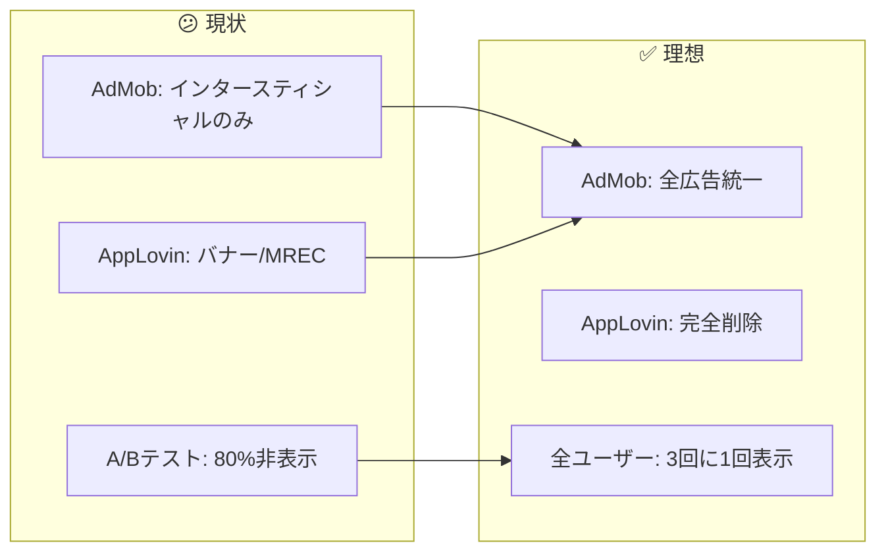
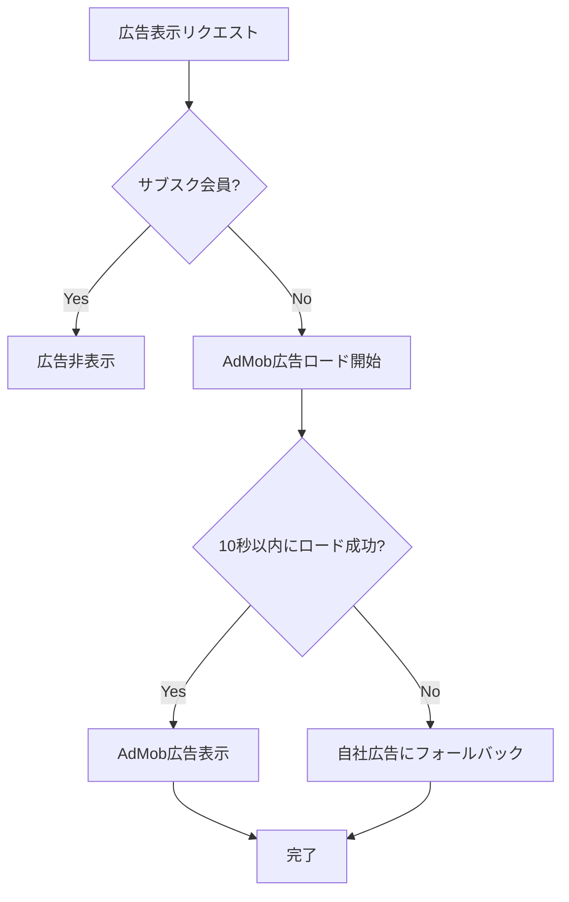
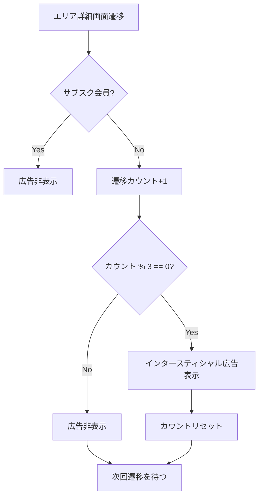

# タスク003：広告プラットフォームをAdMobに統一

**プロジェクト:** App
**ステータス:** 未着手
**優先度:** 高
**ブランチ:** fix/ignore_admob
**壁打ち日:** 2026-01-27

---

## 概要

広告プラットフォームをAppLovinからAdMobに完全統一し、インタースティシャル広告の表示頻度を「3回に1回」に固定する。

---

## 背景

### 現状 → 理想の変化



### 設計方針（壁打ちで確定）

| 方針 | 説明 |
|------|------|
| **AdMob完全統一** | AppLovinを削除し、全広告をAdMobで実装 |
| **A/Bテスト終了** | インタースティシャル広告は全ユーザー「3回に1回」に統一 |
| **フォールバック維持** | AdMob広告失敗時は自社広告（NativeAd）を表示 |
| **複数ユニットID対応** | カンマ区切りで複数ID設定、`adIndex`で選択 |
| **環境別ID分離** | 開発/ステージングはテスト用ID、本番は実ID |

---

## 処理フロー

### バナー/MREC広告の表示フロー



### インタースティシャル広告の表示フロー



---

## 事前調査で把握した既存実装

| ファイル | 内容 | 本タスクとの関連 |
|---------|------|-----------------|
| `app/views/common/AdMobInterstitialManager.ts` | AdMobインタースティシャル広告管理 | A/Bテストロジック削除、頻度固定化 |
| `app/views/common/AppLovinBanner.tsx` | AppLovinバナー広告 | **削除対象** |
| `app/views/common/AppLovinMREC.tsx` | AppLovin MREC広告 | **削除対象** |
| `app/views/common/HybridAdBanner.tsx` | ハイブリッド広告コンポーネント | AdMob用に書き換え |
| `app/helpers/ABTestHelper.ts` | A/Bテスト管理 | インタースティシャル関連ロジック削除 |
| `app/helpers/AppLovinAnalyticsHelper.ts` | AppLovin分析 | **削除対象** |
| `.env`, `.env.staging`, `.env.production` | 環境変数 | AdMobユニットID追加、AppLovin削除 |

---

## 変更一覧

### 1. 環境変数の更新

#### `.env`（開発環境）- テスト用ID

```bash
# === 削除 ===
# APPLOVIN_SDK_KEY=...
# APPLOVIN_USER_RATIO=...
# APPLOVIN_BANNER_IOS_UNIT_IDS=...
# APPLOVIN_BANNER_ANDROID_UNIT_IDS=...
# APPLOVIN_MREC_IOS_UNIT_IDS=...
# APPLOVIN_MREC_ANDROID_UNIT_IDS=...

# === 追加 ===
# AdMob バナー広告（テスト用）
ADMOB_BANNER_IOS_UNIT_IDS=ca-app-pub-3940256099942544/2934735716
ADMOB_BANNER_ANDROID_UNIT_IDS=ca-app-pub-3940256099942544/6300978111

# AdMob MREC広告（テスト用）
ADMOB_MREC_IOS_UNIT_IDS=ca-app-pub-3940256099942544/2934735716
ADMOB_MREC_ANDROID_UNIT_IDS=ca-app-pub-3940256099942544/6300978111
```

#### `.env.staging`（ステージング環境）- テスト用ID

```bash
# 開発環境と同じテスト用IDを使用
ADMOB_BANNER_IOS_UNIT_IDS=ca-app-pub-3940256099942544/2934735716
ADMOB_BANNER_ANDROID_UNIT_IDS=ca-app-pub-3940256099942544/6300978111
ADMOB_MREC_IOS_UNIT_IDS=ca-app-pub-3940256099942544/2934735716
ADMOB_MREC_ANDROID_UNIT_IDS=ca-app-pub-3940256099942544/6300978111
```

#### `.env.production`（本番環境）- 本番用ID

```bash
# AdMob バナー広告（本番用・複数ID対応）
ADMOB_BANNER_IOS_UNIT_IDS=ca-app-pub-6284018108500346/6248157502,ca-app-pub-6284018108500346/8053738359,ca-app-pub-6284018108500346/4086573182
ADMOB_BANNER_ANDROID_UNIT_IDS=ca-app-pub-6284018108500346/9070740935,ca-app-pub-6284018108500346/2870474683,ca-app-pub-6284018108500346/9893433636

# AdMob MREC広告（本番用・複数ID対応）
ADMOB_MREC_IOS_UNIT_IDS=ca-app-pub-6284018108500346/9174749573,ca-app-pub-6284018108500346/5795452352,ca-app-pub-6284018108500346/6357014542
ADMOB_MREC_ANDROID_UNIT_IDS=ca-app-pub-6284018108500346/5961251114,ca-app-pub-6284018108500346/7274332782,ca-app-pub-6284018108500346/9724402158
```

---

### 2. AdMobBanner.tsx（新規作成）

**ファイルパス:** `app/views/common/AdMobBanner.tsx`

```typescript
import React, { useState, useCallback } from 'react';
import { View, Platform, StyleSheet } from 'react-native';
import {
  BannerAd,
  BannerAdSize,
  AdEventType,
} from 'react-native-google-mobile-ads';
import Config from 'react-native-config';
import analytics from '@react-native-firebase/analytics';

interface AdMobBannerProps {
  adIndex?: number;
  onAdLoaded?: () => void;
  onAdFailedToLoad?: (error: Error) => void;
}

/**
 * AdMobバナー広告コンポーネント（320x50）
 * @param adIndex - 複数ユニットIDがある場合のインデックス（デフォルト: 0）
 */
export const AdMobBanner: React.FC<AdMobBannerProps> = ({
  adIndex = 0,
  onAdLoaded,
  onAdFailedToLoad,
}) => {
  const [isLoaded, setIsLoaded] = useState(false);

  // 環境変数からユニットIDを取得
  const unitIds = Platform.select({
    ios: Config.ADMOB_BANNER_IOS_UNIT_IDS?.split(',') || [],
    android: Config.ADMOB_BANNER_ANDROID_UNIT_IDS?.split(',') || [],
  }) || [];

  const unitId = unitIds[adIndex % unitIds.length] || unitIds[0];

  if (!unitId) {
    console.warn('AdMobBanner: ユニットIDが設定されていません');
    return null;
  }

  const handleAdLoaded = useCallback(() => {
    setIsLoaded(true);
    onAdLoaded?.();
  }, [onAdLoaded]);

  const handleAdFailedToLoad = useCallback((error: Error) => {
    // Firebase Analyticsにエラーを送信
    analytics().logEvent('admob_banner_error', {
      ad_platform: 'admob',
      ad_format: 'banner',
      error_message: error.message?.substring(0, 100),
      platform: Platform.OS,
    });
    onAdFailedToLoad?.(error);
  }, [onAdFailedToLoad]);

  return (
    <View style={styles.container}>
      <BannerAd
        unitId={unitId}
        size={BannerAdSize.BANNER}
        requestOptions={{
          requestNonPersonalizedAdsOnly: true,
        }}
        onAdLoaded={handleAdLoaded}
        onAdFailedToLoad={handleAdFailedToLoad}
      />
    </View>
  );
};

const styles = StyleSheet.create({
  container: {
    alignItems: 'center',
    justifyContent: 'center',
    height: 50,
  },
});

export default AdMobBanner;
```

---

### 3. AdMobMREC.tsx（新規作成）

**ファイルパス:** `app/views/common/AdMobMREC.tsx`

```typescript
import React, { useState, useCallback } from 'react';
import { View, Platform, StyleSheet } from 'react-native';
import {
  BannerAd,
  BannerAdSize,
} from 'react-native-google-mobile-ads';
import Config from 'react-native-config';
import analytics from '@react-native-firebase/analytics';

interface AdMobMRECProps {
  adIndex?: number;
  onAdLoaded?: () => void;
  onAdFailedToLoad?: (error: Error) => void;
}

/**
 * AdMob MREC広告コンポーネント（300x250）
 * @param adIndex - 複数ユニットIDがある場合のインデックス（デフォルト: 0）
 */
export const AdMobMREC: React.FC<AdMobMRECProps> = ({
  adIndex = 0,
  onAdLoaded,
  onAdFailedToLoad,
}) => {
  const [isLoaded, setIsLoaded] = useState(false);

  // 環境変数からユニットIDを取得
  const unitIds = Platform.select({
    ios: Config.ADMOB_MREC_IOS_UNIT_IDS?.split(',') || [],
    android: Config.ADMOB_MREC_ANDROID_UNIT_IDS?.split(',') || [],
  }) || [];

  const unitId = unitIds[adIndex % unitIds.length] || unitIds[0];

  if (!unitId) {
    console.warn('AdMobMREC: ユニットIDが設定されていません');
    return null;
  }

  const handleAdLoaded = useCallback(() => {
    setIsLoaded(true);
    onAdLoaded?.();
  }, [onAdLoaded]);

  const handleAdFailedToLoad = useCallback((error: Error) => {
    // Firebase Analyticsにエラーを送信
    analytics().logEvent('admob_mrec_error', {
      ad_platform: 'admob',
      ad_format: 'mrec',
      error_message: error.message?.substring(0, 100),
      platform: Platform.OS,
    });
    onAdFailedToLoad?.(error);
  }, [onAdFailedToLoad]);

  return (
    <View style={styles.container}>
      <BannerAd
        unitId={unitId}
        size={BannerAdSize.MEDIUM_RECTANGLE}
        requestOptions={{
          requestNonPersonalizedAdsOnly: true,
        }}
        onAdLoaded={handleAdLoaded}
        onAdFailedToLoad={handleAdFailedToLoad}
      />
    </View>
  );
};

const styles = StyleSheet.create({
  container: {
    alignItems: 'center',
    justifyContent: 'center',
    height: 250,
  },
});

export default AdMobMREC;
```

---

### 4. HybridAdBanner.tsx の書き換え

**変更内容:** AppLovinをAdMobに置き換え、ロジックをシンプル化

```typescript
// Before: AppLovin + 自社広告のハイブリッド
// After: AdMob + 自社広告のハイブリッド

import React, { useState, useEffect, useCallback } from 'react';
import { View, StyleSheet } from 'react-native';
import { AdMobBanner } from './AdMobBanner';
import { AdMobMREC } from './AdMobMREC';

interface HybridAdBannerProps {
  userId: string;
  adIndex?: number;
  nativeAdComponent: React.ReactNode;
  adType?: 'banner' | 'mrec';
  isSubscribed?: boolean;
}

/**
 * AdMob広告と自社広告のハイブリッドコンポーネント
 * - AdMob広告のロードに成功したらAdMob表示
 * - 失敗またはタイムアウト（10秒）で自社広告にフォールバック
 * - サブスク会員は広告非表示
 */
export const HybridAdBanner: React.FC<HybridAdBannerProps> = ({
  userId,
  adIndex = 0,
  nativeAdComponent,
  adType = 'banner',
  isSubscribed = false,
}) => {
  const [showNativeAd, setShowNativeAd] = useState(false);
  const [adLoaded, setAdLoaded] = useState(false);

  // サブスク会員は広告非表示
  if (isSubscribed) {
    return null;
  }

  // 10秒のタイムアウト処理
  useEffect(() => {
    const timeout = setTimeout(() => {
      if (!adLoaded) {
        setShowNativeAd(true);
      }
    }, 10000);

    return () => clearTimeout(timeout);
  }, [adLoaded]);

  const handleAdLoaded = useCallback(() => {
    setAdLoaded(true);
    setShowNativeAd(false);
  }, []);

  const handleAdFailedToLoad = useCallback(() => {
    setShowNativeAd(true);
  }, []);

  // 自社広告を表示
  if (showNativeAd) {
    return <View style={styles.container}>{nativeAdComponent}</View>;
  }

  // AdMob広告を表示
  const AdComponent = adType === 'mrec' ? AdMobMREC : AdMobBanner;

  return (
    <View style={styles.container}>
      <AdComponent
        adIndex={adIndex}
        onAdLoaded={handleAdLoaded}
        onAdFailedToLoad={handleAdFailedToLoad}
      />
    </View>
  );
};

const styles = StyleSheet.create({
  container: {
    alignItems: 'center',
  },
});

export default HybridAdBanner;
```

---

### 5. AdMobInterstitialManager.ts の修正

**変更内容:** A/Bテストロジックを削除し、「3回に1回」固定に

```typescript
// Before
const frequency = await ABTestHelper.getInterstitialFrequency();
if (frequency === 'none') return;
const interval = frequency === 'every3' ? 3 : 5;

// After
const INTERSTITIAL_INTERVAL = 3; // 3回に1回固定

// shouldShowInterstitial関数内
const count = await this.getViewCount();
if (count > 0 && count % INTERSTITIAL_INTERVAL === 0) {
  await this.showInterstitial();
}
```

---

### 6. ABTestHelper.ts の修正

**変更内容:** インタースティシャル関連のA/Bテストロジックを削除

```typescript
// 削除する関数・定数
// - getInterstitialFrequency()
// - initializeInterstitialFrequency()
// - AB_TEST_INTERSTITIAL_FREQUENCY_KEY
// - InterstitialFrequency型

// 残す機能（将来の他のA/Bテスト用）
// - 基本的なA/Bテスト機能のインフラは残しておく
// - ただしインタースティシャル関連は完全削除
```

---

### 7. 削除対象ファイル

| ファイル | 理由 |
|---------|------|
| `app/views/common/AppLovinBanner.tsx` | AppLovin削除 |
| `app/views/common/AppLovinMREC.tsx` | AppLovin削除 |
| `app/helpers/AppLovinAnalyticsHelper.ts` | AppLovin削除 |

---

### 8. package.json の修正

```json
// 削除
"react-native-applovin-max": "^5.7.0"

// 残す（既存）
"react-native-google-mobile-ads": "14.2.0"
```

---

### 9. ネイティブ設定の修正

#### iOS（Podfile）
```ruby
# === 削除（AppLovin関連） ===
# pod 'AppLovinSDK'
# pod 'AppLovinMediationGoogleAdapter', '11.7.0.0'
# pod 'AppLovinMediationLineAdapter'
# pod 'AppLovinMediationByteDanceAdapter'
# pod 'AppLovinMediationVungleAdapter'
# pod 'AppLovinMediationInMobiAdapter'
# pod 'AppLovinMediationMintegralAdapter'
# pod 'AppLovinMediationFyberAdapter'
# pod 'AppLovinMediationIronSourceAdapter'
# pod 'AppLovinMediationUnityAdsAdapter'

# === 残す/追加（AdMobメディエーション） ===
# 既存（継続使用）
pod 'GoogleMobileAdsMediationFyber', '8.3.0.0'           # DT Exchange
pod 'GoogleMobileAdsMediationInMobi', '10.7.5.0'
pod 'GoogleMobileAdsMediationVungle', '7.4.0.1'          # Liftoff
pod 'GoogleMobileAdsMediationFacebook', '6.15.1.0'       # Meta
pod 'GoogleMobileAdsMediationMintegral', '7.6.9.0'
pod 'GoogleMobileAdsMediationUnity', '4.12.2.0'

# 新規追加
pod 'GoogleMobileAdsMediationAppLovin', '12.5.0.0'       # AppLovin
pod 'GoogleMobileAdsMediationIronSource', '8.1.0.0.0'    # ironSource
pod 'GoogleMobileAdsMediationLine', '2024.8.27.0'        # LINE Ads
pod 'GoogleMobileAdsMediationPangle', '6.3.0.6'          # Pangle
```

#### Android（build.gradle）
```gradle
// === 削除（AppLovin関連） ===
// implementation 'com.applovin:applovin-sdk:11.11.3'
// implementation 'com.applovin.mediation:google-adapter:22.5.0.1'
// implementation 'com.applovin.mediation:line-adapter:2024.2.14.0'
// implementation 'com.applovin.mediation:vungle-adapter:7.4.1.0'
// implementation 'com.applovin.mediation:inmobi-adapter:10.7.5.0'
// implementation 'com.applovin.mediation:mintegral-adapter:16.8.41.0'
// implementation 'com.applovin.mediation:fyber-adapter:8.3.0.0'
// implementation 'com.applovin.mediation:ironsource-adapter:8.3.0.0.1'
// implementation 'com.applovin.mediation:unityads-adapter:4.12.0.0'

// === 残す/追加（AdMobメディエーション） ===
// 既存（継続使用）
implementation 'com.google.ads.mediation:fyber:8.2.3.0'           // DT Exchange
implementation 'com.google.ads.mediation:inmobi:10.6.7.0'
implementation 'com.google.ads.mediation:vungle:7.3.2.0'          // Liftoff
implementation 'com.google.ads.mediation:facebook:6.16.0.0'       // Meta
implementation 'com.google.ads.mediation:mintegral:16.7.21.0'
implementation 'com.google.ads.mediation:unity:4.9.3.0'

// 新規追加
implementation 'com.google.ads.mediation:applovin:12.5.0.0'       // AppLovin
implementation 'com.google.ads.mediation:ironsource:8.1.0.0.0'    // ironSource
implementation 'com.google.ads.mediation:line:2024.8.27.0'        // LINE Ads
// Pangle: Androidは互換性問題のため追加不可
```

#### iOS（Info.plist）
```xml
<!-- 削除 -->
<!-- AppLovinSdkKey -->

<!-- 残す -->
<key>GADApplicationIdentifier</key>
<string>$(ADMOB_IOS_APP_ID)</string>
```

#### Android（AndroidManifest.xml）
```xml
<!-- 削除 -->
<!-- com.applovin.sdk.key -->

<!-- 残す -->
<meta-data
    android:name="com.google.android.gms.ads.APPLICATION_ID"
    android:value="${ADMOB_ANDROID_APP_ID}"/>
```

---

### 10. AdMobメディエーションアダプター一覧

#### 使用するアダプター

| アダプター | iOS | Android | 備考 |
|-----------|-----|---------|------|
| **DT Exchange (Fyber)** | `8.3.0.0` | `8.2.3.0` | 継続使用 |
| **InMobi** | `10.7.5.0` | `10.6.7.0` | 継続使用 |
| **Liftoff (Vungle)** | `7.4.0.1` | `7.3.2.0` | 継続使用 |
| **Meta (Facebook)** | `6.15.1.0` | `6.16.0.0` | 継続使用 |
| **Mintegral** | `7.6.9.0` | `16.7.21.0` | 継続使用 |
| **Unity** | `4.12.2.0` | `4.9.3.0` | 継続使用 |
| **AppLovin** | `12.5.0.0` | `12.5.0.0` | 新規追加 |
| **ironSource** | `8.1.0.0.0` | `8.1.0.0.0` | 新規追加 |
| **LINE Ads** | `2024.8.27.0` | `2024.8.27.0` | 新規追加 |
| **Pangle** | `6.3.0.6` | ❌ | iOSのみ（Android互換性なし） |

#### 互換性問題で追加不可

| アダプター | iOS | Android | 理由 |
|-----------|-----|---------|------|
| **Moloco** | ❌ | ❌ | SDK 12.3.0+必須（互換性なし） |
| **Verve Group** | ❌ | ❌ | SDK 13.0.0+必須（互換性なし） |
| **BIGO Ads** | ❌ | ❌ | SDK 12.4.1+必須（互換性なし） |
| **Chartboost** | ❌ | ❌ | SDK 13.0.0+必須（互換性なし） |
| **Pangle** | - | ❌ | Androidのみ互換性問題 |

---

## データ構造

### 環境変数（最終形）

| キー | 開発/ステージング | 本番 |
|------|------------------|------|
| `ADMOB_IOS_APP_ID` | `ca-app-pub-6284018108500346~9581128395` | `ca-app-pub-6284018108500346~1002594947` |
| `ADMOB_ANDROID_APP_ID` | `ca-app-pub-6284018108500346~1717034528` | `ca-app-pub-6284018108500346~9806195962` |
| `ADMOB_BANNER_IOS_UNIT_IDS` | テスト用ID | 本番用ID（3つ） |
| `ADMOB_BANNER_ANDROID_UNIT_IDS` | テスト用ID | 本番用ID（3つ） |
| `ADMOB_MREC_IOS_UNIT_IDS` | テスト用ID | 本番用ID（3つ） |
| `ADMOB_MREC_ANDROID_UNIT_IDS` | テスト用ID | 本番用ID（3つ） |
| `ADMOB_INTERSTITIAL_IOS_UNIT_ID` | テスト用ID | `ca-app-pub-6284018108500346/6373888576` |
| `ADMOB_INTERSTITIAL_ANDROID_UNIT_ID` | テスト用ID | `ca-app-pub-6284018108500346/1155444810` |

---

## 動作確認

### 確認項目

| # | 確認項目 | 確認手順 | 期待結果 |
|---|---------|---------|---------|
| 1 | バナー広告表示 | タイムライン画面を開く | AdMobバナー広告（320x50）が表示される |
| 2 | MREC広告表示 | ランキング画面を開く | AdMob MREC広告（300x250）が表示される |
| 3 | インタースティシャル広告 | エリア詳細画面を3回遷移 | 3回目に全画面広告が表示される |
| 4 | インタースティシャル広告（2回目） | さらに3回遷移（計6回） | 6回目に全画面広告が表示される |
| 5 | サブスク会員の広告非表示 | サブスク会員でログイン | 全ての広告が非表示 |
| 6 | フォールバック動作 | 機内モードで広告画面を開く | 自社広告（NativeAd）が表示される |
| 7 | 複数ユニットID | 異なる画面で広告確認 | adIndexに応じた異なるユニットIDが使用される |

### iOS/Android両方で確認

- [ ] iOS実機/シミュレータ
- [ ] Android実機/エミュレータ

---

## 実装手順

```mermaid
gantt
    title 実装フェーズ
    dateFormat X
    axisFormat %s

    section Phase 1
    環境変数更新           :a1, 0, 1
    AdMobBanner作成        :a2, after a1, 1
    AdMobMREC作成          :a3, after a1, 1

    section Phase 2
    HybridAdBanner書換     :b1, after a3, 1
    InterstitialManager修正:b2, after b1, 1
    ABTestHelper修正       :b3, after b2, 1

    section Phase 3
    AppLovinファイル削除   :c1, after b3, 1
    package.json修正       :c2, after c1, 1
    ネイティブ設定修正     :c3, after c2, 1

    section Phase 4
    動作確認               :d1, after c3, 1
```



### Phase 1: AdMob広告コンポーネント作成
- [ ] `.env`, `.env.staging`, `.env.production` に新しいAdMob環境変数を追加
- [ ] `app/views/common/AdMobBanner.tsx` を新規作成
- [ ] `app/views/common/AdMobMREC.tsx` を新規作成

### Phase 2: 既存コンポーネントの修正
- [ ] `app/views/common/HybridAdBanner.tsx` をAdMob用に書き換え
- [ ] `app/views/common/AdMobInterstitialManager.ts` からA/Bテストロジックを削除
- [ ] `app/helpers/ABTestHelper.ts` からインタースティシャル関連を削除

### Phase 3: AppLovin関連の削除 & AdMobメディエーション追加
- [ ] `app/views/common/AppLovinBanner.tsx` を削除
- [ ] `app/views/common/AppLovinMREC.tsx` を削除
- [ ] `app/helpers/AppLovinAnalyticsHelper.ts` を削除
- [ ] `package.json` から `react-native-applovin-max` を削除
- [ ] iOS Podfile からAppLovin関連を削除
- [ ] iOS Podfile にAdMobメディエーションアダプターを追加（AppLovin, ironSource, LINE, Pangle）
- [ ] Android build.gradle からAppLovin関連を削除
- [ ] Android build.gradle にAdMobメディエーションアダプターを追加（AppLovin, ironSource, LINE）
- [ ] Info.plist, AndroidManifest.xml からAppLovin設定を削除
- [ ] `yarn install` と `npx pod-install` を実行

### Phase 4: 動作確認
- [ ] iOS/Androidで全広告タイプの表示確認
- [ ] インタースティシャル広告の3回に1回表示を確認
- [ ] フォールバック動作の確認
- [ ] サブスク会員の広告非表示を確認

---

## 関連ファイル

### 変更対象
| ファイル | 変更内容 |
|---------|----------|
| `.env` | AdMob環境変数追加、AppLovin削除 |
| `.env.staging` | AdMob環境変数追加、AppLovin削除 |
| `.env.production` | AdMob環境変数追加、AppLovin削除 |
| `app/views/common/HybridAdBanner.tsx` | AdMob用に全面書き換え |
| `app/views/common/AdMobInterstitialManager.ts` | A/Bテストロジック削除、3回固定 |
| `app/helpers/ABTestHelper.ts` | インタースティシャル関連削除 |
| `package.json` | AppLovin依存削除 |
| `ios/Podfile` | AppLovin Pod削除 |
| `android/app/build.gradle` | AppLovin依存削除 |
| `ios/anglers/Info.plist` | AppLovin設定削除 |
| `android/app/src/main/AndroidManifest.xml` | AppLovin設定削除 |

### 新規作成
| ファイル | 説明 |
|---------|------|
| `app/views/common/AdMobBanner.tsx` | AdMobバナー広告コンポーネント |
| `app/views/common/AdMobMREC.tsx` | AdMob MREC広告コンポーネント |

### 削除対象
| ファイル | 理由 |
|---------|------|
| `app/views/common/AppLovinBanner.tsx` | AppLovin削除 |
| `app/views/common/AppLovinMREC.tsx` | AppLovin削除 |
| `app/helpers/AppLovinAnalyticsHelper.ts` | AppLovin削除 |

### 参照のみ（変更なし）
| ファイル | 参照理由 |
|---------|----------|
| `app/views/common/NativeAd.js` | フォールバック用自社広告として使用継続 |
| 各画面のHybridAdBanner呼び出し箇所 | propsインターフェースが変わらないため変更不要 |

---

## 確認事項

- [ ] TypeScriptエラー: 0件
- [ ] ESLintエラー: 0件
- [ ] iOS/Android両方でビルド成功
- [ ] 動作確認項目: 完了

---

## 注意事項

- `yarn install` 後に `npx pod-install` を忘れずに実行すること
- AppLovin削除後、Xcodeでクリーンビルドが必要な場合あり（`yarn ios:clean`）
- 本番リリース前にAdMob管理画面でユニットIDが有効か確認すること
- テスト時は開発者設定画面からAdMobアドインスペクターを起動して確認可能

---

## 壁打ち決定事項サマリー

### 質問と回答一覧
| # | 質問 | 決定 |
|---|------|------|
| Q1 | AdMobに集約の範囲 | A: バナー/MRECもAppLovinからAdMobに切り替え |
| Q2 | インタースティシャル広告の変更 | A: 全ユーザー「3回に1回」に統一 |
| Q3 | バナー/MREC広告の代替 | A: AdMobで新規実装 |
| Q4 | AdMobユニットID | A: 過去のコミットから調査（判明済み） |
| Q5 | 自社広告フォールバック | A: 維持する |
| Q6 | AppLovin削除範囲 | A: 完全削除 |
| Q7 | 複数ユニットIDの使い分け | B: 画面ごとに複数IDを使い分け |
| Q8 | 環境変数のキー名 | A: シンプルな命名（`ADMOB_BANNER_*_UNIT_IDS`） |
| Q9 | 複数ID管理方法 | A: カンマ区切り + adIndexで選択 |
| Q10 | 過去のユニットID使用 | A: そのまま使用 |
| Q11 | テスト環境のユニットID | A: Google公式テスト用ID |
| Q12 | 環境の分け方 | A: 開発/ステージングはテスト用、本番のみ実ID |
| Q13 | メディエーションアダプター | 互換性のあるもののみ追加（Moloco/Verve/BIGO/Chartboost/Pangle(Android)は除外） |

### 保留事項（互換性問題で追加不可）
| 項目 | 理由 |
|------|------|
| Moloco | SDK 12.3.0+必須（iOS/Android両方） |
| Verve Group | SDK 13.0.0+必須（iOS/Android両方） |
| BIGO Ads | SDK 12.4.1+必須（iOS/Android両方） |
| Chartboost | SDK 13.0.0+必須（iOS/Android両方） |
| Pangle (Android) | Androidのみ互換性問題 |
