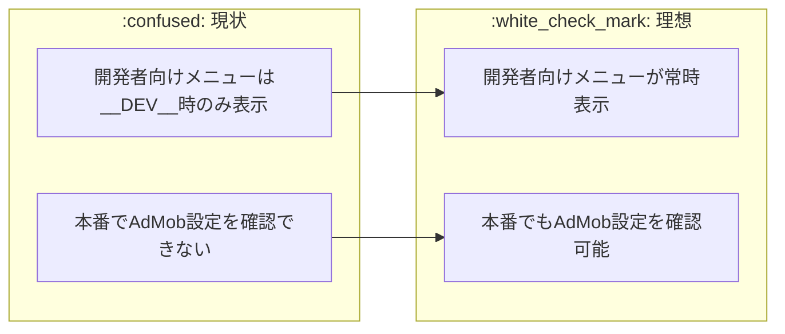
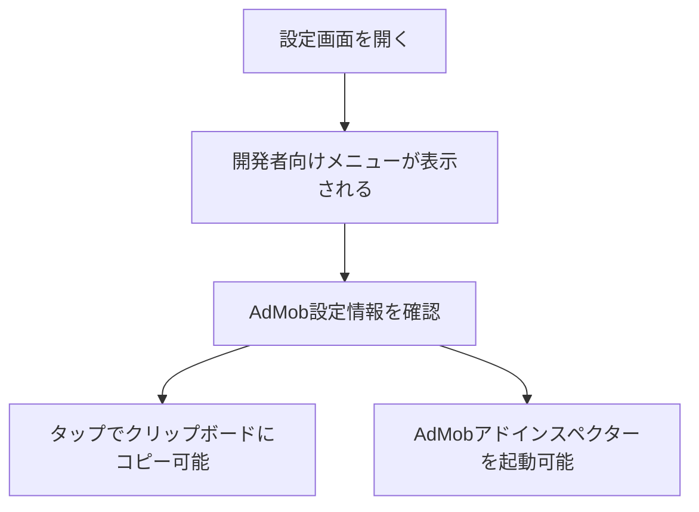

# タスク005：本番環境でAdMobデバッグ情報を表示

**プロジェクト:** App
**ステータス:** 未着手
**優先度:** 高
**ブランチ:** fix/ignore_admob（既存ブランチ）
**壁打ち日:** 2025-01-29

---

## 概要

設定画面の開発者向けメニュー（AdMobデバッグ情報）を一時的に本番環境でも表示できるようにする。

---

## 背景

### 現状 → 理想の変化



### 設計方針（壁打ちで確定）

| 方針 | 説明 |
|------|------|
| **一時的な変更** | 確認完了後、手動でコードを戻す |
| **最小限の変更** | `__DEV__`条件を削除するのみ |
| **App Open広告** | 不要（追加しない） |

---

## 処理フロー



---

## 事前調査で把握した既存実装

| ファイル | 内容 | 本タスクとの関連 |
|---------|------|-----------------|
| `app/views/settings/IndexView.js` | 設定画面のメインビュー | `__DEV__`条件でDeveloperSettingsMenusを表示制御している（471行目） |
| `app/views/settings/DeveloperSettingsMenus.js` | 開発者向けメニューコンポーネント | AdMob設定情報の表示ロジックが実装済み |

---

## 変更一覧

### 1. IndexView.js（設定画面）

**変更内容**: `__DEV__`条件を削除して常時表示にする

```javascript
// Before（471行目）
{__DEV__ && <DeveloperSettingsMenus />}

// After
<DeveloperSettingsMenus />
```

**理由**: 本番環境でもAdMobデバッグ情報を確認するため

---

## 動作確認

### 確認項目

| # | 確認項目 | 確認手順 | 期待結果 |
|---|---------|---------|---------|
| 1 | 開発者向けメニュー表示 | 本番ビルドで設定画面を開く | 「開発者向け」セクションが表示される |
| 2 | AdMob設定情報表示 | 「AdMob設定情報」をタップ | 設定情報がアラートで表示され、クリップボードにコピーされる |
| 3 | AdMobアドインスペクター | 「AdMobアドインスペクター」をタップ | AdMobのアドインスペクターが起動する |

---

## 実装手順

### Phase 1: コード変更
- [ ] `app/views/settings/IndexView.js`の471行目を修正

### Phase 2: 動作確認
- [ ] 本番ビルドで設定画面を開く
- [ ] AdMob設定情報が表示されることを確認
- [ ] 確認完了後、コードを元に戻す

### Phase 3: コード復元（確認完了後）
- [ ] `__DEV__ &&`条件を元に戻す

---

## 関連ファイル

### 変更対象
| ファイル | 変更内容 |
|---------|----------|
| `app/views/settings/IndexView.js` | `__DEV__`条件を削除 |

### 参照のみ（変更なし）
| ファイル | 参照理由 |
|---------|----------|
| `app/views/settings/DeveloperSettingsMenus.js` | AdMob設定情報の表示ロジック確認 |

---

## 確認事項

- [ ] 本番ビルドで開発者向けメニューが表示される
- [ ] AdMob設定情報が正しく表示される
- [ ] 確認完了後、コードを元に戻す

---

## 注意事項

- **一時的な変更**: これは調査用の一時的な変更です。確認完了後、必ず`__DEV__`条件を元に戻してください
- **リリース前に必ず戻す**: このままリリースすると、一般ユーザーにも開発者向けメニューが表示されてしまいます

---

## 壁打ち決定事項サマリー

### 質問と回答一覧
| # | 質問 | 決定 |
|---|------|------|
| 1 | 過去のコミットをベースにする意味 | A: 過去のAppLovin版にあった項目をAdMob版にも追加 |
| 2 | 追加する情報 | A: App Open広告ユニットID → 後にC: 不要に変更 |
| 3 | 本番での表示方法 | A: 設定画面に常時表示 |
| 4 | 非表示に戻すタイミング | A: 確認後、手動でコードを戻す |
| 5 | App Open広告 | C: 不要（追加しない） |

### 保留事項
| 項目 | 理由 |
|------|------|
| なし | - |
