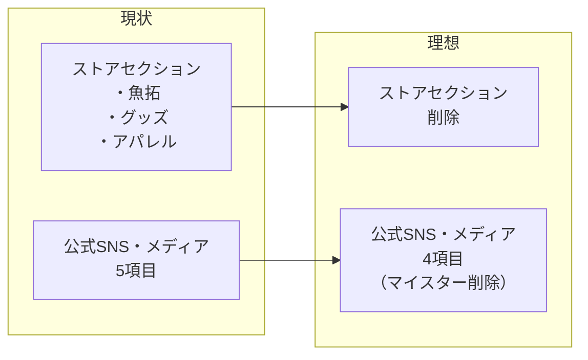
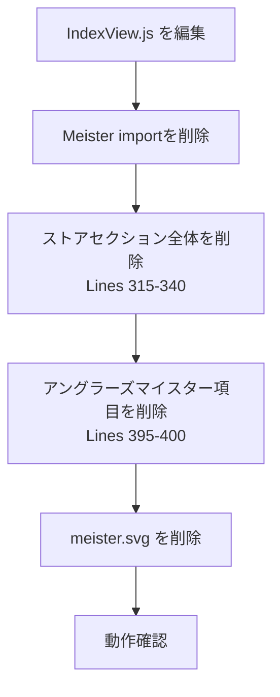

# タスク006：設定画面から不要な導線を削除

**プロジェクト:** App（React Native - レガシー）
**ステータス:** 未着手
**優先度:** 中
**ブランチ:** TBD
**壁打ち日:** 2026-02-02

---

## 概要

設定画面から「ストア」セクション全体と「アングラーズマイスター」メニュー項目を削除する。

---

## 背景

### 現状 → 理想の変化



### 設計方針（壁打ちで確定）

| 方針 | 説明 |
|------|------|
| **ストアセクション** | セクションごと丸ごと削除（タイトル + 3項目すべて） |
| **公式SNS・メディア** | アングラーズマイスターのみ削除（4項目は残す） |
| **アセット削除** | `meister.svg` を削除 |
| **import文** | 不要になった `Meister` のimportを削除 |

---

## 処理フロー



---

## 事前調査で把握した既存実装

| ファイル | 内容 | 本タスクとの関連 |
|---------|------|-----------------|
| `app/views/settings/IndexView.js` | 設定画面のメインコンポーネント | 削除対象のメニュー項目が定義されている |
| `app/views/settings/MenuList.js` | メニューセクションコンポーネント | 構造の理解（変更なし） |
| `app/views/settings/MenuListItem.js` | 個別メニュー項目コンポーネント | 構造の理解（変更なし） |
| `app/assets/svgs/meister.svg` | マイスターロゴSVG | 削除対象 |

---

## 変更一覧

### 1. `app/views/settings/IndexView.js` - import文の削除

**変更内容**: Line 1 の `Meister` importを削除

```javascript
// Before
import Meister from '@assets/svgs/meister.svg';

// After
// （この行を削除）
```

**理由**: アングラーズマイスター項目を削除するため、SVGコンポーネントのimportが不要になる

---

### 2. `app/views/settings/IndexView.js` - ストアセクションの削除

**変更内容**: Lines 315-340 の「ストア」セクション全体を削除

```javascript
// Before（削除対象）
          <MenuList
            title="ストア"
            paddingHorizontal={CONTENT_PADDING_HORIZONTAL}
          >
            <MenuListItem
              text="デジタル魚拓 #gyotaku"
              onPress={() =>
                this.onPressLink('https://event.anglers.jp/gyotaku')
              }
              paddingHorizontal={CONTENT_PADDING_HORIZONTAL}
            />
            <MenuListItem
              text="限定グッズ"
              onPress={() => this.onPressLink('https://anglers.thebase.in/')}
              paddingHorizontal={CONTENT_PADDING_HORIZONTAL}
            />
            <MenuListItem
              text="アパレル"
              onPress={() =>
                this.onPressLink(
                  'https://utme.uniqlo.com/jp/front/mkt/show?id=602210&locale=ja',
                )
              }
              paddingHorizontal={CONTENT_PADDING_HORIZONTAL}
            />
          </MenuList>

// After
// （このセクション全体を削除）
```

**理由**: ストアセクションは不要なため丸ごと削除

---

### 3. `app/views/settings/IndexView.js` - アングラーズマイスター項目の削除

**変更内容**: Lines 395-400 の「アングラーズマイスター」項目を削除

```javascript
// Before（削除対象）
            <MenuListItem
              icon={<Meister width={26} height={26} />}
              text="アングラーズマイスター"
              onPress={() => this.onPressLink('https://anglers.jp/meisters')}
              paddingHorizontal={CONTENT_PADDING_HORIZONTAL}
            />

// After
// （この項目を削除）
```

**理由**: アングラーズマイスターへの導線は不要

---

### 4. `app/assets/svgs/meister.svg` - ファイル削除

**変更内容**: ファイルを削除

**理由**: 使用箇所がなくなるため不要

---

## 削除後の「公式SNS・メディア」セクション構成

```javascript
<MenuList
  title="公式SNS・メディア"
  paddingHorizontal={CONTENT_PADDING_HORIZONTAL}
>
  <MenuListItem
    icon={<ImageIcon source={require('@assets/images/views/settings/twitter.png')} />}
    text="Twitter"
    onPress={() => this.onPressLink('https://twitter.com/anglers_jp')}
    paddingHorizontal={CONTENT_PADDING_HORIZONTAL}
  />
  <MenuListItem
    icon={<ImageIcon source={require('@assets/images/views/settings/facebook.png')} />}
    text="Facebook"
    onPress={() => this.onPressLink('https://www.facebook.com/anglers.jp/')}
    paddingHorizontal={CONTENT_PADDING_HORIZONTAL}
  />
  <MenuListItem
    icon={<ImageIcon source={require('@assets/images/views/settings/instagram.png')} />}
    text="Instagram"
    onPress={() => this.onPressLink('https://www.instagram.com/anglers_jp/')}
    paddingHorizontal={CONTENT_PADDING_HORIZONTAL}
  />
  <MenuListItem
    icon={<ImageIcon source={require('@assets/images/views/settings/anglers_magazine.png')} />}
    text="アングラーズマガジン"
    onPress={() => {
      const url = GoogleUtils.generateAnalyticsUrl(
        `${ANGLERS_SITE_URL}/magazines`,
        'menu',
      );
      this.onPressLinkInApp(url);
    }}
    paddingHorizontal={CONTENT_PADDING_HORIZONTAL}
  />
</MenuList>
```

---

## 動作確認

### 確認項目

| # | 確認項目 | 確認手順 | 期待結果 |
|---|---------|---------|---------|
| 1 | 設定画面の表示 | アプリを起動し、設定画面を開く | エラーなく設定画面が表示される |
| 2 | ストアセクション削除確認 | 設定画面をスクロール | 「ストア」セクションが表示されない |
| 3 | マイスター削除確認 | 「公式SNS・メディア」セクションを確認 | 「アングラーズマイスター」が表示されない |
| 4 | 残り4項目の動作 | Twitter/Facebook/Instagram/マガジンをタップ | それぞれ正しいリンクが開く |
| 5 | 他のセクション影響なし | アカウント、あなたのデータ、マイタックル、ヘルプとサポートを確認 | 変更なく正常に動作する |

---

## 実装手順

```mermaid
gantt
    title 実装フェーズ
    dateFormat X
    axisFormat %s

    section Phase 1
    IndexView.js編集    :a1, 0, 1
    meister.svg削除     :a2, after a1, 1

    section Phase 2
    動作確認            :b1, after a2, 1
```



### Phase 1: コード・アセット削除
- [ ] `app/views/settings/IndexView.js` Line 1: `import Meister from '@assets/svgs/meister.svg';` を削除
- [ ] `app/views/settings/IndexView.js` Lines 315-340: 「ストア」セクション全体を削除
- [ ] `app/views/settings/IndexView.js` Lines 395-400: 「アングラーズマイスター」項目を削除
- [ ] `app/assets/svgs/meister.svg` を削除

### Phase 2: 動作確認
- [ ] iOSシミュレーターで設定画面を確認
- [ ] 確認項目のチェック

---

## 関連ファイル

### 変更対象
| ファイル | 変更内容 |
|---------|----------|
| `app/views/settings/IndexView.js` | import削除、ストアセクション削除、マイスター項目削除 |

### 削除対象
| ファイル | 説明 |
|---------|------|
| `app/assets/svgs/meister.svg` | マイスターロゴSVG |

### 参照のみ（変更なし）
| ファイル | 参照理由 |
|---------|----------|
| `app/views/settings/MenuList.js` | コンポーネント構造の理解 |
| `app/views/settings/MenuListItem.js` | コンポーネント構造の理解 |

---

## 確認事項

- [ ] TypeScriptエラー: 0件（※本ファイルはJavaScript + Flow）
- [ ] 動作確認項目: 完了

---

## 注意事項

- 本ファイル（IndexView.js）は JavaScript + Flow で記述されている
- 行番号は編集前の状態を基準としている。ストアセクション削除後はマイスター項目の行番号がずれるため、削除は上から順に行うこと
- SNSアイコン画像（twitter.png, facebook.png, instagram.png, anglers_magazine.png）は残す

---

## 壁打ち決定事項サマリー

### 質問と回答一覧
| # | 質問 | 決定 |
|---|------|------|
| 1 | 「ストア」セクションの扱い | A: セクションごと丸ごと削除 |
| 2 | 「公式SNS・メディア」セクションの扱い | B: アングラーズマイスターのみ削除（4項目残す） |
| 3 | `meister.svg` の削除 | A: 削除する |
| 4 | 残す項目の確認 | A: Twitter/Facebook/Instagram/マガジンの4項目を残す |

### 保留事項
| 項目 | 理由 |
|------|------|
| なし | - |
