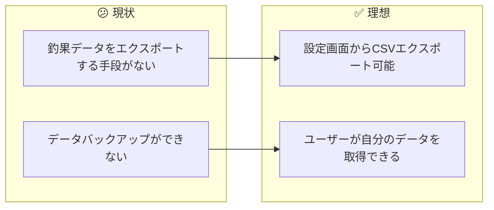
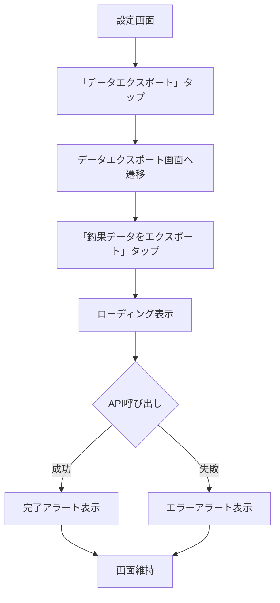
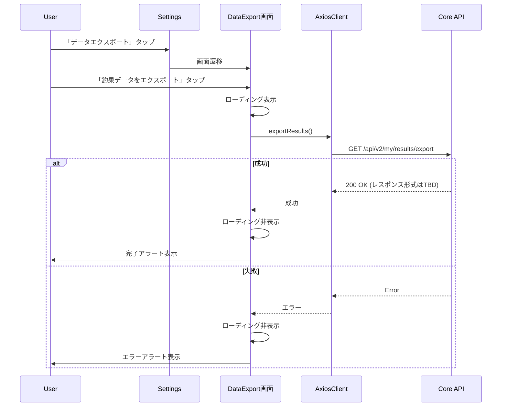

# タスク007：釣果データCSVエクスポート機能

**プロジェクト:** App（React Native レガシー）
**ステータス:** 未着手
**優先度:** 高（2月中リリース必須）
**ブランチ:** TBD
**壁打ち日:** 2026-02-03

---

## 概要

設定画面に「データエクスポート」ボタンを追加し、`/api/v2/my/results/export` APIを叩いて過去の釣果データをCSV形式でエクスポートできるようにする。

---

## 背景

### 現状 → 理想の変化



### 設計方針（壁打ちで確定）

| 方針 | 説明 |
|------|------|
| **シンプルなAPI呼び出し** | 既存の`/api/v2/my/results/export`を叩くだけ |
| **既存パターン踏襲** | `AxiosClient`を使用したAPI通信 |
| **ローディング+アラート** | API呼び出し中はローディング表示、完了/エラー時はアラート |

---

## 処理フロー



### シーケンス図



---

## 事前調査で把握した既存実装

| ファイル | 内容 | 本タスクとの関連 |
|---------|------|-----------------|
| `app/views/settings/IndexView.js` | 設定画面メインコンポーネント | ここに「データエクスポート」メニュー追加 |
| `app/views/settings/MenuList.js` | メニューリストラッパー | UIコンポーネントとして使用 |
| `app/views/settings/MenuListItem.js` | メニューアイテム | UIコンポーネントとして使用 |
| `app/models/AxiosClient.js` | API通信基盤（axios使用） | API呼び出しに使用 |
| `config/navigators.js` | ナビゲーション設定 | 新画面のルート追加 |

---

## 変更一覧

### 1. 設定画面にメニュー追加（`app/views/settings/IndexView.js`）

**変更内容**: 「あなたのデータ」セクションに「データエクスポート」メニューを追加

```javascript
// Before（「あなたのデータ」セクション内、L294の後）
<MenuListItem
  text="あなたが書いたレビュー"
  onPress={() => this.onPressNavigate('MyProductReviews')}
  paddingHorizontal={CONTENT_PADDING_HORIZONTAL}
/>

// After
<MenuListItem
  text="あなたが書いたレビュー"
  onPress={() => this.onPressNavigate('MyProductReviews')}
  paddingHorizontal={CONTENT_PADDING_HORIZONTAL}
/>
<MenuListItem
  text="データエクスポート"
  onPress={() => this.onPressNavigate('DataExport')}
  paddingHorizontal={CONTENT_PADDING_HORIZONTAL}
/>
```

**理由**: 「あなたのデータ」セクションにデータ管理系機能を集約

---

### 2. データエクスポート画面の新規作成

**新規ファイル**: `app/views/settings/data_export/IndexView.js`

```javascript
// @flow
import Container from '@assets/themes/components/Container';
import variables from '@assets/themes/variables/platform';
import { StyledHeader } from '@views/common/StyledHeader';
import { Content } from 'native-base';
import React from 'react';
import { ActivityIndicator, Alert, StyleSheet, View } from 'react-native';

import type { BaseProps } from '../../common/BaseView';
import { BaseView } from '../../common/BaseView';
import ResultExportClient from '../../../models/results/ResultExportClient';
import { MenuList } from '../MenuList';
import { MenuListItem } from '../MenuListItem';

const CONTENT_PADDING_HORIZONTAL = 16;

type State = {
  isLoading: boolean,
};

export class IndexView extends BaseView<BaseProps, State> {
  constructor(props: BaseProps) {
    super(props);
    this.state = {
      isLoading: false,
    };
  }

  onPressExportResults = async () => {
    this.setState({ isLoading: true });

    try {
      const response = await ResultExportClient.exportResults();
      // TODO: レスポンス形式に応じて処理を追加
      // 現時点ではAPIレスポンスの形式が不明なため、成功アラートのみ表示
      Alert.alert(
        'エクスポート完了',
        '釣果データのエクスポートが完了しました。',
        [{ text: 'OK' }]
      );
    } catch (error) {
      console.error('Export error:', error);
      Alert.alert(
        'エラー',
        'エクスポートに失敗しました。しばらく経ってからお試しください。',
        [{ text: 'OK' }]
      );
    } finally {
      this.setState({ isLoading: false });
    }
  };

  render() {
    const { navigation } = this.props;
    const { goBack } = navigation;
    const { isLoading } = this.state;

    return (
      <Container safe={true}>
        <StyledHeader
          onPressLeft={() => goBack()}
          title="データエクスポート"
        />
        <Content contentContainerStyle={styles.contentContainer}>
          {isLoading && (
            <View style={styles.loadingOverlay}>
              <ActivityIndicator size="large" color={variables.brandPrimary} />
            </View>
          )}
          <MenuList
            title="エクスポート"
            paddingHorizontal={CONTENT_PADDING_HORIZONTAL}
          >
            <MenuListItem
              text="釣果データをエクスポート"
              subText="過去の釣果データをCSV形式で取得"
              onPress={this.onPressExportResults}
              paddingHorizontal={CONTENT_PADDING_HORIZONTAL}
            />
          </MenuList>
        </Content>
      </Container>
    );
  }
}

const styles = StyleSheet.create({
  contentContainer: {
    flexGrow: 1,
    backgroundColor: variables.fillColorSub,
    paddingTop: 24,
  },
  loadingOverlay: {
    position: 'absolute',
    top: 0,
    left: 0,
    right: 0,
    bottom: 0,
    backgroundColor: 'rgba(255, 255, 255, 0.8)',
    justifyContent: 'center',
    alignItems: 'center',
    zIndex: 1000,
  },
});
```

---

### 3. APIクライアントの新規作成

**新規ファイル**: `app/models/results/ResultExportClient.js`

```javascript
// @flow
import AxiosClient from '../AxiosClient';

export default class ResultExportClient {
  static async exportResults(): Promise<any> {
    const client = new AxiosClient().buildClient();
    const response = await client.get('/api/v2/my/results/export');
    return response.data;
  }
}
```

**理由**: API通信は専用クライアントクラスに分離（既存パターン踏襲）

---

### 4. ナビゲーション設定の追加（`config/navigators.js`）

**変更内容**: DataExport画面のルートを追加

```javascript
// import追加（ファイル上部）
import { IndexView as DataExportView } from '../app/views/settings/data_export/IndexView';

// StackNavigator内にルート追加
DataExport: {
  screen: DataExportView,
},
```

---

## データ構造

### APIレスポンス（TBD）

現時点ではAPIレスポンスの形式が不明です。レスポンス確認後、以下を追記予定：

```typescript
// TODO: 実際のレスポンス形式に合わせて更新
interface ExportResponse {
  // TBD
}
```

---

## ファイル構成

```
app/
├── views/
│   └── settings/
│       ├── IndexView.js          # 変更：メニュー追加
│       └── data_export/
│           └── IndexView.js      # 新規：データエクスポート画面
├── models/
│   └── results/
│       └── ResultExportClient.js # 新規：APIクライアント
config/
└── navigators.js                  # 変更：ルート追加
```

---

## 動作確認

### 確認項目

| # | 確認項目 | 確認手順 | 期待結果 |
|---|---------|---------|---------|
| 1 | メニュー表示 | 設定画面を開く | 「あなたのデータ」に「データエクスポート」が表示される |
| 2 | 画面遷移 | 「データエクスポート」をタップ | データエクスポート画面に遷移する |
| 3 | API呼び出し成功 | 「釣果データをエクスポート」タップ | ローディング表示 → 完了アラート |
| 4 | API呼び出し失敗 | ネットワークOFF状態でタップ | エラーアラート表示 |
| 5 | 戻るボタン | 左上の戻るボタンをタップ | 設定画面に戻る |

---

## 実装手順

```mermaid
gantt
    title 実装フェーズ
    dateFormat X
    axisFormat %s

    section Phase 1
    APIクライアント作成           :a1, 0, 1
    データエクスポート画面作成    :a2, after a1, 2

    section Phase 2
    ナビゲーション設定追加        :b1, after a2, 1
    設定画面にメニュー追加        :b2, after b1, 1

    section Phase 3
    動作確認                      :c1, after b2, 1
```



### Phase 1: 基盤実装
- [ ] `app/models/results/ResultExportClient.js` 新規作成
- [ ] `app/views/settings/data_export/IndexView.js` 新規作成

### Phase 2: 画面連携
- [ ] `config/navigators.js` にルート追加
- [ ] `app/views/settings/IndexView.js` にメニュー追加

### Phase 3: 動作確認
- [ ] 確認項目のチェック

---

## 関連ファイル

### 変更対象
| ファイル | 変更内容 |
|---------|----------|
| `app/views/settings/IndexView.js` | 「データエクスポート」メニュー追加 |
| `config/navigators.js` | DataExportルート追加 |

### 新規作成
| ファイル | 説明 |
|---------|------|
| `app/views/settings/data_export/IndexView.js` | データエクスポート画面 |
| `app/models/results/ResultExportClient.js` | エクスポートAPIクライアント |

### 参照のみ（変更なし）
| ファイル | 参照理由 |
|---------|----------|
| `app/views/settings/MenuList.js` | UIコンポーネント参照 |
| `app/views/settings/MenuListItem.js` | UIコンポーネント参照 |
| `app/models/AxiosClient.js` | API通信パターン参照 |

---

## 確認事項

- [ ] TypeScript/Flowエラー: 0件
- [ ] 動作確認項目: 完了

---

## 注意事項

- **APIレスポンス形式が不明**: 現時点では成功アラートを表示するのみ。レスポンス形式確認後、必要に応じてファイル保存・共有機能を追加
- **2月中リリース必須**: シンプルな実装を優先
- **画像DL機能は対象外**: 別タスクとして後日対応

---

## 壁打ち決定事項サマリー

### 質問と回答一覧
| # | 質問 | 決定 |
|---|------|------|
| 1 | 対象プロジェクト | App（React Native レガシー） |
| 2 | 機能分割 | 1つのタスク（画像DLは対象外） |
| 3 | CSVエクスポート方式 | APIレスポンス確認後に決定 |
| 4 | 画像DL機能 | 一旦対象外 |
| 5 | UI配置 | 「あなたのデータ」セクションに追加 |
| 6 | DL後の挙動 | 特になし（アラート表示のみ） |
| 7 | UI詳細 | 「データエクスポート」ボタン → 次画面で選択 |
| 8 | ローディング | インジケーター表示 → 完了アラート |
| 9 | エラーハンドリング | アラートでエラーメッセージ表示 |

### 保留事項
| 項目 | 理由 |
|------|------|
| APIレスポンス形式に応じた処理 | レスポンス確認後に追記予定 |
| 画像一括DL機能 | 別タスクとして後日対応 |

---

## 追記予定（APIレスポンス確認後）

- レスポンス形式の型定義
- ファイル保存処理（必要な場合）
- 共有シート連携（必要な場合）
