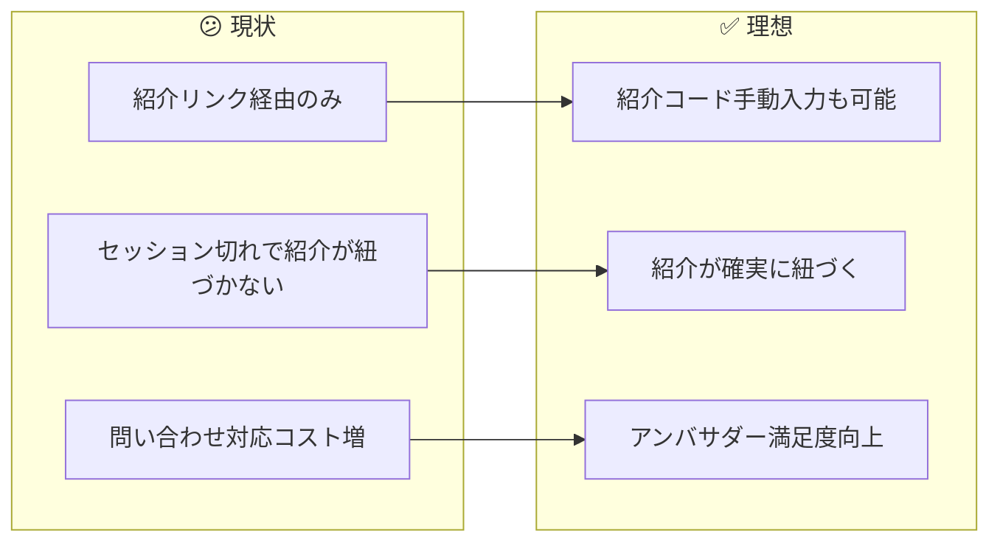
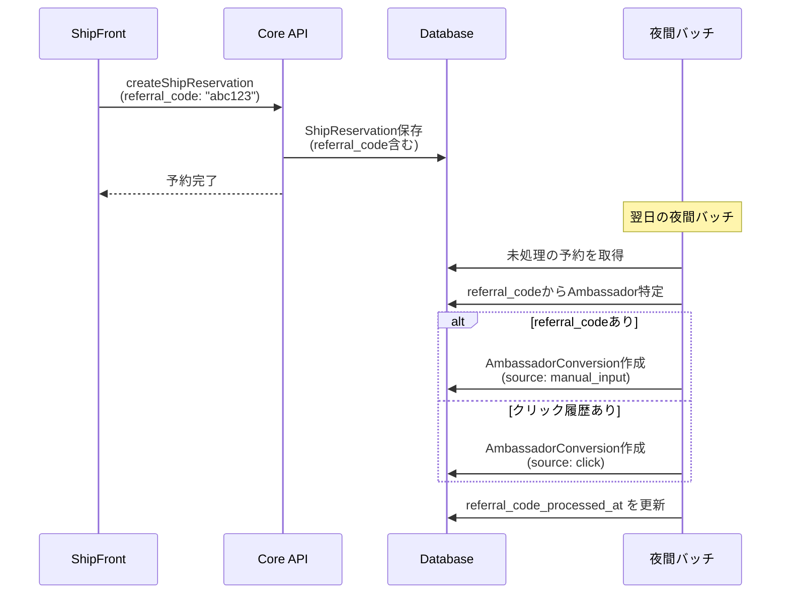
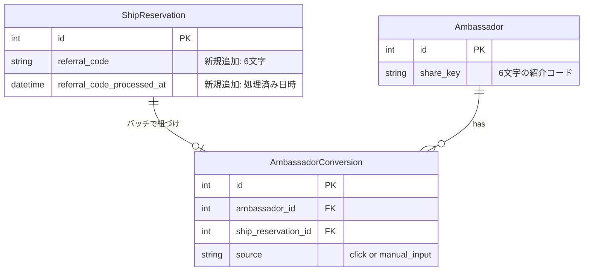

# タスク001：予約時に紹介コードを入力できるようにする（Core側）

**プロジェクト:** Core
**ステータス:** 未着手
**優先度:** 高
**ブランチ:** `feature/reservation-referral-code`
**壁打ち日:** 2026-01-13

---

## 概要

予約時に紹介コードを手動入力できるようにし、アンバサダースコアとして計上されるようにする。紹介コードは一時保存し、夜間バッチで`AmbassadorConversion`に統合する。

---

## 背景

### 現状 → 理想の変化



### 設計方針（壁打ちで確定）

| 方針 | 説明 |
|------|------|
| **単一の真実源** | 最終的な紐づけは`AmbassadorConversion`で一元管理 |
| **referral_codeは一時保存** | 予約作成時に保存し、バッチ処理後は処理済みとして扱う |
| **既存バッチの拡張** | 新規バッチではなく、既存の`ConversionSidekiqJob`を拡張 |
| **優先順位** | 手動入力 > クリック履歴（重複防止） |

---

## 処理フロー



---

## 事前調査で把握した既存実装

| ファイル | 内容 | 本タスクとの関連 |
|---------|------|-----------------|
| `app/models/ambassador.rb` | `share_key`（6文字の紹介コード） | 入力値の検証に使用 |
| `app/models/ship_reservation.rb` | 予約モデル | `referral_code`カラム追加 |
| `app/models/ambassador_conversion.rb` | 紹介コンバージョン | 最終的な紐づけ先 |
| `app/jobs/ambassador/conversion_sidekiq_job.rb` | 夜間バッチ | 拡張対象 |
| `lib/ambassador_event_referral/reservation_metrics_aggregator.rb` | 紹介判定ロジック | 拡張対象 |
| `app/graphql/types/inputs/ship_reservation_type.rb` | 予約作成Input | `referral_code`引数追加 |
| `app/interactors/ship_reservation/create_interactor.rb` | 予約作成ロジック | `referral_code`保存追加 |

---

## データ構造

### スキーマ変更



### マイグレーション

```ruby
class AddReferralCodeToShipReservations < ActiveRecord::Migration[7.0]
  def change
    add_column :ship_reservations, :referral_code, :string, limit: 6
    add_column :ship_reservations, :referral_code_processed_at, :datetime
    add_index :ship_reservations, :referral_code
  end
end
```

---

## 変更一覧

### 1. マイグレーション追加

**ファイル**: `db/migrate/YYYYMMDDHHMMSS_add_referral_code_to_ship_reservations.rb`

```ruby
class AddReferralCodeToShipReservations < ActiveRecord::Migration[7.0]
  def change
    add_column :ship_reservations, :referral_code, :string, limit: 6
    add_column :ship_reservations, :referral_code_processed_at, :datetime
    add_index :ship_reservations, :referral_code
  end
end
```

---

### 2. GraphQL Input追加

**ファイル**: `app/graphql/types/inputs/ship_reservation_type.rb`

```ruby
# Before
argument :consume_points, Integer, required: false, description: 'ポイント利用数'
argument :applied_discount_policy, Types::Inputs::ShipReservationAppliedDiscountPolicyType, required: false

# After
argument :consume_points, Integer, required: false, description: 'ポイント利用数'
argument :applied_discount_policy, Types::Inputs::ShipReservationAppliedDiscountPolicyType, required: false
argument :referral_code, String, required: false, description: '紹介コード（6文字）'
```

---

### 3. 予約作成Interactor修正

**ファイル**: `app/interactors/ship_reservation/create_interactor.rb`

```ruby
# ShipReservation.new の引数に追加
ship_reservation =
  ShipReservation.new(
    # ... 既存の引数 ...
    referral_code: validated_referral_code(@params[:referral_code]),
    operator: @account
  )

# private メソッドに追加
def validated_referral_code(code)
  return nil if code.blank?

  # 6文字の英数字小文字のみ許可
  normalized = code.to_s.downcase.strip
  return nil unless normalized.match?(/\A[a-z0-9]{6}\z/)

  # 存在するAmbassadorのshare_keyか確認
  Ambassador.exists?(share_key: normalized) ? normalized : nil
end
```

---

### 4. ReservationMetricsAggregator拡張

**ファイル**: `lib/ambassador_event_referral/reservation_metrics_aggregator.rb`

```ruby
class AmbassadorEventReferral::ReservationMetricsAggregator
  ReservationAttribution = Struct.new(:reservation, :event_referral, :source, keyword_init: true)

  class << self
    def stats(on_date:)
      reservations = ShipReservation
                     .preload(:ship_reservation_customer)
                     .where(created_at: on_date.all_day)
                     .where(referral_code_processed_at: nil) # 未処理のみ

      reservations.find_each.with_object({}) do |reservation, acc|
        attribution = find_attribution_for_reservation(reservation)
        next unless attribution

        acc[attribution[:ambassador_id]] ||= []
        acc[attribution[:ambassador_id]] << ReservationAttribution.new(
          reservation:,
          event_referral: attribution[:event_referral],
          source: attribution[:source]
        )
      end
    end

    private

    # 手動入力を優先、なければクリック履歴から検索
    def find_attribution_for_reservation(reservation)
      # 1. 手動入力の紹介コードを優先
      if reservation.referral_code.present?
        ambassador = Ambassador.find_by(share_key: reservation.referral_code)
        if ambassador
          return {
            ambassador_id: ambassador.id,
            event_referral: nil,
            source: :manual_input
          }
        end
      end

      # 2. クリック履歴から検索（従来の処理）
      event_referral = find_last_event_referral_for_reservation(reservation)
      if event_referral
        return {
          ambassador_id: event_referral.ambassador_id,
          event_referral:,
          source: :click
        }
      end

      nil
    end

    def find_last_event_referral_for_reservation(reservation)
      AmbassadorEventReferral.valid_clicks
        .where(account_id: reservation.ship_reservation_customer.account_id)
        .where(event_at: reservation.created_at - AmbassadorEventReferral::RESERVATION_WINDOW_DAYS.days..reservation.created_at)
        .order(event_at: :desc)
        .first
    end
  end
end
```

---

### 5. ConversionSidekiqJob修正

**ファイル**: `app/jobs/ambassador/conversion_sidekiq_job.rb`

```ruby
def process_reservation_conversions(target_date)
  reservation_stats = AmbassadorEventReferral::ReservationMetricsAggregator.stats(on_date: target_date)

  reservation_stats.each do |ambassador_id, attributions|
    attributions.each do |attr|
      conversion = AmbassadorConversion.find_or_create_by!(
        ambassador_id:,
        account: attr.reservation.ship_reservation_customer.account,
        conversion_date: target_date,
        event_type: :reservation,
        ship_reservation: attr.reservation,
        last_touch_ambassador_event_referral: attr.event_referral # manual_inputの場合はnil
      )

      # 処理済みフラグを更新
      attr.reservation.update!(referral_code_processed_at: Time.current)
    end
  end
end
```

---

### 6. AmbassadorConversionモデル修正

**ファイル**: `app/models/ambassador_conversion.rb`

```ruby
# validates修正: manual_inputの場合はevent_referralがnilでもOK
validates :last_touch_ambassador_event_referral, presence: true, if: -> { reservation? && !manual_input_source? }

def manual_input_source?
  ship_reservation&.referral_code.present?
end
```

---

## 実装手順

```mermaid
gantt
    title 実装フェーズ
    dateFormat X
    axisFormat %s

    section Phase 1: DB
    マイグレーション作成    :a1, 0, 1
    マイグレーション実行    :a2, after a1, 1

    section Phase 2: API
    GraphQL Input追加    :b1, after a2, 1
    Interactor修正    :b2, after b1, 1
    バリデーション追加    :b3, after b2, 1

    section Phase 3: バッチ
    ReservationMetricsAggregator拡張    :c1, after b3, 1
    ConversionSidekiqJob修正    :c2, after c1, 1
    AmbassadorConversion修正    :c3, after c2, 1

    section Phase 4: テスト
    ユニットテスト    :d1, after c3, 1
    結合テスト    :d2, after d1, 1
```



### Phase 1: データベース
- [ ] マイグレーションファイル作成
- [ ] マイグレーション実行

### Phase 2: API層
- [ ] `Types::Inputs::ShipReservationType`に`referral_code`引数追加
- [ ] `ShipReservation::CreateInteractor`で`referral_code`を保存
- [ ] 紹介コードのバリデーション実装（6文字英数字、存在チェック）

### Phase 3: バッチ処理
- [ ] `ReservationMetricsAggregator`を拡張（手動入力優先ロジック）
- [ ] `ConversionSidekiqJob`で処理済みフラグを更新
- [ ] `AmbassadorConversion`のvalidates修正

### Phase 4: テスト
- [ ] 紹介コード付き予約作成のテスト
- [ ] バッチ処理で`AmbassadorConversion`が作成されるテスト
- [ ] 手動入力 > クリック履歴の優先順位テスト

---

## 関連ファイル

### 変更対象
| ファイル | 変更内容 |
|---------|----------|
| `db/migrate/xxx_add_referral_code_to_ship_reservations.rb` | 新規作成 |
| `app/graphql/types/inputs/ship_reservation_type.rb` | `referral_code`引数追加 |
| `app/interactors/ship_reservation/create_interactor.rb` | `referral_code`保存・バリデーション |
| `lib/ambassador_event_referral/reservation_metrics_aggregator.rb` | 手動入力優先ロジック |
| `app/jobs/ambassador/conversion_sidekiq_job.rb` | 処理済みフラグ更新 |
| `app/models/ambassador_conversion.rb` | validates修正 |

### 新規作成
| ファイル | 説明 |
|---------|------|
| `db/migrate/xxx_add_referral_code_to_ship_reservations.rb` | マイグレーション |

---

## 確認事項

- [ ] マイグレーション成功
- [ ] 紹介コード付き予約が作成できる
- [ ] 無効な紹介コードは無視される（エラーにはしない）
- [ ] バッチ処理で`AmbassadorConversion`が作成される
- [ ] 手動入力が優先される（クリック履歴より）
- [ ] スコア計上が正しく行われる

---

## 注意事項

- **無効な紹介コードはエラーにしない**: UXを考慮し、無効なコードは単に無視する（予約は成功させる）
- **referral_codeは一時的なデータ**: 最終的な紐づけは`AmbassadorConversion`で管理
- **バッチ処理のタイミング**: 紹介コード入力から`AmbassadorConversion`作成まで最大1日のタイムラグがある
- **既存予約への影響なし**: 新規予約のみが対象

---

## 壁打ち決定事項サマリー

### 質問と回答一覧
| # | 質問 | 決定 |
|---|------|------|
| 1 | 紹介コードの保存先 | A: `ship_reservations.referral_code`（一時保存）、最終紐づけは`AmbassadorConversion` |
| 2 | 入力タイミング | A: 予約フォームに専用フィールド追加 |
| 3 | 自動入力の仕組み | A: フロントでlocalStorageに保存し、予約フォームで自動入力 |
| 4 | スコア計上の仕組み | A: 既存の`ReservationMetricsAggregator`を拡張 |
| - | T-wada視点での設計 | B案（バッチ処理版）: 単一の真実源として`AmbassadorConversion`を使用 |

### 保留事項
| 項目 | 理由 |
|------|------|
| リアルタイム処理への移行 | 将来的な検討事項として記録。現状はバッチ処理で十分 |
