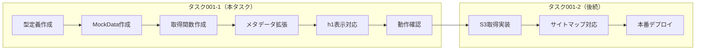

# タスク001-1：検索カテゴリページSEO最適化 - MockData版

**ステータス:** 未着手
**優先度:** 高
**ブランチ:** TBD
**壁打ち日:** 2025-01-09
**前提タスク:** なし
**後続タスク:** task-001-2（S3版）

---

## 概要

検索カテゴリページのSEOメタデータオーバーライド機能を、MockDataを使って実装・動作確認する。バックエンドのS3対応完了前に、フロントエンド側の実装を先行して進める。

---

## 背景

### 現状の問題

- バックエンドのS3対応がまだ完了していない
- フロントエンドの実装を並行して進めたい
- 本番デプロイ前にUI・SEOメタデータの動作確認をしたい

### 設計方針（壁打ちで確定）

| 方針 | 説明 |
|------|------|
| **実装範囲** | UI（h1表示）+ SEOメタデータ（title/description）※サイトマップは除外 |
| **データソース** | MockData（TypeScriptファイルにハードコード） |
| **MockData配置** | `src/app/search/_lib/get-seo-overrides/mock-data.ts` |
| **確認環境** | テスト環境のみ（本番デプロイなし） |
| **切り替え方式** | タスク001-2でファイル差し替え（環境変数切り替えは不要） |

---

## タスク分割の全体像



---

## 実装範囲

### 本タスクで実装するもの

| 項目 | 説明 |
|------|------|
| 型定義 | `SeoOverrideEntry`, `SeoOverridesData`等 |
| MockData | 各typeのテストデータ |
| 取得関数 | `getSeoOverrides`（MockDataを返す） |
| ユーティリティ | `findSeoOverride`, `resolveOverrideType` |
| メタデータ拡張 | `generateSearchBaseMetadata`の拡張 |
| h1表示 | `SearchTitle`, `SearchMainContent`の拡張 |

### 本タスクで実装しないもの（タスク001-2で対応）

| 項目 | 理由 |
|------|------|
| S3からの実データ取得 | バックエンド未完了 |
| サイトマップ連動 | 表示確認できない（SEO効果はGoogle経由でしかわからん） |
| 環境変数切り替え | 2タスク分離なので不要 |

---

## MockData設計

### MockDataファイル（`src/app/search/_lib/get-seo-overrides/mock-data.ts`）

```typescript
import type { SeoOverridesData } from "@/app/search/_types/seo-override";

/**
 * 開発・テスト用のMockData
 * タスク001-2でS3取得に差し替え後、このファイルは削除する
 */
export const mockSeoOverrides: SeoOverridesData = {
  overrides: [
    // パターン1: area - 全項目オーバーライド
    {
      type: "area",
      id: "1", // 実際のエリアIDに合わせて調整
      metaTitle: "【Mock】東京湾の釣り船・船釣り予約",
      metaDescription: "【Mock】東京湾で人気の釣り船を簡単予約。",
      h1: "【Mock】東京湾の釣り船・船釣りプラン",
      canonicalUrl: "/search/areas/1",
      indexed: true,
    },

    // パターン2: prefecture - h1のみオーバーライド
    {
      type: "prefecture",
      id: "13", // 東京都
      h1: "【Mock】東京都の釣り船一覧",
    },

    // パターン3: fish - title/descriptionのみ
    {
      type: "fish",
      id: "1", // 実際の魚種IDに合わせて調整
      metaTitle: "【Mock】アジ釣りができる釣り船",
      metaDescription: "【Mock】アジ釣りが楽しめる釣り船を探そう。",
    },

    // パターン4: fishingMethod - indexed: false
    {
      type: "fishingMethod",
      id: "99", // 存在しないIDでnoindex確認用
      indexed: false,
    },

    // パターン5: area × fish 複合条件
    {
      type: "area",
      id: "1",
      fishId: "1",
      metaTitle: "【Mock】東京湾でアジ釣り",
      h1: "【Mock】東京湾のアジ釣り船",
    },

    // パターン6: region
    {
      type: "region",
      id: "1", // 関東
      h1: "【Mock】関東の釣り船",
    },

    // パターン7: marineFacility
    {
      type: "marineFacility",
      id: "1",
      metaTitle: "【Mock】○○港の釣り船",
      h1: "【Mock】○○港から出船する釣り船",
    },
  ],
};
```

### MockDataのポイント

- 全項目に`【Mock】`プレフィックスをつけて、Mockかどうか一目でわかるようにする
- 各パターンを網羅:
  - 全項目オーバーライド
  - 部分オーバーライド（h1のみ、title/descriptionのみ）
  - indexed: false
  - 複合条件（area × fish）

---

## 変更一覧

### 1. 型定義ファイル作成

**新規ファイル**: `src/app/search/_types/seo-override.ts`

```typescript
/**
 * SEOオーバーライドの対象カテゴリ種別
 */
export type SeoOverrideType =
  | "region"
  | "prefecture"
  | "area"
  | "marineFacility"
  | "fish"
  | "fishingMethod";

/**
 * 単一のSEOオーバーライド設定
 * - 指定しないフィールドは省略可能（省略時はデフォルト値が適用される）
 */
export type SeoOverrideEntry = {
  /** カテゴリ種別 */
  type: SeoOverrideType;
  /** カテゴリID */
  id: string;
  /** 魚種ID（複合条件の場合） */
  fishId?: string | null;
  /** 釣法ID（複合条件の場合） */
  fishingMethodId?: string | null;
  /** Meta Title（省略時: デフォルト生成） */
  metaTitle?: string;
  /** Meta Description（省略時: デフォルト生成） */
  metaDescription?: string;
  /** h1タグ（省略時: デフォルト生成） */
  h1?: string;
  /** Canonical URL（省略時: 現在のパス） */
  canonicalUrl?: string;
  /** インデックス許可（省略時: true、falseでnoindex & サイトマップ除外） */
  indexed?: boolean;
};

/**
 * S3 JSONファイルのルート構造
 */
export type SeoOverridesData = {
  overrides: SeoOverrideEntry[];
};
```

---

### 2. MockData作成

**新規ファイル**: `src/app/search/_lib/get-seo-overrides/mock-data.ts`

上記「MockData設計」セクションのコードを参照

---

### 3. S3データ取得関数作成（MockData版）

**新規ファイル**: `src/app/search/_lib/get-seo-overrides/index.ts`

```typescript
import type { SeoOverridesData, SeoOverrideEntry, SeoOverrideType } from "@/app/search/_types/seo-override";
import { mockSeoOverrides } from "./mock-data";

/**
 * SEOオーバーライドデータを取得
 *
 * 【タスク001-1】MockDataを返す
 * 【タスク001-2】S3から実データを取得するように差し替え
 */
export async function getSeoOverrides(): Promise<SeoOverridesData> {
  // TODO: タスク001-2でS3取得に差し替え
  return mockSeoOverrides;
}

/**
 * オーバーライドデータから特定ページの設定を検索
 */
type FindOverrideParams = {
  overrides: SeoOverrideEntry[];
  type: SeoOverrideType;
  id: string;
  fishId?: string | null;
  fishingMethodId?: string | null;
};

export function findSeoOverride({
  overrides,
  type,
  id,
  fishId,
  fishingMethodId,
}: FindOverrideParams): SeoOverrideEntry | undefined {
  return overrides.find((entry) => {
    if (entry.type !== type || entry.id !== id) return false;

    // 複合条件のマッチング
    const fishMatch = (entry.fishId ?? null) === (fishId ?? null);
    const methodMatch = (entry.fishingMethodId ?? null) === (fishingMethodId ?? null);

    return fishMatch && methodMatch;
  });
}
```

---

### 4. type/id解決ユーティリティ作成

**新規ファイル**: `src/app/search/_lib/resolve-override-type/index.ts`

```typescript
import type { ParamsInSearchPage } from "@/features/search";
import type { SeoOverrideType } from "@/app/search/_types/seo-override";

type ResolveResult = {
  type: SeoOverrideType | null;
  id: string | null;
};

/**
 * ページパラメータからオーバーライド用のtype/idを解決
 * 優先順位: marineFacility > area > prefecture > region > fish > fishingMethod
 */
export function resolveOverrideType(params: ParamsInSearchPage): ResolveResult {
  if (params.marineFacilityId) {
    return { type: "marineFacility", id: params.marineFacilityId };
  }
  if (params.areaId) {
    return { type: "area", id: params.areaId };
  }
  if (params.prefectureId) {
    return { type: "prefecture", id: params.prefectureId };
  }
  if (params.regionId) {
    return { type: "region", id: params.regionId };
  }
  if (params.fishId && !params.areaId && !params.prefectureId && !params.marineFacilityId) {
    return { type: "fish", id: params.fishId };
  }
  if (params.fishingMethodId && !params.areaId && !params.prefectureId && !params.marineFacilityId) {
    return { type: "fishingMethod", id: params.fishingMethodId };
  }

  return { type: null, id: null };
}
```

---

### 5. generateSearchBaseMetadataの拡張

**ファイル**: `src/app/search/_lib/generate-search-base-metadata/index.ts`

```typescript
import { headers } from "next/headers";

import { fetchAndProcessSearchData } from "@/app/search/_commons/utils/fetch-and-process-search-data";
import { generateDynamicSearchDescription } from "@/app/search/_lib/generate-dynamic-search-description";
import { getSeoOverrides, findSeoOverride } from "@/app/search/_lib/get-seo-overrides";
import { resolveOverrideType } from "@/app/search/_lib/resolve-override-type";

import type { ParamsInSearchPage, SearchParamsInSearchPage } from "@/features/search";
import type { Metadata } from "next";

type Args = {
  params: ParamsInSearchPage;
  searchParams: SearchParamsInSearchPage & { page?: `${number}` };
};

export const generateSearchBaseMetadata = async (args: Readonly<Args>): Promise<Metadata> => {
  const { params } = args;

  // 既存のデフォルト値を生成
  const { title: defaultTitle, searchData } = await fetchAndProcessSearchData(args);
  const defaultDescription = await generateDynamicSearchDescription(args);

  // オーバーライドデータを取得（MockData）
  const { overrides } = await getSeoOverrides();

  // 現在のページに対応するオーバーライドを検索
  const { type, id } = resolveOverrideType(params);
  const override = type && id
    ? findSeoOverride({
        overrides,
        type,
        id,
        fishId: params.fishId,
        fishingMethodId: params.fishingMethodId,
      })
    : undefined;

  // オーバーライドとデフォルト値をマージ
  const title = override?.metaTitle ?? defaultTitle;
  const description = override?.metaDescription ?? defaultDescription;

  // noindex判定: オーバーライドで明示的にfalse、または検索結果0件
  const enabledNoindex =
    override?.indexed === false ||
    searchData.shipSearch.pagenateInfo.totalCount === 0;

  const headersList = headers();
  const url = headersList.get("x-url");

  // canonical URLの決定
  const canonicalUrl = override?.canonicalUrl ?? url;

  return {
    title,
    description,
    openGraph: {
      siteName: "アングラーズ釣船予約",
      type: "article",
      images: "https://ships.anglers.jp/opengraph-image.jpg?96259ad8545f6194aa",
      title,
      description,
      locale: "ja_JP",
      ...(canonicalUrl && { url: canonicalUrl }),
    },
    twitter: {
      card: "summary_large_image",
      site: "@ANGLERS_jp",
      creator: "@ANGLERS_jp",
    },
    alternates: {
      ...(canonicalUrl && { canonical: canonicalUrl }),
    },
    ...(enabledNoindex ? { robots: { index: false } } : {}),
  };
};

// h1用のオーバーライド値を取得する関数をエクスポート
export const getH1Override = async (params: ParamsInSearchPage): Promise<string | undefined> => {
  const { overrides } = await getSeoOverrides();
  const { type, id } = resolveOverrideType(params);

  if (!type || !id) return undefined;

  const override = findSeoOverride({
    overrides,
    type,
    id,
    fishId: params.fishId,
    fishingMethodId: params.fishingMethodId,
  });

  return override?.h1;
};
```

---

### 6. SearchTitleコンポーネントの拡張

**ファイル**: `src/app/search/_components/search-title/index.tsx`

```typescript
// Propsにh1Overrideを追加
type Props = {
  title: string;
  h1Override?: string; // 追加
  searchData: SearchData;
  totalCount: number;
};

export function SearchTitle({ title, h1Override, searchData, totalCount }: Props) {
  const displayTitle = h1Override ?? title;

  return (
    // displayTitleを使用してh1を表示
    <h1>...</h1>
  );
}
```

---

### 7. SearchMainContentでh1オーバーライドを渡す

**ファイル**: `src/app/search/_commons/components/search-main-content.tsx`

```typescript
import { getH1Override } from "@/app/search/_lib/generate-search-base-metadata";

const _SearchMainContent = async (props: Props) => {
  const { params, searchParams } = props;
  const { title, currentPage, searchData } = await fetchAndProcessSearchData(props);
  const h1Override = await getH1Override(params);

  return (
    <>
      <SearchTitle
        title={title}
        h1Override={h1Override}
        searchData={searchData}
        totalCount={searchData.shipSearch.pagenateInfo.totalCount}
      />
      {/* ... */}
    </>
  );
};
```

---

## 実装手順

### Phase 1: 基盤構築

- [ ] 型定義ファイル作成（`src/app/search/_types/seo-override.ts`）
- [ ] MockDataファイル作成（`src/app/search/_lib/get-seo-overrides/mock-data.ts`）
- [ ] S3データ取得関数作成（`src/app/search/_lib/get-seo-overrides/index.ts`）
- [ ] type/id解決ユーティリティ作成（`src/app/search/_lib/resolve-override-type/index.ts`）

### Phase 2: メタデータ・UI連携

- [ ] `generateSearchBaseMetadata`の拡張
- [ ] `getH1Override`関数の追加
- [ ] `SearchTitle`コンポーネントにh1Override propsを追加
- [ ] `SearchMainContent`でh1Overrideを取得・渡す

### Phase 3: 動作確認（Claude Code `/chrome` 機能を使用）

- [ ] TypeScriptエラーが0件であることを確認
- [ ] ローカル開発サーバーを起動（`npm run dev`）

#### `/chrome` を使った自動動作確認

以下の確認を `/chrome` 機能で実施する:

**確認1: MockDataありのページ（h1オーバーライド）**
```
/chrome http://localhost:3000/search/areas/1
- h1タグに「【Mock】東京湾の釣り船・船釣りプラン」が表示されているか確認
- <title>タグに「【Mock】東京湾の釣り船・船釣り予約」が含まれているか確認
- <meta name="description">に「【Mock】」が含まれているか確認
```

**確認2: 部分オーバーライド（h1のみ）**
```
/chrome http://localhost:3000/search/regions/[regionId]/prefectures/13
- h1タグに「【Mock】東京都の釣り船一覧」が表示されているか確認
- <title>タグはデフォルト値（【Mock】なし）であることを確認
```

**確認3: MockDataなしのページ（デフォルト値）**
```
/chrome http://localhost:3000/search/areas/999
- h1タグに「【Mock】」が含まれていないことを確認
- <title>タグに「【Mock】」が含まれていないことを確認
- 既存のデフォルト値が表示されていることを確認
```

**確認4: indexed: false のページ（noindex）**
```
/chrome http://localhost:3000/search/methods/99
- <meta name="robots" content="noindex">が存在することを確認
```

**確認5: 複合条件（area × fish）**
```
/chrome http://localhost:3000/search/areas/1/fishes/1
- h1タグに「【Mock】東京湾のアジ釣り船」が表示されているか確認
- <title>タグに「【Mock】東京湾でアジ釣り」が含まれているか確認
```

#### 確認結果の記録

| 確認項目 | URL | 期待値 | 結果 |
|---------|-----|--------|------|
| h1オーバーライド | /search/areas/1 | 【Mock】東京湾の釣り船・船釣りプラン | [ ] OK / NG |
| title オーバーライド | /search/areas/1 | 【Mock】東京湾の釣り船・船釣り予約 | [ ] OK / NG |
| 部分オーバーライド（h1のみ） | /search/.../prefectures/13 | h1のみ【Mock】 | [ ] OK / NG |
| デフォルト値 | /search/areas/999 | 【Mock】なし | [ ] OK / NG |
| noindex | /search/methods/99 | robots noindex あり | [ ] OK / NG |
| 複合条件 | /search/areas/1/fishes/1 | 【Mock】東京湾のアジ釣り船 | [ ] OK / NG |

---

## 関連ファイル

### 新規作成

| ファイル | 説明 |
|---------|------|
| `src/app/search/_types/seo-override.ts` | SEOオーバーライドの型定義 |
| `src/app/search/_lib/get-seo-overrides/index.ts` | データ取得関数（MockData版） |
| `src/app/search/_lib/get-seo-overrides/mock-data.ts` | MockData |
| `src/app/search/_lib/resolve-override-type/index.ts` | params→type/id変換 |

### 変更対象

| ファイル | 変更内容 |
|---------|----------|
| `src/app/search/_lib/generate-search-base-metadata/index.ts` | オーバーライドロジック追加 |
| `src/app/search/_components/search-title/index.tsx` | h1Override props追加 |
| `src/app/search/_commons/components/search-main-content.tsx` | h1Override取得・渡す |

---

## 確認事項

- [ ] TypeScriptエラー: 0件
- [ ] 動作確認（テスト環境）:
  - [ ] MockDataありのページでtitle/description/h1が`【Mock】`付きで表示
  - [ ] MockDataなしのページで既存のデフォルト値が表示
  - [ ] indexed: falseのページでnoindexメタタグが出力
  - [ ] 複合条件（area × fish）のオーバーライドが正しく動作

---

## 注意事項

- **本番デプロイ禁止**: このタスクはテスト環境での確認のみ
- **MockDataのID**: 実際に存在するエリアID/魚種ID等を使うと確認しやすい
- **`【Mock】`プレフィックス**: MockかどうかUI上で判別しやすくするため

---

## 壁打ち決定事項サマリー

### 質問と回答一覧

| # | 質問 | 決定 |
|---|------|------|
| 1 | MockData戦略の範囲 | B: UI + SEOメタデータ両方 |
| 4 | タスク1の実装範囲 | B: サイトマップ以外を作る |
| 5 | MockDataの配置場所 | A: TypeScriptファイルにハードコード |
| 6 | MockDataの中身 | B: 各type 1件ずつ + 部分オーバーライドパターン |
| 7 | ドキュメント出力形式 | A: task-001-1, task-001-2に分割 |

### タスク分割

| タスク | 内容 | 本番デプロイ |
|--------|------|-------------|
| **001-1（本タスク）** | MockDataで実装・動作確認 | なし |
| **001-2（後続）** | S3取得 + サイトマップ | あり |
