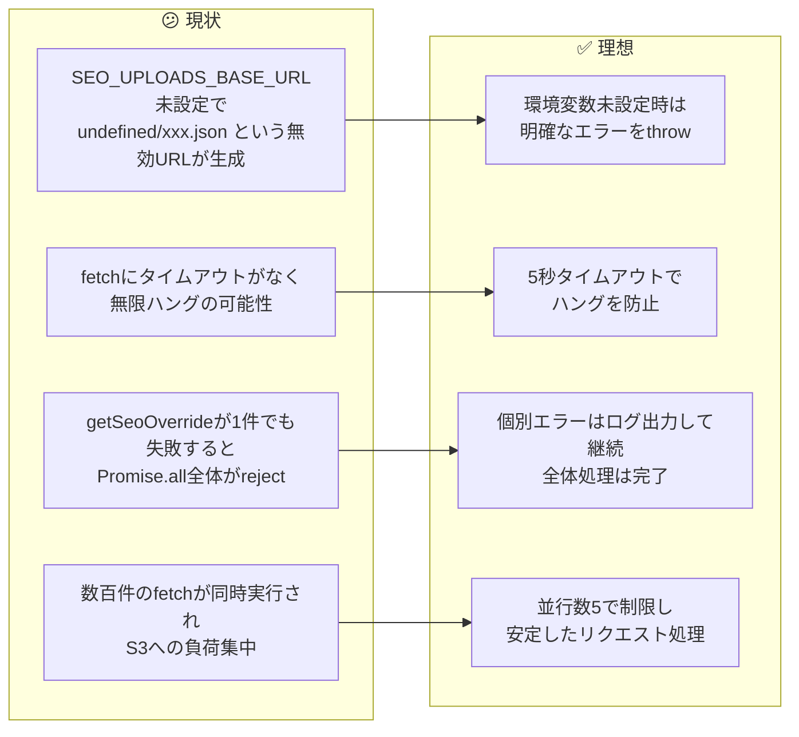
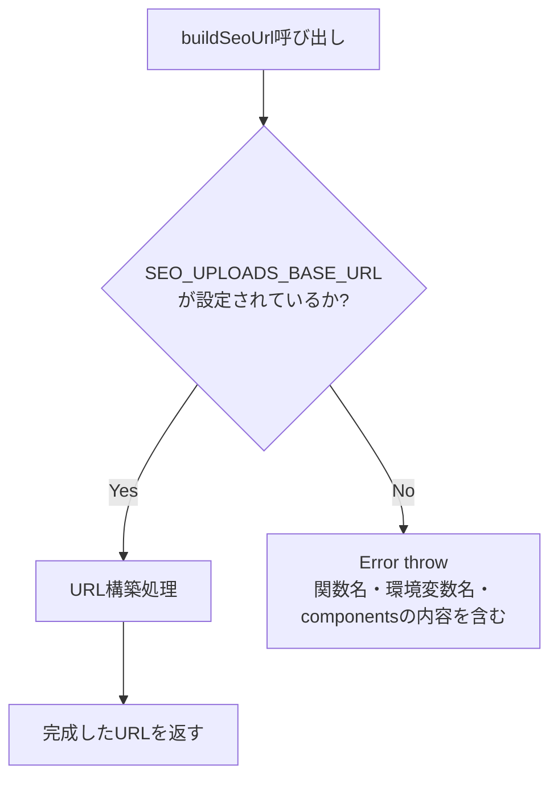
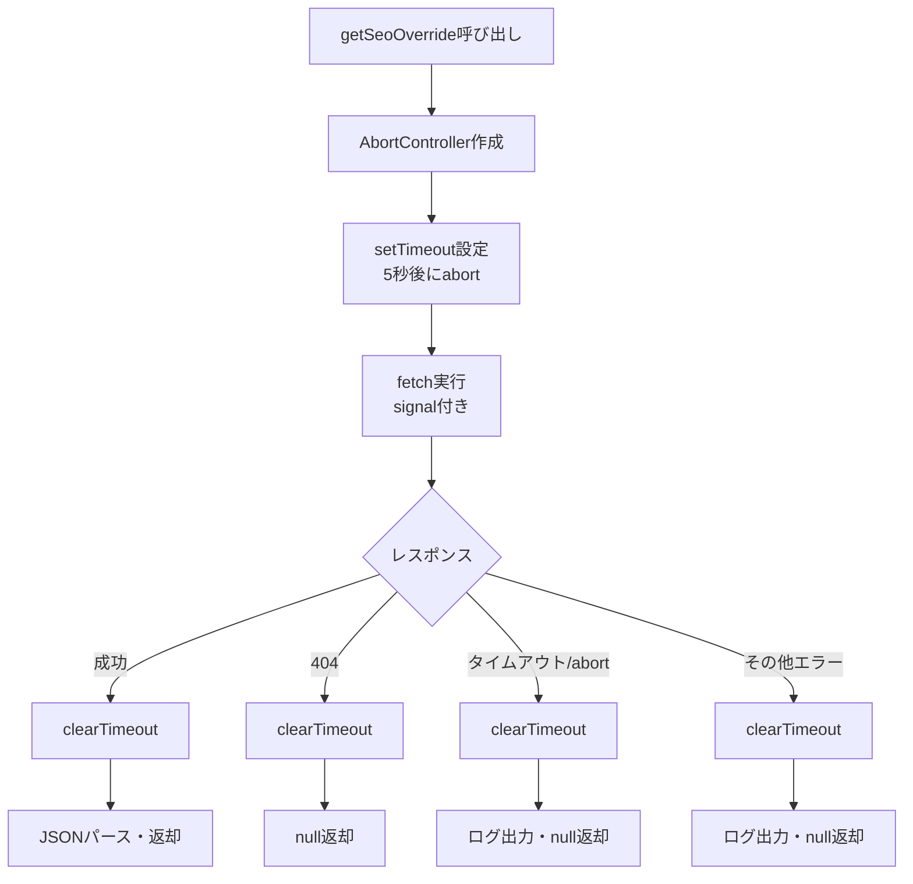
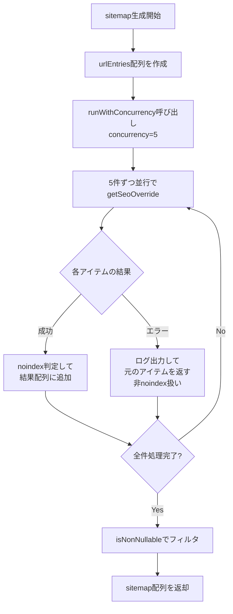
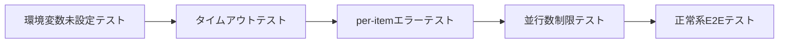

# タスク001：SEO Override機能の堅牢性向上

**プロジェクト:** ShipFront
**ステータス:** 未着手
**優先度:** 高
**ブランチ:** TBD
**壁打ち日:** 2026-01-19

---

## 概要

SEO設定取得機能（`getSeoOverride`）とサイトマップ生成の堅牢性を向上させる。環境変数未設定時のエラー、fetchの無限ハング、Promise.allの全体失敗、無制限の並行リクエストの4つの問題を解決する。

---

## 背景

### 現状 → 理想の変化



### 設計方針（壁打ちで確定）

| 方針 | 説明 |
|------|------|
| **早期エラー検出** | 環境変数未設定はデプロイ設定ミスなのでthrowで早期検出 |
| **タイムアウト5秒** | S3静的JSONは通常1秒以内、5秒で十分なマージン |
| **個別エラー継続** | 1件の失敗で全体を止めず、エラーをログして継続 |
| **並行数5制限** | S3負荷を抑えつつ適度な並列度を確保 |
| **タスク範囲限定** | fishes/sitemap.tsとregion/sitemap.tsのみ変更、他は別タスク |

---

## 処理フロー

### buildSeoUrl のバリデーションフロー



### getSeoOverride のタイムアウト付きfetchフロー



### sitemap生成の並行処理フロー



---

## 事前調査で把握した既存実装

| ファイル | 内容 | 本タスクとの関連 |
|---------|------|-----------------|
| `src/app/search/_lib/get-seo-overrides/build-seo-url.ts` | SEO用S3 URL構築 | 環境変数バリデーション追加対象 |
| `src/app/search/_lib/get-seo-overrides/index.ts` | S3からSEO設定取得 | タイムアウト追加対象 |
| `src/app/seo/search/fishes/sitemap.ts` | 魚種別サイトマップ | per-itemエラーハンドリング追加対象 |
| `src/app/seo/search/region/sitemap.ts` | 地域別サイトマップ | 並行数制限追加対象 |
| `src/common/types/is-non-nullable.ts` | 型ガード関数 | フィルタリングで使用（変更なし） |
| `src/app/seo/search/area/sitemap.ts` | エリア別サイトマップ | 同様パターンあり（今回は対象外） |

---

## 変更一覧

### 1. buildSeoUrl - 環境変数バリデーション追加

**ファイル:** `src/app/search/_lib/get-seo-overrides/build-seo-url.ts`

**変更内容**: 関数冒頭でbaseUrlの存在チェックを追加し、未設定時は詳細なエラーをthrow

```typescript
// Before
export function buildSeoUrl(components: SeoUrlComponents): string {
  const baseUrl = process.env.SEO_UPLOADS_BASE_URL;

  const fileName = [
    `location_type=${components.locationType}`,
    // ...
  ].join("__");

  return `${baseUrl}/${fileName}.json`;
}

// After
export function buildSeoUrl(components: SeoUrlComponents): string {
  const baseUrl = process.env.SEO_UPLOADS_BASE_URL;

  if (!baseUrl) {
    throw new Error(
      `buildSeoUrl: SEO_UPLOADS_BASE_URL environment variable is not set. ` +
      `Components: locationType=${components.locationType}, locationId=${components.locationId}, ` +
      `fishingTargetType=${components.fishingTargetType}, fishingTargetId=${components.fishingTargetId}, ` +
      `shipReservationTagId=${components.shipReservationTagId}`
    );
  }

  const fileName = [
    `location_type=${components.locationType}`,
    // ...（既存ロジックは変更なし）
  ].join("__");

  return `${baseUrl}/${fileName}.json`;
}
```

**理由**:
- 環境変数未設定はデプロイ設定ミスであり、早期検出が重要
- エラーメッセージに関数名・環境変数名・componentsの値を含めることでデバッグが容易
- 返り値に"undefined"が含まれることを確実に防止

---

### 2. getSeoOverride - AbortController付きタイムアウト追加

**ファイル:** `src/app/search/_lib/get-seo-overrides/index.ts`

**変更内容**: fetchにAbortControllerベースの5秒タイムアウトを追加

```typescript
// Before
export async function getSeoOverride(
  params: ParamsInSearchPage,
  searchParams?: Pick<SearchParamsInSearchPage, "tags">,
): Promise<S3SeoSettingResponse | null> {
  const components = buildSeoUrlComponents(params, searchParams);
  const url = buildSeoUrl(components);

  try {
    const response = await fetch(url, {
      cache: "default",
    });

    if (response.status === 404) {
      return null;
    }

    if (!response.ok) {
      console.error(`SEO settings fetch failed: ${response.status}`);
      return null;
    }

    return await response.json();
  } catch (error) {
    console.error("SEO settings fetch error:", error);
    return null;
  }
}

// After
const FETCH_TIMEOUT_MS = 5000;

export async function getSeoOverride(
  params: ParamsInSearchPage,
  searchParams?: Pick<SearchParamsInSearchPage, "tags">,
): Promise<S3SeoSettingResponse | null> {
  const components = buildSeoUrlComponents(params, searchParams);
  const url = buildSeoUrl(components);

  const controller = new AbortController();
  const timeoutId = setTimeout(() => controller.abort(), FETCH_TIMEOUT_MS);

  try {
    const response = await fetch(url, {
      cache: "default",
      signal: controller.signal,
    });

    clearTimeout(timeoutId);

    if (response.status === 404) {
      return null;
    }

    if (!response.ok) {
      console.error(`SEO settings fetch failed: ${response.status}`);
      return null;
    }

    return await response.json();
  } catch (error) {
    clearTimeout(timeoutId);

    // AbortErrorはタイムアウトとして扱う
    if (error instanceof Error && error.name === "AbortError") {
      console.error(`SEO settings fetch timeout (${FETCH_TIMEOUT_MS}ms): ${url}`);
      return null;
    }

    console.error("SEO settings fetch error:", error);
    return null;
  }
}
```

**理由**:
- fetchにはデフォルトタイムアウトがなく、ネットワーク問題で無限ハングする可能性
- AbortControllerは標準的なfetchキャンセル方法
- 成功・404・エラー全てのパスでclearTimeoutを呼び、タイマーリークを防止

---

### 3. fishes/sitemap.ts - per-itemエラーハンドリング追加

**ファイル:** `src/app/seo/search/fishes/sitemap.ts`

**変更内容**: `getSeoOverride`呼び出しをtry-catchで囲み、エラー時は元のfishを返す（非noindex扱い）

```typescript
// Before
const fishesWithSeoCheck = await Promise.all(
  fishList.map(async (fish) => {
    const seoSetting = await getSeoOverride({ fishId: String(fish.id) });
    return seoSetting?.noindex === true ? null : fish;
  }),
);

// After
const fishesWithSeoCheck = await Promise.all(
  fishList.map(async (fish) => {
    try {
      const seoSetting = await getSeoOverride({ fishId: String(fish.id) });
      return seoSetting?.noindex === true ? null : fish;
    } catch (error) {
      console.error(`getSeoOverride failed for fishId=${fish.id}:`, error);
      // エラー時は非noindex扱いで元のfishを返す
      return fish;
    }
  }),
);
```

**理由**:
- 1件のgetSeoOverrideエラーで全体のPromise.allがrejectするのを防止
- エラー時は安全側に倒して非noindex扱い（サイトマップに含める）
- エラーログを出力してデバッグ可能にする

---

### 4. 並行処理ヘルパー関数の新規作成

**ファイル:** `src/common/utils/run-with-concurrency/index.ts`（新規作成）

**変更内容**: 並行数を制限して非同期処理を実行するヘルパー関数

```typescript
/**
 * 並行数を制限して非同期処理を実行する
 *
 * @param items - 処理対象の配列
 * @param fn - 各アイテムに対して実行する非同期関数
 * @param concurrency - 同時実行数（デフォルト: 5）
 * @returns 全アイテムの処理結果の配列（入力と同じ順序）
 *
 * @example
 * ```ts
 * const results = await runWithConcurrency(
 *   urls,
 *   async (url) => fetch(url).then(r => r.json()),
 *   5
 * );
 * ```
 */
export async function runWithConcurrency<T, R>(
  items: T[],
  fn: (item: T, index: number) => Promise<R>,
  concurrency = 5,
): Promise<R[]> {
  const results: R[] = new Array(items.length);
  let currentIndex = 0;

  async function worker(): Promise<void> {
    while (currentIndex < items.length) {
      const index = currentIndex++;
      results[index] = await fn(items[index], index);
    }
  }

  // concurrency数のworkerを並行実行
  const workers = Array.from({ length: Math.min(concurrency, items.length) }, () => worker());
  await Promise.all(workers);

  return results;
}
```

**理由**:
- Promise.allは全件同時実行でS3への負荷が集中する
- 並行数を制限することで安定したリクエスト処理が可能
- 他のsitemapファイルでも再利用可能な汎用ヘルパー

---

### 5. region/sitemap.ts - 並行数制限とper-itemエラーハンドリング適用

**ファイル:** `src/app/seo/search/region/sitemap.ts`

**変更内容**: `Promise.all`を`runWithConcurrency`に置き換え、per-itemエラーハンドリングを追加

```typescript
// Before
import { getSeoOverride } from "@/app/search/_lib/get-seo-overrides";
// ...

const entriesWithSeoCheck = await Promise.all(
  urlEntries.map(async (entry) => {
    const seoSetting = await getSeoOverride(entry.params);
    return seoSetting?.noindex === true ? null : entry;
  }),
);

// After
import { getSeoOverride } from "@/app/search/_lib/get-seo-overrides";
import { runWithConcurrency } from "@/common/utils/run-with-concurrency";
// ...

const entriesWithSeoCheck = await runWithConcurrency(
  urlEntries,
  async (entry) => {
    try {
      const seoSetting = await getSeoOverride(entry.params);
      return seoSetting?.noindex === true ? null : entry;
    } catch (error) {
      console.error(`getSeoOverride failed for path=${entry.path}:`, error);
      // エラー時は非noindex扱いで元のentryを返す
      return entry;
    }
  },
  5, // concurrency
);
```

**理由**:
- region/sitemapは数百件のエントリがあり得るため、並行数制限が特に重要
- per-itemエラーハンドリングでfishes/sitemapと同様の堅牢性を確保

---

## データ構造（該当する場合）

本タスクではスキーマ変更・新規型定義なし。

---

## 新規ユーティリティ関数

### 1. runWithConcurrency（`src/common/utils/run-with-concurrency/index.ts`）

```typescript
/**
 * 並行数を制限して非同期処理を実行する
 *
 * @param items - 処理対象の配列
 * @param fn - 各アイテムに対して実行する非同期関数
 * @param concurrency - 同時実行数（デフォルト: 5）
 * @returns 全アイテムの処理結果の配列（入力と同じ順序）
 *
 * @example
 * ```ts
 * const results = await runWithConcurrency(
 *   urls,
 *   async (url) => fetch(url).then(r => r.json()),
 *   5
 * );
 * ```
 */
export async function runWithConcurrency<T, R>(
  items: T[],
  fn: (item: T, index: number) => Promise<R>,
  concurrency = 5,
): Promise<R[]> {
  const results: R[] = new Array(items.length);
  let currentIndex = 0;

  async function worker(): Promise<void> {
    while (currentIndex < items.length) {
      const index = currentIndex++;
      results[index] = await fn(items[index], index);
    }
  }

  const workers = Array.from({ length: Math.min(concurrency, items.length) }, () => worker());
  await Promise.all(workers);

  return results;
}
```

---

## 動作確認・E2Eテスト

### 検証フロー概要



### 完了条件（ユニットテスト）

本タスクはバックエンド/ビルド時処理のため、MaestroではなくJestユニットテストで検証する。

#### テスト1: buildSeoUrl - 環境変数未設定時のエラー

```typescript
// src/app/search/_lib/get-seo-overrides/build-seo-url.test.ts

describe("buildSeoUrl", () => {
  const originalEnv = process.env.SEO_UPLOADS_BASE_URL;

  afterEach(() => {
    process.env.SEO_UPLOADS_BASE_URL = originalEnv;
  });

  it("should throw error when SEO_UPLOADS_BASE_URL is not set", () => {
    delete process.env.SEO_UPLOADS_BASE_URL;

    const components = {
      locationType: "region" as const,
      locationId: "1",
      fishingTargetType: "fish" as const,
      fishingTargetId: "2",
      shipReservationTagId: "none",
    };

    expect(() => buildSeoUrl(components)).toThrow(
      /buildSeoUrl: SEO_UPLOADS_BASE_URL environment variable is not set/
    );
    expect(() => buildSeoUrl(components)).toThrow(/locationType=region/);
    expect(() => buildSeoUrl(components)).toThrow(/locationId=1/);
  });

  it("should return valid URL when SEO_UPLOADS_BASE_URL is set", () => {
    process.env.SEO_UPLOADS_BASE_URL = "https://example.com/seo";

    const components = {
      locationType: "region" as const,
      locationId: "1",
      fishingTargetType: "none" as const,
      fishingTargetId: "none",
      shipReservationTagId: "none",
    };

    const url = buildSeoUrl(components);
    expect(url).not.toContain("undefined");
    expect(url).toStartWith("https://example.com/seo/");
  });
});
```

#### テスト2: getSeoOverride - タイムアウト処理

```typescript
// src/app/search/_lib/get-seo-overrides/index.test.ts

describe("getSeoOverride", () => {
  it("should return null on timeout", async () => {
    // fetchをモックして遅延させる
    global.fetch = jest.fn().mockImplementation(
      () => new Promise((resolve) => setTimeout(resolve, 10000))
    );

    const consoleSpy = jest.spyOn(console, "error").mockImplementation();

    const result = await getSeoOverride({ fishId: "1" });

    expect(result).toBeNull();
    expect(consoleSpy).toHaveBeenCalledWith(
      expect.stringContaining("timeout")
    );

    consoleSpy.mockRestore();
  }, 10000);

  it("should clear timeout on success", async () => {
    global.fetch = jest.fn().mockResolvedValue({
      ok: true,
      status: 200,
      json: () => Promise.resolve({ noindex: false }),
    });

    const result = await getSeoOverride({ fishId: "1" });

    expect(result).toEqual({ noindex: false });
  });
});
```

#### テスト3: runWithConcurrency - 並行数制限

```typescript
// src/common/utils/run-with-concurrency/index.test.ts

describe("runWithConcurrency", () => {
  it("should limit concurrent executions", async () => {
    let currentlyRunning = 0;
    let maxConcurrent = 0;

    const items = Array.from({ length: 20 }, (_, i) => i);

    await runWithConcurrency(
      items,
      async (item) => {
        currentlyRunning++;
        maxConcurrent = Math.max(maxConcurrent, currentlyRunning);
        await new Promise((r) => setTimeout(r, 10));
        currentlyRunning--;
        return item * 2;
      },
      5
    );

    expect(maxConcurrent).toBeLessThanOrEqual(5);
  });

  it("should preserve order of results", async () => {
    const items = [1, 2, 3, 4, 5];

    const results = await runWithConcurrency(
      items,
      async (item) => {
        await new Promise((r) => setTimeout(r, Math.random() * 10));
        return item * 2;
      },
      3
    );

    expect(results).toEqual([2, 4, 6, 8, 10]);
  });
});
```

### 手動確認項目

| # | 確認項目 | 確認方法 |
|---|---------|---------|
| 1 | SEO_UPLOADS_BASE_URL未設定でビルドエラー | 環境変数を削除して`npm run build`実行 |
| 2 | sitemap生成が正常完了 | `npm run build`でsitemap生成を確認 |
| 3 | 生成されたsitemapにURLが含まれる | `public/seo/search/*/sitemap*.xml`を確認 |

---

## 実装手順

```mermaid
gantt
    title 実装フェーズ
    dateFormat X
    axisFormat %s

    section Phase 1: ヘルパー作成
    runWithConcurrency作成    :a1, 0, 1
    runWithConcurrencyテスト  :a2, after a1, 1

    section Phase 2: buildSeoUrl改修
    バリデーション追加        :b1, after a2, 1
    テスト作成               :b2, after b1, 1

    section Phase 3: getSeoOverride改修
    タイムアウト追加          :c1, after b2, 1
    テスト作成               :c2, after c1, 1

    section Phase 4: sitemap改修
    fishes/sitemap改修       :d1, after c2, 1
    region/sitemap改修       :d2, after d1, 1

    section Phase 5: 検証
    ユニットテスト実行        :e1, after d2, 1
    ビルド確認               :e2, after e1, 1
```



### Phase 1: 並行処理ヘルパー作成
- [ ] `src/common/utils/run-with-concurrency/index.ts` 作成
- [ ] `src/common/utils/run-with-concurrency/index.test.ts` 作成

### Phase 2: buildSeoUrl改修
- [ ] `build-seo-url.ts` に環境変数バリデーション追加
- [ ] `build-seo-url.test.ts` 作成

### Phase 3: getSeoOverride改修
- [ ] `index.ts` にAbortController付きタイムアウト追加
- [ ] `index.test.ts` 作成

### Phase 4: sitemap改修
- [ ] `fishes/sitemap.ts` にper-itemエラーハンドリング追加
- [ ] `region/sitemap.ts` に並行数制限とper-itemエラーハンドリング追加

### Phase 5: 検証
- [ ] `npm run test` でユニットテスト全件パス
- [ ] `npm run ts:test` で型チェックパス
- [ ] `npm run lint` でLintパス
- [ ] `npm run build` でビルド成功・sitemap生成確認

---

## 関連ファイル

### 変更対象
| ファイル | 変更内容 |
|---------|----------|
| `src/app/search/_lib/get-seo-overrides/build-seo-url.ts` | 環境変数バリデーション追加 |
| `src/app/search/_lib/get-seo-overrides/index.ts` | AbortController付きタイムアウト追加 |
| `src/app/seo/search/fishes/sitemap.ts` | per-itemエラーハンドリング追加 |
| `src/app/seo/search/region/sitemap.ts` | 並行数制限・per-itemエラーハンドリング追加 |

### 新規作成
| ファイル | 説明 |
|---------|------|
| `src/common/utils/run-with-concurrency/index.ts` | 並行数制限ヘルパー |
| `src/common/utils/run-with-concurrency/index.test.ts` | ヘルパーのテスト |
| `src/app/search/_lib/get-seo-overrides/build-seo-url.test.ts` | buildSeoUrlのテスト |
| `src/app/search/_lib/get-seo-overrides/index.test.ts` | getSeoOverrideのテスト |

### 参照のみ（変更なし）
| ファイル | 参照理由 |
|---------|----------|
| `src/common/types/is-non-nullable.ts` | フィルタリングで使用 |
| `src/app/seo/search/area/sitemap.ts` | 同様パターンの確認（今回は対象外） |
| `src/app/seo/search/areas/sitemap.ts` | 同様パターンの確認（今回は対象外） |
| `src/app/seo/search/methods/sitemap.ts` | 同様パターンの確認（今回は対象外） |

---

## 確認事項

- [ ] TypeScriptエラー: 0件
- [ ] ユニットテスト: 全て成功
- [ ] Lint: パス
- [ ] ビルド: 成功
- [ ] sitemap生成: 正常

---

## 注意事項

- `runWithConcurrency`は結果の順序を保持する（入力配列と同じ順序）
- タイムアウト値（5秒）は定数化しており、必要に応じて調整可能
- 他のsitemapファイル（area, areas, methods等）への適用は別タスクとする
- `buildSeoUrl`がthrowする場合、呼び出し元の`getSeoOverride`のcatchで捕捉される

---

## 壁打ち決定事項サマリー

### 質問と回答一覧
| # | 質問 | 決定 |
|---|------|------|
| 1 | buildSeoUrlでSEO_UPLOADS_BASE_URLがundefinedの場合の挙動 | A: エラーをthrow |
| 2 | fetchのタイムアウト時間 | A: 5秒 |
| 3 | 並行処理の同時実行数 | A: 5 |
| 4 | 並行処理ヘルパーの配置場所 | A: `src/common/utils/run-with-concurrency/index.ts` |
| 5 | 他のsitemapファイルへの適用範囲 | A: タスク指定の2ファイルのみ |

### 保留事項
| 項目 | 理由 |
|------|------|
| 他sitemapファイル（area, areas, methods等）への適用 | 今回のタスク範囲外、別タスクとして管理 |
