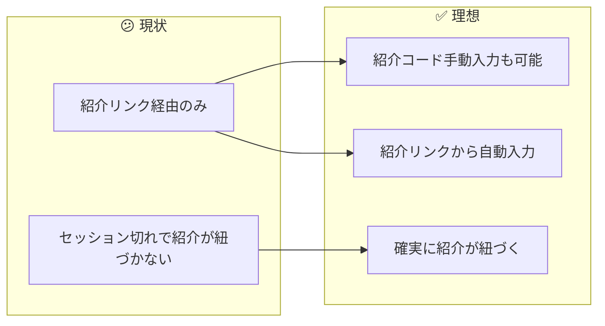
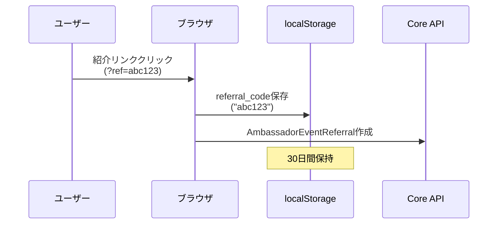
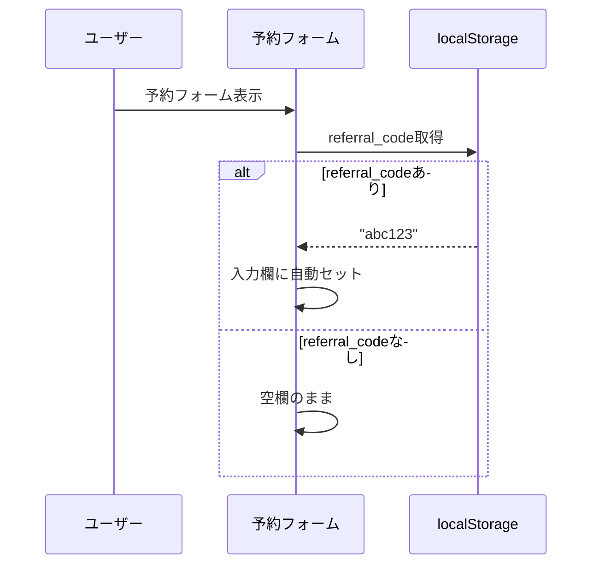
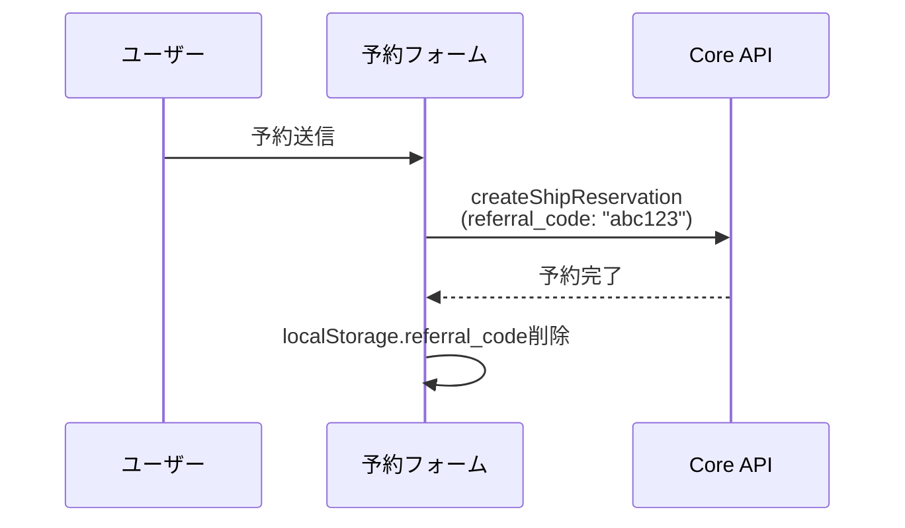

# タスク002：予約時に紹介コードを入力できるようにする（ShipFront側）

**プロジェクト:** ShipFront
**ステータス:** 未着手
**優先度:** 高
**ブランチ:** `feature/reservation-referral-code`
**壁打ち日:** 2026-01-13

---

## 概要

予約フォームに紹介コード入力欄を追加し、紹介リンクからのセッションがあれば自動入力する機能を実装する。

---

## 背景

### 現状 → 理想の変化



### 設計方針（壁打ちで確定）

| 方針 | 説明 |
|------|------|
| **専用フィールド** | 「ご要望・ご相談」とは別に紹介コード入力欄を設置 |
| **自動入力** | localStorageに紹介コードを保存し、予約フォームで自動入力 |
| **バリデーション** | 6文字の英数字のみ許可（存在チェックはサーバー側） |

---

## 処理フロー

### 紹介リンククリック時



### 予約フォーム表示時



### 予約送信時



---

## 事前調査で把握した既存実装

| ファイル | 内容 | 本タスクとの関連 |
|---------|------|-----------------|
| `src/features/reserve/hooks/use-create-ship-reservation/index.ts` | 予約作成hook | `referral_code`送信追加 |
| `src/features/reserve/hooks/use-create-ship-reservation/transformers.ts` | リクエストパラメータ構築 | `referral_code`追加 |
| `src/features/reserve/components/drawer/drawer-confirm-inquiry/` | ご要望入力Drawer | 参考UI |
| `src/apis/ships/reservation/post-create-ship-reservation.gql` | 予約作成mutation | 変更なし（Input型はCore側で拡張） |

---

## 変更一覧

### 1. localStorage管理hook作成

**ファイル**: `src/features/reserve/hooks/use-referral-code-storage/index.ts`（新規）

```typescript
"use client";

import { useCallback, useEffect, useState } from "react";

const STORAGE_KEY = "anglers_referral_code";
const EXPIRY_DAYS = 30;

type StoredReferralCode = {
  code: string;
  expiresAt: number; // timestamp
};

export const useReferralCodeStorage = () => {
  const [referralCode, setReferralCode] = useState<string | null>(null);

  // 初期化: localStorageから取得
  useEffect(() => {
    const stored = localStorage.getItem(STORAGE_KEY);
    if (!stored) return;

    try {
      const parsed: StoredReferralCode = JSON.parse(stored);
      if (parsed.expiresAt > Date.now()) {
        setReferralCode(parsed.code);
      } else {
        localStorage.removeItem(STORAGE_KEY);
      }
    } catch {
      localStorage.removeItem(STORAGE_KEY);
    }
  }, []);

  // 保存
  const saveReferralCode = useCallback((code: string) => {
    const data: StoredReferralCode = {
      code: code.toLowerCase().trim(),
      expiresAt: Date.now() + EXPIRY_DAYS * 24 * 60 * 60 * 1000,
    };
    localStorage.setItem(STORAGE_KEY, JSON.stringify(data));
    setReferralCode(data.code);
  }, []);

  // 削除
  const clearReferralCode = useCallback(() => {
    localStorage.removeItem(STORAGE_KEY);
    setReferralCode(null);
  }, []);

  return {
    referralCode,
    saveReferralCode,
    clearReferralCode,
  };
};
```

---

### 2. 紹介リンククリック時の保存処理

**ファイル**: 紹介リンク処理を行っているコンポーネント/hook（要調査）

```typescript
// URLパラメータから紹介コードを取得してlocalStorageに保存
import { useSearchParams } from "next/navigation";
import { useEffect } from "react";
import { useReferralCodeStorage } from "@/features/reserve/hooks/use-referral-code-storage";

export const useReferralCodeFromUrl = () => {
  const searchParams = useSearchParams();
  const { saveReferralCode } = useReferralCodeStorage();

  useEffect(() => {
    const refCode = searchParams.get("ref");
    if (refCode && /^[a-zA-Z0-9]{6}$/.test(refCode)) {
      saveReferralCode(refCode);
    }
  }, [searchParams, saveReferralCode]);
};
```

---

### 3. 紹介コード入力コンポーネント作成

**ファイル**: `src/features/reserve/components/referral-code-input/index.tsx`（新規）

```typescript
"use client";

import { Input } from "@/components/ui/input";
import { Label } from "@/components/ui/label";

type Props = {
  value: string;
  onChange: (value: string) => void;
  disabled?: boolean;
};

export const ReferralCodeInput = ({ value, onChange, disabled }: Props) => {
  const handleChange = (e: React.ChangeEvent<HTMLInputElement>) => {
    // 6文字の英数字のみ許可
    const normalized = e.target.value.toLowerCase().replace(/[^a-z0-9]/g, "").slice(0, 6);
    onChange(normalized);
  };

  return (
    <div className="space-y-2">
      <Label htmlFor="referral-code">紹介コード（任意）</Label>
      <Input
        id="referral-code"
        type="text"
        placeholder="例: abc123"
        value={value}
        onChange={handleChange}
        disabled={disabled}
        maxLength={6}
        className="font-mono"
      />
      <p className="text-xs text-muted-foreground">
        お知り合いから紹介コードを受け取っている場合は入力してください
      </p>
    </div>
  );
};
```

---

### 4. 予約フォームへの組み込み

**ファイル**: `src/features/reserve/components/feedback-section/index.tsx`（既存修正）または近くの適切なコンポーネント

```typescript
// 紹介コード入力欄を追加
import { ReferralCodeInput } from "../referral-code-input";
import { useReferralCodeStorage } from "../../hooks/use-referral-code-storage";

// コンポーネント内
const { referralCode: storedReferralCode } = useReferralCodeStorage();
const [referralCode, setReferralCode] = useState(storedReferralCode || "");

// useEffectで自動入力
useEffect(() => {
  if (storedReferralCode && !referralCode) {
    setReferralCode(storedReferralCode);
  }
}, [storedReferralCode]);

// JSX内
<ReferralCodeInput
  value={referralCode}
  onChange={setReferralCode}
/>
```

---

### 5. 予約作成パラメータに追加

**ファイル**: `src/features/reserve/hooks/use-create-ship-reservation/transformers.ts`

```typescript
// buildRequestParams関数を修正
export const buildRequestParams = ({
  createStorageResult,
  shipListPriceId,
  shipReservationCustomerId,
  shipId,
  variationPlanId,
  isExternal,
  referralCode, // 追加
}: BuildRequestParamsArgs) => {
  return {
    params: {
      // ... 既存のパラメータ ...
      referralCode: referralCode || null, // 追加
    },
  };
};
```

---

### 6. 予約作成hook修正

**ファイル**: `src/features/reserve/hooks/use-create-ship-reservation/index.ts`

```typescript
// useReferralCodeStorageをimport
import { useReferralCodeStorage } from "../use-referral-code-storage";

// hook内で使用
const { referralCode, clearReferralCode } = useReferralCodeStorage();

// buildRequestParams呼び出し時に追加
const requestParams = buildRequestParams({
  // ... 既存 ...
  referralCode,
});

// 成功時にlocalStorageから削除
await handleReservationSuccess({
  // ... 既存 ...
});
clearReferralCode(); // 追加
```

---

### 7. GraphQL codegen再生成

```bash
npm run codegen
```

Core側で`Types::Inputs::ShipReservationType`に`referral_code`が追加されるため、型定義が自動更新される。

---

## 実装手順

```mermaid
gantt
    title 実装フェーズ
    dateFormat X
    axisFormat %s

    section Phase 1: 基盤
    useReferralCodeStorage作成    :a1, 0, 1
    URLパラメータ取得hook    :a2, after a1, 1

    section Phase 2: UI
    ReferralCodeInput作成    :b1, after a2, 1
    予約フォームに組み込み    :b2, after b1, 1

    section Phase 3: API連携
    transformers修正    :c1, after b2, 1
    use-create-ship-reservation修正    :c2, after c1, 1
    codegen実行    :c3, after c2, 1

    section Phase 4: テスト
    動作確認    :d1, after c3, 1
```



### Phase 1: 基盤
- [ ] `useReferralCodeStorage` hook作成
- [ ] URLパラメータから紹介コードを保存する処理追加

### Phase 2: UI
- [ ] `ReferralCodeInput`コンポーネント作成
- [ ] 予約フォーム（`feedback-section`等）に紹介コード入力欄を追加
- [ ] localStorageからの自動入力実装

### Phase 3: API連携
- [ ] `buildRequestParams`に`referralCode`追加
- [ ] `useCreateShipReservation`で`referralCode`を送信
- [ ] 予約成功時にlocalStorageから削除
- [ ] `npm run codegen`実行

### Phase 4: テスト
- [ ] 手動入力で予約できることを確認
- [ ] 紹介リンククリック後に自動入力されることを確認
- [ ] 予約成功後にlocalStorageがクリアされることを確認

---

## 関連ファイル

### 変更対象
| ファイル | 変更内容 |
|---------|----------|
| `src/features/reserve/components/feedback-section/index.tsx` | 紹介コード入力欄追加 |
| `src/features/reserve/hooks/use-create-ship-reservation/transformers.ts` | `referralCode`追加 |
| `src/features/reserve/hooks/use-create-ship-reservation/index.ts` | `referralCode`送信・クリア |

### 新規作成
| ファイル | 説明 |
|---------|------|
| `src/features/reserve/hooks/use-referral-code-storage/index.ts` | localStorage管理hook |
| `src/features/reserve/components/referral-code-input/index.tsx` | 入力コンポーネント |

### 自動生成（codegen）
| ファイル | 説明 |
|---------|------|
| `src/common/libs/graphql/graphql.ts` | 型定義更新 |
| `src/common/libs/graphql/generated-hooks.ts` | hooks更新 |

---

## 確認事項

- [ ] 紹介コード入力欄が表示される
- [ ] 6文字の英数字のみ入力可能
- [ ] 紹介リンククリック後、30日間localStorageに保存される
- [ ] 予約フォーム表示時に自動入力される
- [ ] 予約成功後にlocalStorageがクリアされる
- [ ] 紹介コード付きで予約が送信される

---

## 注意事項

- **Core側の実装が先**: GraphQL Inputの拡張はCore側で行うため、Core側のデプロイ後にcodegenを実行する
- **無効な紹介コードはサーバー側で無視**: フロントではフォーマットチェックのみ、存在チェックはサーバー側
- **localStorageの有効期限**: 30日間（`AmbassadorEventReferral::RESERVATION_WINDOW_DAYS`と同じ）

---

## UI配置案

```
予約フォーム
├── プラン情報
├── 日程選択
├── 人数選択
├── 割引選択
├── オプション選択
├── ────────────────
├── ご要望・ご相談
├── 紹介コード（任意）  ← 新規追加
├── ────────────────
├── 予約者情報
└── 予約確定ボタン
```

---

## 壁打ち決定事項サマリー

### 質問と回答一覧
| # | 質問 | 決定 |
|---|------|------|
| 2 | 入力タイミング | A: 予約フォームに専用フィールド追加 |
| 3 | 自動入力の仕組み | A: フロントでlocalStorageに保存し、予約フォームで自動入力 |

### 保留事項
| 項目 | 理由 |
|------|------|
| 紹介リンク処理の正確な実装箇所 | 既存コードの調査が必要 |
