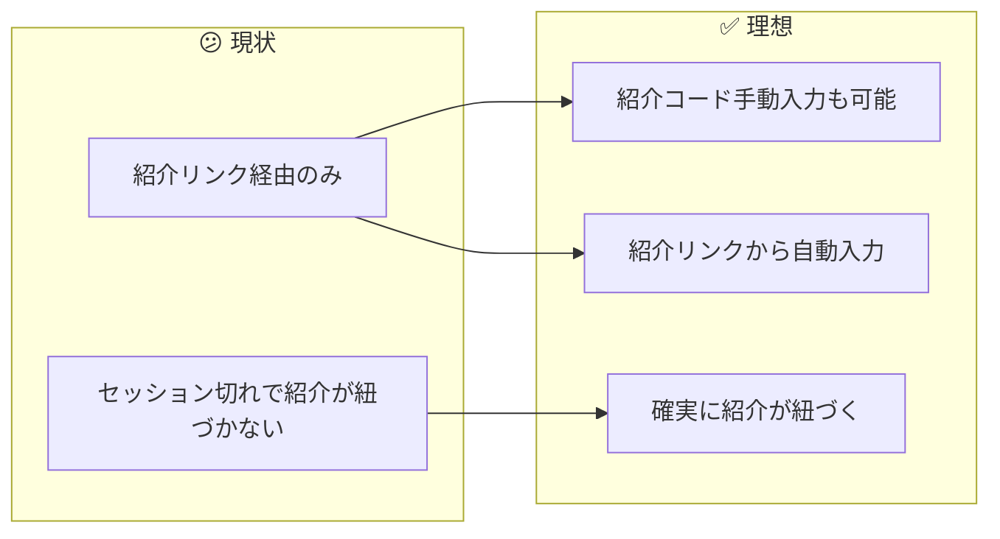
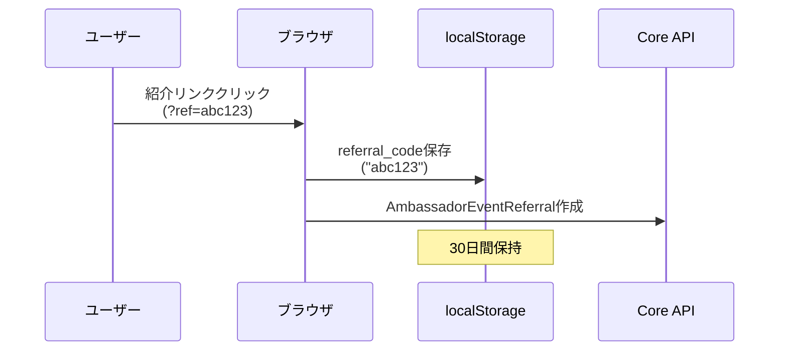
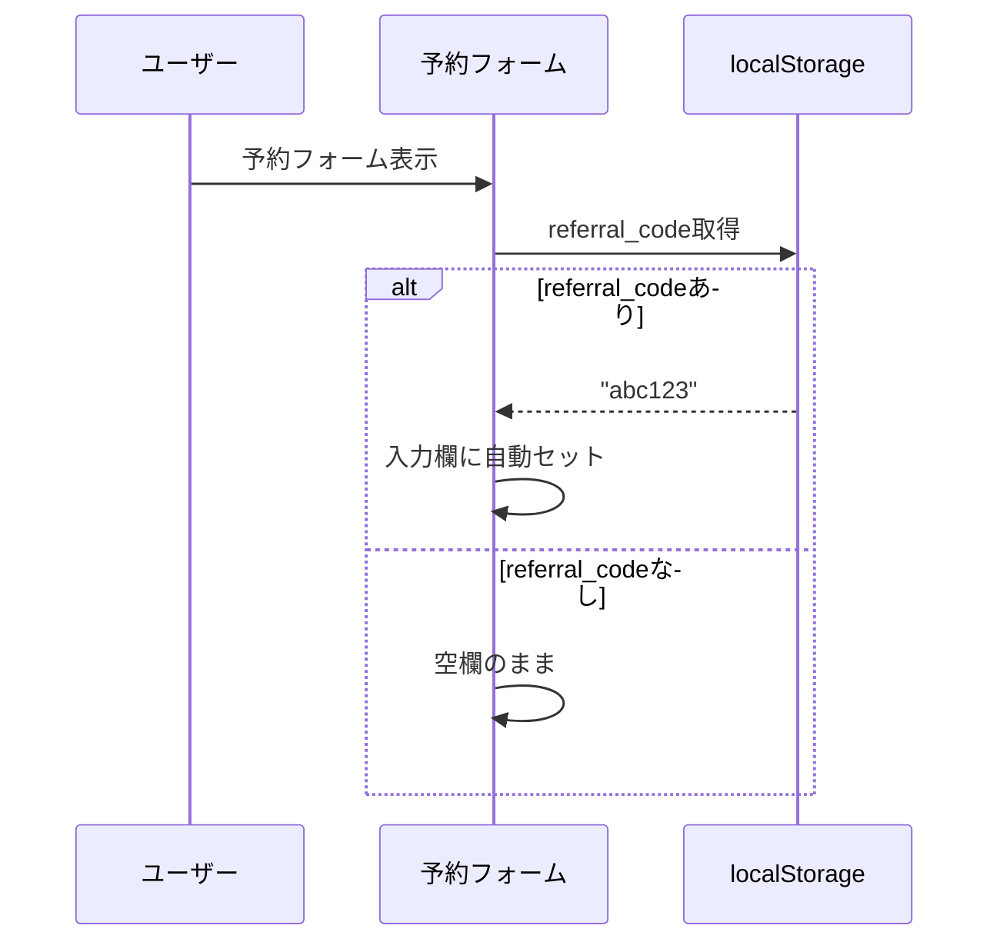
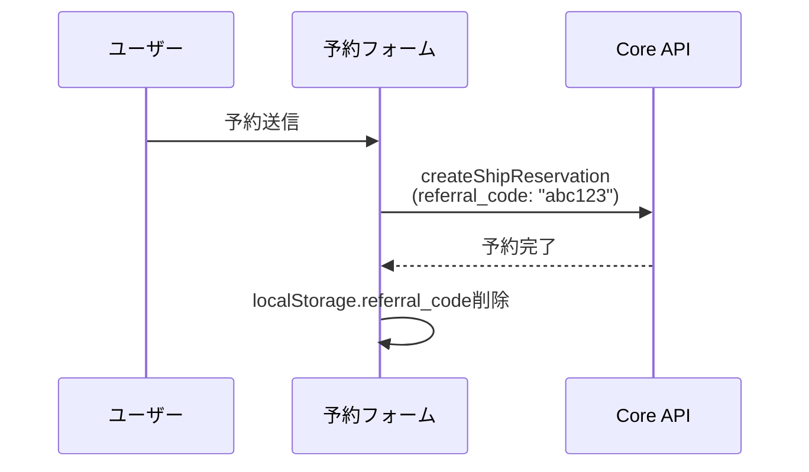
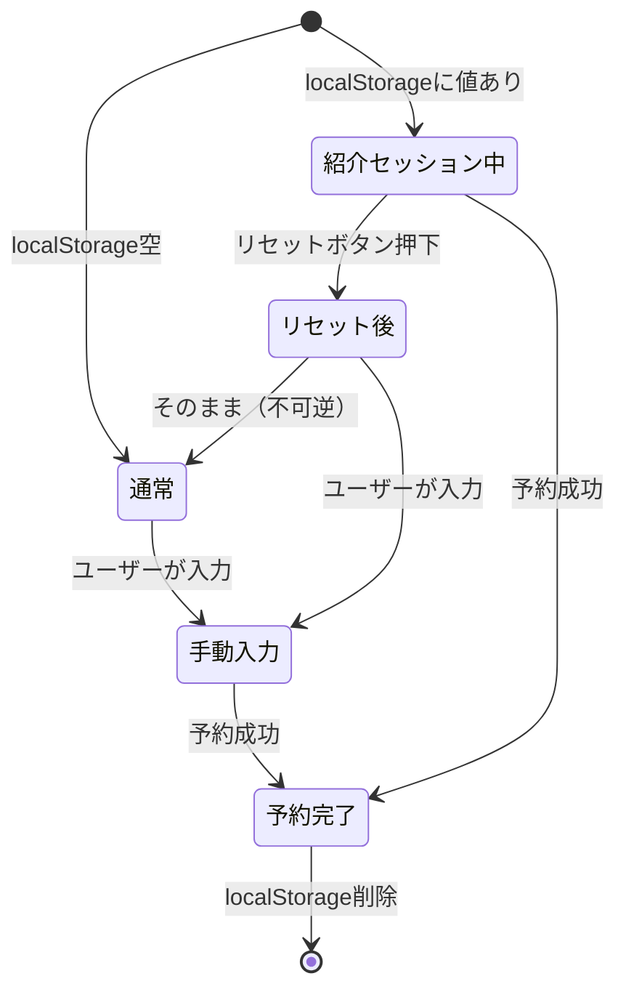

# タスク002：予約時に紹介コードを入力できるようにする（ShipFront側）

**プロジェクト:** ShipFront
**ステータス:** 未着手
**優先度:** 高
**ブランチ:** `feature/reservation-referral-code`
**壁打ち日:** 2026-01-13

---

## 概要

予約フォームに紹介コード入力欄を追加し、紹介リンクからのセッションがあれば自動入力する機能を実装する。

---

## 背景

### 現状 → 理想の変化



### 設計方針（壁打ちで確定）

| 方針 | 説明 |
|------|------|
| **専用フィールド** | 「ご要望・ご相談」とは別に紹介コード入力欄を設置 |
| **自動入力** | localStorageに紹介コードを保存し、予約フォームで自動入力 |
| **バリデーション** | チェックなし（サーバー側に任せる） |
| **Disabled制御** | 紹介セッション継続中は自動入力 & Disabled |
| **リセット機能** | リセットボタンでlocalStorage削除 & 入力欄クリア |
| **上書き禁止** | localStorage既存時は新しいリンククリックで上書きしない |

---

## 処理フロー

### 紹介リンククリック時



### 予約フォーム表示時



### 予約送信時



---

## 入力欄の状態管理（壁打ち追加要件）

### 状態遷移

| 状態 | Input | リセットボタン | 説明 |
|------|-------|---------------|------|
| 紹介セッション継続中 | 自動入力 & **Disabled** | 表示 | localStorageに値がある場合 |
| リセット後 | 空 & 編集可能 | 非表示 | リセットボタン押下後 |
| 通常（紹介なし） | 空 & 編集可能 | 非表示 | localStorageに値がない場合 |

### フロー図



### リセット挙動の詳細

- **リセット = 不可逆**: リセット後に元の自動入力値には戻せない
- **localStorage削除**: リセット時にlocalStorageからも削除
- **次回訪問時**: 空欄スタート（紹介コードを使いたい場合は手動入力）

### 上書き禁止ロジック

紹介コード入力後（または自動入力後）に別の紹介リンクをクリックした場合：
- **上書きしない**: 最初に保存された値を維持
- **理由**: 手動入力優先の考え方と整合性を保つ

---

## 予約確認画面の表示（壁打ち追加要件）

### 表示パターン

| 状態 | 表示内容 |
|------|----------|
| 紹介コード入力あり | 紹介コード: `abc123` |
| 紹介コード入力なし | 「紹介された予約ではありません。」 |

### UI配置
- **位置**: ご要望・ご相談 と お支払い金額の内訳 の間
- **常に表示**: 入力の有無に関わらずセクションを表示（紹介状態の確認用途）

---

## マイページ改善（壁打ち追加スコープ）

### 変更内容

#### 1. shareKey表示 & コピーボタン追加
- アンバサダーカードに自分の紹介コード（shareKey）を表示
- コピーボタンで簡単にクリップボードにコピー
- ※ IDがそのままシェアキーになっている仕様（追加API不要の可能性）

#### 2. 「上位30位で翌月のトップアンバサダー」テキスト削除
- マイページのアンバサダーカードからのみ削除
- 他の画面では使用していない

### 実装箇所
- `src/features/mypage/components/ambassador-card/` または類似のコンポーネント（要調査）

---

## エッジケース対応（壁打ち確定）

| ケース | 対応 | 理由 |
|--------|------|------|
| **セルフリファラル** | チェックなしで許可 | バッチ側で対応。フロントでは制限しない |
| **紹介コード入力後にリンククリック** | 上書きしない | 最初の値を維持（手動入力優先の考え方） |
| **フォーマット不正** | チェックなし | サーバーに任せる |
| **存在しない紹介コード** | エラーにしない | サーバー側で無視して予約は成功させる |

---

## 事前調査で把握した既存実装

| ファイル | 内容 | 本タスクとの関連 |
|---------|------|-----------------|
| `src/features/reserve/hooks/use-create-ship-reservation/index.ts` | 予約作成hook | `referral_code`送信追加 |
| `src/features/reserve/hooks/use-create-ship-reservation/transformers.ts` | リクエストパラメータ構築 | `referral_code`追加 |
| `src/features/reserve/components/drawer/drawer-confirm-inquiry/` | ご要望入力Drawer | 参考UI |
| `src/apis/ships/reservation/post-create-ship-reservation.gql` | 予約作成mutation | 変更なし（Input型はCore側で拡張） |

---

## 変更一覧

### 1. localStorage管理hook作成

**ファイル**: `src/features/reserve/hooks/use-referral-code-storage/index.ts`（新規）

```typescript
"use client";

import { useCallback, useEffect, useState } from "react";

const STORAGE_KEY = "anglers_referral_code";
const EXPIRY_DAYS = 30;

type StoredReferralCode = {
  code: string;
  expiresAt: number; // timestamp
};

export const useReferralCodeStorage = () => {
  const [referralCode, setReferralCode] = useState<string | null>(null);
  const [isFromStorage, setIsFromStorage] = useState(false); // 自動入力かどうか

  // 初期化: localStorageから取得
  useEffect(() => {
    const stored = localStorage.getItem(STORAGE_KEY);
    if (!stored) return;

    try {
      const parsed: StoredReferralCode = JSON.parse(stored);
      if (parsed.expiresAt > Date.now()) {
        setReferralCode(parsed.code);
        setIsFromStorage(true); // localStorageから取得した = 自動入力
      } else {
        localStorage.removeItem(STORAGE_KEY);
      }
    } catch {
      localStorage.removeItem(STORAGE_KEY);
    }
  }, []);

  // 保存（上書き禁止: 既に値がある場合は保存しない）
  const saveReferralCode = useCallback((code: string) => {
    // 上書き禁止: 既にlocalStorageに値がある場合は何もしない
    const existing = localStorage.getItem(STORAGE_KEY);
    if (existing) {
      try {
        const parsed: StoredReferralCode = JSON.parse(existing);
        if (parsed.expiresAt > Date.now()) {
          return; // 有効な値が既に存在するので上書きしない
        }
      } catch {
        // パースエラーの場合は上書きを許可
      }
    }

    const data: StoredReferralCode = {
      code: code.toLowerCase().trim(),
      expiresAt: Date.now() + EXPIRY_DAYS * 24 * 60 * 60 * 1000,
    };
    localStorage.setItem(STORAGE_KEY, JSON.stringify(data));
    setReferralCode(data.code);
    setIsFromStorage(true);
  }, []);

  // 削除（リセット用）
  const clearReferralCode = useCallback(() => {
    localStorage.removeItem(STORAGE_KEY);
    setReferralCode(null);
    setIsFromStorage(false);
  }, []);

  return {
    referralCode,
    isFromStorage, // Disabled制御に使用
    saveReferralCode,
    clearReferralCode,
  };
};
```

---

### 2. 紹介リンククリック時の保存処理

**ファイル**: 紹介リンク処理を行っているコンポーネント/hook（要調査）

```typescript
// URLパラメータから紹介コードを取得してlocalStorageに保存
import { useSearchParams } from "next/navigation";
import { useEffect } from "react";
import { useReferralCodeStorage } from "@/features/reserve/hooks/use-referral-code-storage";

export const useReferralCodeFromUrl = () => {
  const searchParams = useSearchParams();
  const { saveReferralCode } = useReferralCodeStorage();

  useEffect(() => {
    const refCode = searchParams.get("ref");
    if (refCode && /^[a-zA-Z0-9]{6}$/.test(refCode)) {
      saveReferralCode(refCode);
    }
  }, [searchParams, saveReferralCode]);
};
```

---

### 3. 紹介コード入力コンポーネント作成（Disabled & リセットボタン対応）

**ファイル**: `src/features/reserve/components/referral-code-input/index.tsx`（新規）

```typescript
"use client";

import { Input } from "@/components/ui/input";
import { Label } from "@/components/ui/label";
import { Button } from "@/components/ui/button";

type Props = {
  value: string;
  onChange: (value: string) => void;
  isFromStorage: boolean; // localStorageからの自動入力かどうか
  onReset: () => void; // リセットボタン押下時のコールバック
};

export const ReferralCodeInput = ({
  value,
  onChange,
  isFromStorage,
  onReset,
}: Props) => {
  const handleChange = (e: React.ChangeEvent<HTMLInputElement>) => {
    // フォーマットチェックなし（サーバー任せ）
    onChange(e.target.value);
  };

  const handleReset = () => {
    onReset();
  };

  // 紹介セッション継続中 = Disabled
  const isDisabled = isFromStorage && value !== "";

  return (
    <div className="space-y-2">
      <Label htmlFor="referral-code">紹介コード（任意）</Label>
      <div className="flex gap-2">
        <Input
          id="referral-code"
          type="text"
          placeholder="紹介コードを入力"
          value={value}
          onChange={handleChange}
          disabled={isDisabled}
          className="font-mono flex-1"
        />
        {isDisabled && (
          <Button
            type="button"
            variant="outline"
            size="sm"
            onClick={handleReset}
          >
            リセット
          </Button>
        )}
      </div>
      <p className="text-xs text-muted-foreground">
        お知り合いから紹介コードを受け取っている場合は入力してください
      </p>
    </div>
  );
};
```

#### 状態別の表示

| 状態 | Input | リセットボタン |
|------|-------|---------------|
| `isFromStorage && value !== ""` | Disabled | 表示 |
| `!isFromStorage \|\| value === ""` | 編集可能 | 非表示 |

---

### 4. 予約フォームへの組み込み

**ファイル**: `src/features/reserve/components/feedback-section/index.tsx`（既存修正）または近くの適切なコンポーネント

```typescript
// 紹介コード入力欄を追加
import { ReferralCodeInput } from "../referral-code-input";
import { useReferralCodeStorage } from "../../hooks/use-referral-code-storage";

// コンポーネント内
const { referralCode: storedReferralCode } = useReferralCodeStorage();
const [referralCode, setReferralCode] = useState(storedReferralCode || "");

// useEffectで自動入力
useEffect(() => {
  if (storedReferralCode && !referralCode) {
    setReferralCode(storedReferralCode);
  }
}, [storedReferralCode]);

// JSX内
<ReferralCodeInput
  value={referralCode}
  onChange={setReferralCode}
/>
```

---

### 5. 予約作成パラメータに追加

**ファイル**: `src/features/reserve/hooks/use-create-ship-reservation/transformers.ts`

```typescript
// buildRequestParams関数を修正
export const buildRequestParams = ({
  createStorageResult,
  shipListPriceId,
  shipReservationCustomerId,
  shipId,
  variationPlanId,
  isExternal,
  referralCode, // 追加
}: BuildRequestParamsArgs) => {
  return {
    params: {
      // ... 既存のパラメータ ...
      referralCode: referralCode || null, // 追加
    },
  };
};
```

---

### 6. 予約作成hook修正

**ファイル**: `src/features/reserve/hooks/use-create-ship-reservation/index.ts`

```typescript
// useReferralCodeStorageをimport
import { useReferralCodeStorage } from "../use-referral-code-storage";

// hook内で使用
const { referralCode, clearReferralCode } = useReferralCodeStorage();

// buildRequestParams呼び出し時に追加
const requestParams = buildRequestParams({
  // ... 既存 ...
  referralCode,
});

// 成功時にlocalStorageから削除
await handleReservationSuccess({
  // ... 既存 ...
});
clearReferralCode(); // 追加
```

---

### 7. GraphQL codegen再生成

```bash
npm run codegen
```

Core側で`Types::Inputs::ShipReservationType`に`referral_code`が追加されるため、型定義が自動更新される。

---

## 実装手順

```mermaid
gantt
    title 実装フェーズ
    dateFormat X
    axisFormat %s

    section Phase 1: 基盤
    useReferralCodeStorage作成    :a1, 0, 1
    URLパラメータ取得hook    :a2, after a1, 1

    section Phase 2: UI
    ReferralCodeInput作成    :b1, after a2, 1
    予約フォームに組み込み    :b2, after b1, 1

    section Phase 3: API連携
    transformers修正    :c1, after b2, 1
    use-create-ship-reservation修正    :c2, after c1, 1
    codegen実行    :c3, after c2, 1

    section Phase 4: テスト
    動作確認    :d1, after c3, 1
```



### Phase 1: 基盤
- [ ] `useReferralCodeStorage` hook作成
- [ ] URLパラメータから紹介コードを保存する処理追加

### Phase 2: UI
- [ ] `ReferralCodeInput`コンポーネント作成
- [ ] 予約フォーム（`feedback-section`等）に紹介コード入力欄を追加
- [ ] localStorageからの自動入力実装

### Phase 3: API連携
- [ ] `buildRequestParams`に`referralCode`追加
- [ ] `useCreateShipReservation`で`referralCode`を送信
- [ ] 予約成功時にlocalStorageから削除
- [ ] `npm run codegen`実行

### Phase 4: テスト
- [ ] 手動入力で予約できることを確認
- [ ] 紹介リンククリック後に自動入力されることを確認
- [ ] 予約成功後にlocalStorageがクリアされることを確認

---

## 関連ファイル

### 変更対象
| ファイル | 変更内容 |
|---------|----------|
| `src/features/reserve/components/feedback-section/index.tsx` | 紹介コード入力欄追加 |
| `src/features/reserve/hooks/use-create-ship-reservation/transformers.ts` | `referralCode`追加 |
| `src/features/reserve/hooks/use-create-ship-reservation/index.ts` | `referralCode`送信・クリア |

### 新規作成
| ファイル | 説明 |
|---------|------|
| `src/features/reserve/hooks/use-referral-code-storage/index.ts` | localStorage管理hook |
| `src/features/reserve/components/referral-code-input/index.tsx` | 入力コンポーネント |

### 自動生成（codegen）
| ファイル | 説明 |
|---------|------|
| `src/common/libs/graphql/graphql.ts` | 型定義更新 |
| `src/common/libs/graphql/generated-hooks.ts` | hooks更新 |

---

## 確認事項

- [ ] 紹介コード入力欄が表示される
- [ ] 6文字の英数字のみ入力可能
- [ ] 紹介リンククリック後、30日間localStorageに保存される
- [ ] 予約フォーム表示時に自動入力される
- [ ] 予約成功後にlocalStorageがクリアされる
- [ ] 紹介コード付きで予約が送信される

---

## 注意事項

- **Core側の実装が先**: GraphQL Inputの拡張はCore側で行うため、Core側のデプロイ後にcodegenを実行する
- **無効な紹介コードはサーバー側で無視**: フロントではフォーマットチェックのみ、存在チェックはサーバー側
- **localStorageの有効期限**: 30日間（`AmbassadorEventReferral::RESERVATION_WINDOW_DAYS`と同じ）

---

## UI配置案

### 予約入力画面

```
予約フォーム
├── プラン情報
├── 日程選択
├── 人数選択
├── 割引選択
├── オプション選択
├── ────────────────
├── ご要望・ご相談
├── 紹介コード（任意）  ← 新規追加（ご要望とお支払いの間）
├── ────────────────
├── お支払い
├── 予約者情報
└── 予約確定ボタン
```

### 予約確認画面

```
予約確認
├── 予約内容
├── レンタル&オプション
├── ────────────────
├── ご要望・ご相談
├── 紹介コード  ← 新規追加（ご要望とお支払い金額の間）
│   └── 値あり: "abc123"
│   └── 値なし: "紹介された予約ではありません。"
├── ────────────────
├── お支払い金額の内訳
├── 予約者情報
└── ...
```

### Figmaデザイン

Figma: https://www.figma.com/design/khgFPYNj3aVRDIaWeM8IRl/2026.Q1?node-id=1044-1002&m=dev

---

## 壁打ち決定事項サマリー

### 質問と回答一覧（2026-01-15 壁打ち）

| # | 質問 | 決定 |
|---|------|------|
| 1 | Cookie vs localStorage | **localStorage**（既存ドキュメントとの整合性、サーバー送信不要） |
| 2 | 入力タイミング | 予約フォームに専用フィールド追加 |
| 3 | 自動入力の仕組み | フロントでlocalStorageに保存し、予約フォームで自動入力 |
| 4 | リセット後の挙動 | **不可逆（localStorage削除）** |
| 5 | 上書き挙動 | **上書きしない**（最初の値を維持） |
| 6 | マイページの扱い | **同一タスクに含める** |
| 7 | セルフリファラル | **チェックなしで許可** |
| 8 | ドキュメント構成 | **3分割**（モック→Core→繋ぎ込み） |
| 9 | 確認画面の空欄表示 | **「紹介された予約ではありません。」** |
| 10 | フォーマットチェック | **チェックなし**（サーバー任せ） |

### 追加スコープ（壁打ちで確定）

| 項目 | 内容 |
|------|------|
| マイページ改善 | shareKey表示 & コピーボタン追加、「上位30位で〜」削除 |
| Disabled制御 | 紹介セッション継続中は自動入力 & Disabled |
| リセットボタン | Disabled時にリセットボタン表示、押下でlocalStorage削除 |
| 確認画面表示 | 入力有無に関わらずセクション表示 |

### 確認が必要な実装詳細

| 項目 | 理由 |
|------|------|
| 紹介リンク処理の正確な実装箇所 | 既存コードの調査が必要 |
| shareKeyの取得方法 | IDがそのままシェアキー？既存実装を確認 |
| 「上位30位で〜」の実装箇所 | 削除 or 条件分岐で非表示 |
| リセットボタンのUI詳細 | Figmaで確認 |
