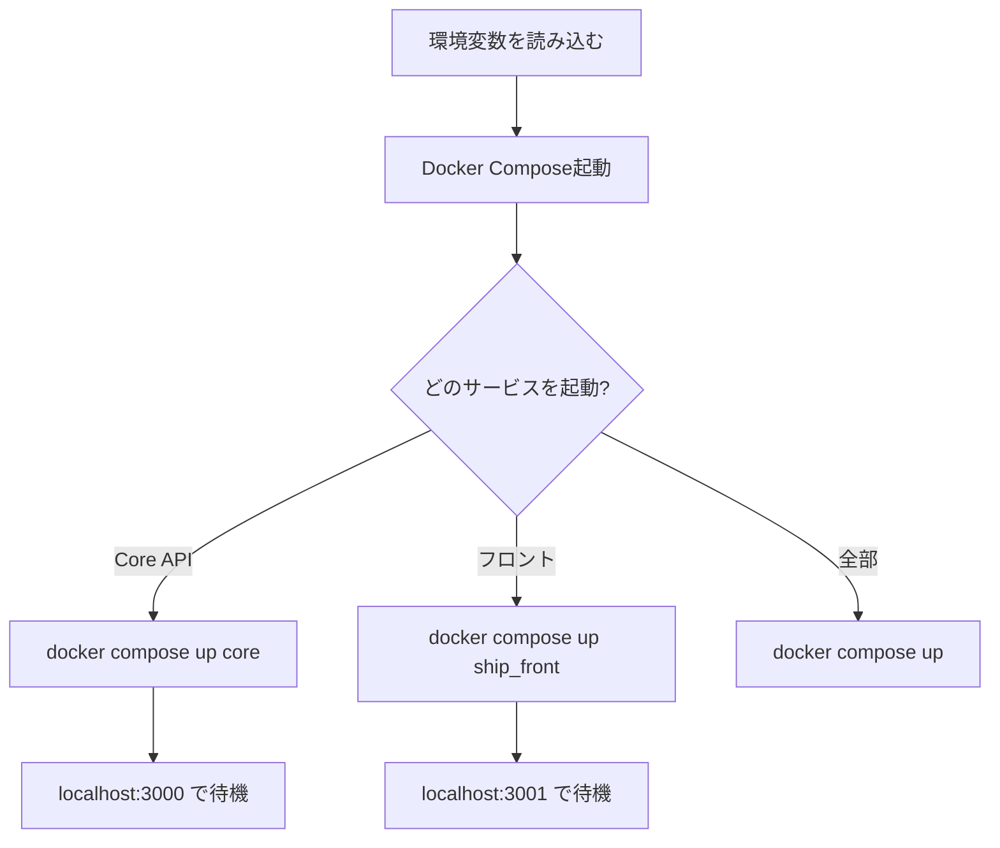
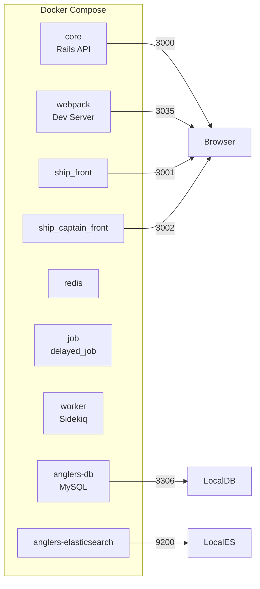

# Anglers Docker Compose 起動ガイド

## 概要

Anglersプロジェクトの開発環境をDocker Composeで起動する方法をまとめたガイド。

---

## 前提条件

- Docker Desktop がインストールされていること
- direnv がインストールされていること
- anglers リポジトリがクローンされていること

---

## ディレクトリ構成

```
/Users/anno/Downloads/anglers/
├── .envrc                    # 環境変数定義（自動生成）
├── anglers-compose/          # Docker設定
│   ├── docker-compose.yml
│   ├── docker-compose.rails.yml
│   ├── setup.sh
│   └── helpers.sh
├── core/                     # Rails API
├── ship_front/               # 釣船予約フロント
└── ship_captain_front/       # 船長画面フロント
```

---

## 起動フロー



---

## 基本的な起動手順

### Step 1: 環境変数の読み込み

**重要**: Docker Composeを実行する前に、必ず環境変数を読み込む必要がある。

```bash
# anglersディレクトリに移動
cd /Users/anno/Downloads/anglers

# 環境変数を読み込む
source .envrc
```

または direnv を使っている場合は自動で読み込まれる。

### Step 2: サービスの起動

```bash
# Core（Rails API）を起動
docker compose up core -d

# ログを確認
docker compose logs core --tail=50
```

---

## よく使うコマンド

### サービス起動

| コマンド | 説明 |
|---------|------|
| `docker compose up core -d` | Core APIをバックグラウンド起動 |
| `docker compose up ship_front -d` | ship_frontをバックグラウンド起動 |
| `docker compose up -d` | 全サービスをバックグラウンド起動 |

### 状態確認

| コマンド | 説明 |
|---------|------|
| `docker compose ps` | 起動中のコンテナ一覧 |
| `docker compose logs core --tail=50` | Coreのログを確認 |
| `docker compose logs -f core` | Coreのログをリアルタイム表示 |

### 停止・再起動

| コマンド | 説明 |
|---------|------|
| `docker compose stop core` | Coreを停止 |
| `docker compose restart core` | Coreを再起動 |
| `docker compose down` | 全コンテナを停止・削除 |

---

## サービス一覧とポート



| サービス | コンテナ名 | ポート | 用途 |
|---------|-----------|--------|------|
| core | anglers-core | 3000 | Rails API / GraphQL |
| webpack | anglers-webpack | 3035 | Webpack Dev Server |
| ship_front | anglers-ship_front | 3001 | 釣船予約フロント |
| ship_captain_front | anglers-ship_captain_front | 3002 | 船長画面 |
| anglers-db | anglers-db | 3306 | MySQL |
| anglers-elasticsearch | anglers-elasticsearch | 9200, 9300 | Elasticsearch |
| redis | anglers-redis | 6379 | Redis |

---

## 環境変数ファイル（.envrc）

`/Users/anno/Downloads/anglers/.envrc` の内容：

```bash
export ANGLERS_BASE_PATH=/Users/anno/Downloads/anglers
export ANGLERS_CORE_PATH=${ANGLERS_BASE_PATH}/core
export ANGLERS_SHIP_FRONT_PATH=${ANGLERS_BASE_PATH}/ship_front
export ANGLERS_SHIP_CAPTAIN_FRONT_PATH=${ANGLERS_BASE_PATH}/ship_captain_front
export COMPOSE_FILE=${ANGLERS_BASE_PATH}/anglers-compose/docker-compose.yml
export ANGLERS_CORE_HOSTNAME=`hostname`
export HOST_ARCH=arm64
```

**ポイント**:
- `COMPOSE_FILE` で docker-compose.yml のパスを指定しているので、どのディレクトリからでも `docker compose` が使える
- `source .envrc` で読み込まないとパスが設定されずエラーになる

---

## 初回セットアップ

初めて環境構築する場合は `setup.sh` を使う：

```bash
cd /Users/anno/Downloads/anglers/anglers-compose
./setup.sh
```

これにより以下が実行される：
1. Docker イメージのビルド
2. Ruby gems のインストール
3. Node modules のインストール
4. データベース作成・マイグレーション
5. Elasticsearch同期

---

## トラブルシューティング

### 環境変数エラー

```
The "ANGLERS_CORE_PATH" variable is not set.
```

**解決策**: `source .envrc` を実行してから `docker compose` を実行する。

### マイグレーションエラー

```
Mysql2::Error: Table 'xxx' already exists
```

**解決策**: schema_migrations テーブルにバージョンを手動追加：

```bash
docker compose exec anglers-db mysql -uroot -ppass anglers_development \
  -e "INSERT INTO schema_migrations (version) VALUES ('XXXXXXXXXX');"
```

### コンテナが起動しない

```bash
# ログを確認
docker compose logs core

# コンテナを再起動
docker compose restart core
```

---

## codegen実行時の手順

GraphQL codegenを実行する場合、ローカルのCoreサーバーを使う：

```bash
# 1. 環境変数読み込み
cd /Users/anno/Downloads/anglers
source .envrc

# 2. Core起動
docker compose up core -d

# 3. 起動確認（"Listening on http://0.0.0.0:3000" が出るまで待つ）
docker compose logs core --tail=20

# 4. codegen実行
cd ship_front
GRAPHQL_ENDPOINT=http://localhost:3000/graphql npm run codegen
```

---

## 参考リンク

- Docker Compose設定: `/Users/anno/Downloads/anglers/anglers-compose/docker-compose.yml`
- Rails設定: `/Users/anno/Downloads/anglers/anglers-compose/docker-compose.rails.yml`
- 環境変数: `/Users/anno/Downloads/anglers/.envrc`
